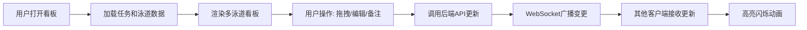

## 1. 产品概述

团队任务看板系统，用于解决团队协作中任务分配和进度追踪的数据安全与自定义程度受限问题，提供轻量级的自建看板解决方案。
- 面向敏捷开发团队，支持任务可视化管理、状态流转和实时协作
- 提供数据主权、高度自定义能力和私有化部署能力

## 2. 核心功能

### 2.1 用户角色
| 角色 | 注册方式 | 核心权限 |
|------|---------|----------|
| 团队成员 | 默认接入 | 查看看板、创建任务、拖拽任务、编辑任务、添加备注 |

### 2.2 功能模块
1. **看板主页面**: 多泳道看板、标签筛选器、任务卡片列表
2. **任务详情弹窗**: 任务编辑、备注管理、分配人设置
3. **实时协作同步**: WebSocket实时推送、变更高亮动画

### 2.3 页面详情
| 页面名称 | 模块名称 | 功能描述 |
|---------|---------|----------|
| 看板主页面 | 泳道管理 | 默认三个泳道（待办/进行中/已完成）、支持新增/删除泳道、泳道标题可编辑 |
| 看板主页面 | 标签筛选器 | 彩色标签展示、点击筛选、清除筛选、未匹配卡片淡出隐藏 |
| 看板主页面 | 任务卡片拖拽 | 泳道内排序、跨泳道移动、拖拽视觉反馈（缩放+阴影） |
| 任务详情弹窗 | 任务编辑 | 编辑标题、描述、截止日期、优先级、分配人 |
| 任务详情弹窗 | 备注管理 | 添加多条备注、时间倒序排列、平滑缩放过渡动画 |
| 实时协作模块 | 同步机制 | WebSocket广播状态变更、短暂高亮闪烁标识更新卡片 |

## 3. 核心流程

用户打开看板页面 → 从后端加载所有任务和泳道数据 → 渲染多泳道看板布局 → 用户拖拽任务卡片或点击编辑 → 前端调用API更新数据 → 后端通过WebSocket广播变更 → 其他客户端接收更新并触发高亮动画。

## 4. 用户界面设计

### 4.1 设计风格
- 主背景色：深灰 #1a1a2e
- 泳道背景：浅灰半透明 #16213e
- 优先级标识：高（红色边框）、中（橙色边框）、低（绿色边框）
- 标题栏和按钮渐变色：从 #0f3460 到 #e94560
- 所有交互缓动动画：ease-out 0.3s
- 拖拽反馈：卡片缩放至 1.05 倍 + 阴影

### 4.2 页面设计概述
| 页面名称 | 模块名称 | UI元素 |
|---------|---------|--------|
| 看板主页面 | 顶部栏 | 渐变标题、标签筛选区、清除筛选按钮 |
| 看板主页面 | 泳道区 | 水平排列泳道卡片、可编辑标题、新增/删除操作 |
| 看板主页面 | 任务卡片 | 彩色左边框优先级标识、标题、标签、截止日期、分配人 |
| 任务详情弹窗 | 内容区 | 缩放动画、表单字段、备注列表（倒序）、添加备注输入框 |

### 4.3 响应式
- 桌面优先设计，768px 以下自动转为单列垂直布局
- 泳道滚动适配触摸操作
- 移动端优化触摸拖拽体验
