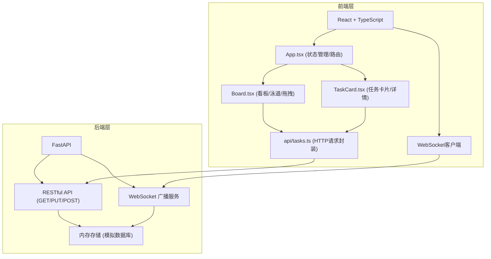
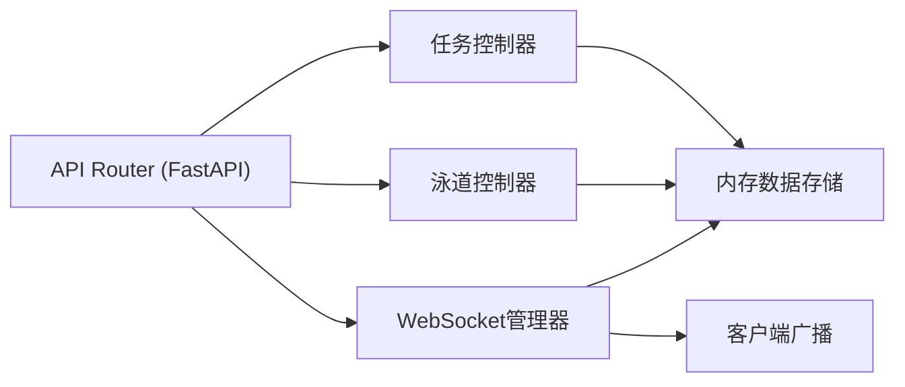
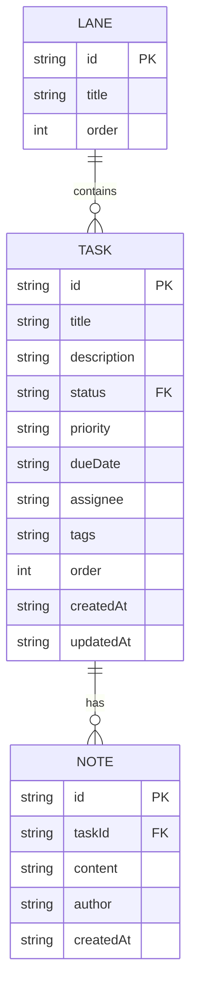

## 1. 架构设计



## 2. 技术说明

- 前端: React@18 + TypeScript + Vite
- 拖拽库: @dnd-kit/core + @dnd-kit/sortable
- HTTP客户端: axios
- 通知提示: react-hot-toast
- 路由: react-router-dom
- 后端: FastAPI (Python)
- 实时通信: WebSocket
- 数据存储: 内存存储 (模拟数据库，最多50条任务)

## 3. 路由定义

| 路由 | 用途 |
|-----|------|
| / | 看板主页面 |

## 4. API 定义

### TypeScript 类型定义

```typescript
interface Task {
  id: string;
  title: string;
  description: string;
  status: string;
  priority: 'high' | 'medium' | 'low';
  dueDate: string | null;
  assignee: string | null;
  tags: string[];
  notes: Note[];
  order: number;
  createdAt: string;
  updatedAt: string;
}

interface Note {
  id: string;
  content: string;
  author: string;
  createdAt: string;
}

interface Lane {
  id: string;
  title: string;
  order: number;
}

interface WSMessage {
  type: 'task_updated' | 'task_created' | 'task_deleted' | 'lane_updated' | 'note_added';
  data: Task | Lane | Note;
}
```

### REST API

| 方法 | 路径 | 描述 | 请求体 | 响应 |
|-----|------|------|--------|------|
| GET | /tasks | 获取所有任务和泳道 | - | { tasks: Task[], lanes: Lane[] } |
| PUT | /tasks/{id} | 更新任务（状态、标题、描述等） | Partial\<Task\> | Task |
| POST | /tasks/{id}/notes | 为任务添加备注 | { content: string, author: string } | Note |
| GET | /lanes | 获取所有泳道 | - | Lane[] |
| POST | /lanes | 新增泳道 | { title: string } | Lane |
| PUT | /lanes/{id} | 更新泳道标题 | { title: string } | Lane |
| DELETE | /lanes/{id} | 删除泳道 | - | { success: boolean } |
| GET | /ws | WebSocket连接 | - | WSMessage |

## 5. 服务端架构图



## 6. 数据模型

### 6.1 数据模型定义



### 6.2 内存存储结构

```python
# 内存数据结构
lanes_db: Dict[str, Lane] = {
    "todo": {"id": "todo", "title": "待办", "order": 0},
    "in_progress": {"id": "in_progress", "title": "进行中", "order": 1},
    "done": {"id": "done", "title": "已完成", "order": 2},
}

tasks_db: Dict[str, Task] = {}  # 最多50条
```
