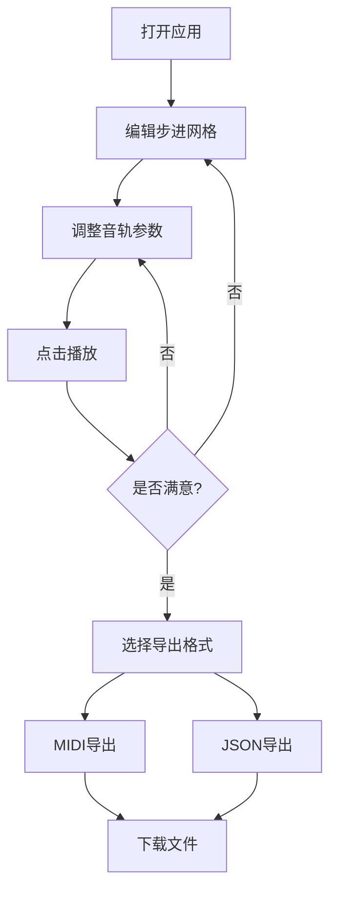

## 1. 产品概述

交互式乐器音轨混合与节奏可视化编排应用，为音乐爱好者和初学者提供在浏览器中直观地对多轨乐器进行音量混音、声像定位和节奏型可视化编辑的能力。

- 主要解决音乐创作者难以在轻量级Web环境中快速构建和试听多轨节奏型的问题
- 目标用户：音乐爱好者、初学者、Beatmaker、音乐教育工作者

## 2. 核心功能

### 2.1 用户角色

| 角色 | 注册方式 | 核心权限 |
|------|----------|----------|
| 普通用户 | 无需注册 | 使用全部编辑、播放、导出功能 |

### 2.2 功能模块

1. **音轨通道条面板**：4条乐器通道（鼓组/贝斯/吉他/键盘），含音量推子、声像旋钮、静音/独奏按钮
2. **步进音序网格编辑器**：4×16可视化网格，点击激活/取消步进，带播放光标动画
3. **播放控制工具栏**：播放/暂停、重置、BPM调节、节拍计数器
4. **导出模块**：MIDI文件导出、JSON配置文件导出

### 2.3 页面详情

| 页面名称 | 模块名称 | 功能描述 |
|----------|----------|----------|
| 主页 | 音轨通道条面板 | 4条乐器通道，水平推子控制音量(-60dB~0dB)，旋转旋钮控制声像，红色静音(M)和黄色独奏(S)按钮 |
| 主页 | 步进音序网格 | 4×16网格编辑器，行代表乐器，列代表16分音符，点击切换激活状态，当前播放位置由垂直光棒指示 |
| 主页 | 播放控制工具栏 | 底部固定工具栏，播放/暂停按钮(带脉冲光晕)、重置按钮、BPM滑块(60-200)、节拍计数器 |
| 主页 | 导出功能区 | 导出MIDI按钮、导出JSON按钮，带加载动画和下载提示 |

## 3. 核心流程

### 主工作流
用户打开应用 → 在步进网格中编辑节奏型 → 通过通道条调整各乐器音量/声像 → 点击播放试听 → 使用BPM滑块调节速度 → 满意后导出为MIDI或JSON文件

## 4. 用户界面设计

### 4.1 设计风格
- **主色调**：深空蓝背景(#0a0e27)，深灰网格(#16213e)
- **乐器颜色**：鼓组=#ff6b6b(珊瑚红)、贝斯=#4ecdc4(青绿)、吉他=#45b7d1(天蓝)、键盘=#f9ca24(金黄)
- **视觉效果**：毛玻璃面板(backdrop-filter: blur)、霓虹发光激活格子、柔光环指示旋钮
- **按钮风格**：圆角胶囊按钮，带阴影和悬停过渡
- **字体**：Space Mono(等宽数字显示) + Inter(界面文字)
- **布局**：上半部分通道条垂直排列，下半部分步进网格，底部固定工具栏
- **动效**：所有交互带0.3s ease过渡，推子渐变填充，旋钮旋转跟踪环

### 4.2 页面设计概览

| 页面名称 | 模块名称 | UI元素 |
|----------|----------|--------|
| 主页 | 通道条面板 | 毛玻璃背景卡片、发光隔线、水平推子(深蓝→亮绿渐变填充)、旋转旋钮(柔光圆环)、M/S按钮(红/黄)、数值Tooltip |
| 主页 | 步进网格 | 深灰背景、圆角徽章乐器标签、霓虹色激活格子(内发光)、深灰半透明未激活格子、弹性缓动垂直光棒 |
| 主页 | 控制工具栏 | 毛玻璃固定底栏、下定阴影、播放按钮脉冲光晕、彩虹渐变BPM滑块、圆形发光滑块头、节拍计数器 |

### 4.3 响应式适配
- **桌面端**：4条通道条垂直并排，网格4行16列等比缩放
- **平板/移动端(宽度<1024px)**：通道条变为水平长条排列，网格自适应缩小，触控区域放大

### 4.4 性能要求
- 播放光标移动帧率稳定60fps
- 导出操作响应时间≤1秒
- Web Audio API实时合成音色，无延迟
