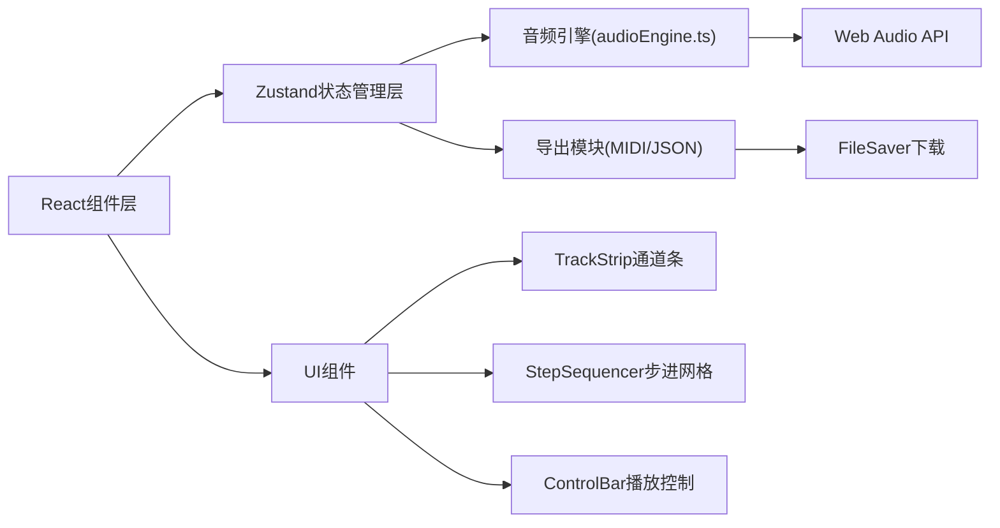

## 1. 架构设计



## 2. 技术描述

- **前端框架**：React@18 + TypeScript@5 + Vite@5
- **状态管理**：Zustand@4 (集中管理音轨参数、网格状态、播放状态)
- **音频处理**：原生 Web Audio API (OscillatorNode + GainNode 合成音色)
- **图标库**：lucide-react
- **文件导出**：file-saver@2 (文件下载)，自实现MIDI编码器
- **CSS方案**：原生CSS + CSS变量 + 响应式媒体查询
- **构建工具**：Vite@5 (React插件 + TypeScript支持)

## 3. 项目文件结构

```
auto80/
├── package.json
├── vite.config.js
├── tsconfig.json
├── index.html
└── src/
    ├── App.tsx              (主组件，组合所有子组件)
    ├── store.ts             (Zustand状态仓库)
    ├── TrackStrip.tsx       (通道条组件)
    ├── StepSequencer.tsx    (步进网格组件)
    ├── audioEngine.ts       (音频引擎模块)
    └── index.css            (全局样式)
```

## 4. 数据模型

### 4.1 音轨状态(Track)

```typescript
interface Track {
  id: string;
  name: string;           // 鼓组/贝斯/吉他/键盘
  color: string;          // 对应霓虹色
  volume: number;         // -60 ~ 0 (dB)
  pan: number;            // -100 ~ 100 (声像)
  muted: boolean;         // 静音状态
  solo: boolean;          // 独奏状态
  frequency: number;      // 对应音色频率(Hz)
  waveform: OscillatorType; // 波形类型
}
```

### 4.2 网格状态

```typescript
// 4行 × 16列 = 64个格子
// grid[trackIndex][stepIndex] = boolean
type GridState = boolean[][];
```

### 4.3 播放状态

```typescript
interface PlayState {
  isPlaying: boolean;
  currentStep: number;    // 0 ~ 15
  currentBar: number;     // 当前小节数
  currentBeat: number;    // 当前拍数
  bpm: number;            // 60 ~ 200
}
```

## 5. Zustand Store Actions

| Action | 说明 |
|--------|------|
| `toggleGridCell(trackIdx, stepIdx)` | 切换网格格子激活状态 |
| `setVolume(trackIdx, value)` | 设置指定音轨音量 |
| `setPan(trackIdx, value)` | 设置指定音轨声像 |
| `toggleMute(trackIdx)` | 切换音轨静音 |
| `toggleSolo(trackIdx)` | 切换音轨独奏 |
| `setBPM(value)` | 设置BPM |
| `play()` | 开始播放 |
| `stop()` | 停止播放 |
| `reset()` | 重置到第一拍 |
| `exportMidi()` | 导出MIDI文件 |
| `exportJson()` | 导出JSON配置 |

## 6. 音频引擎设计

### 6.1 节点拓扑
```
OscillatorNode (方波/三角波)
    → GainNode (音量包络 ADSR)
    → StereoPannerNode (声像)
    → GainNode (通道音量)
    → AudioContext.destination (主输出)
```

### 6.2 播放调度
- 使用 `setInterval` + `AudioContext.currentTime` 精确调度
- 每步间隔 = 60000 / (BPM × 4) 毫秒 (16分音符)
- 触发时创建 oscillator → 连接增益包络 → 播放16分音符时长后释放

## 7. MIDI导出格式
- Format 1, 4条MIDI轨道
- 每个激活格子对应一个Note On/Off事件
- 默认音符：鼓组=C2(36), 贝斯=C3(48), 吉他=C4(60), 键盘=C5(72)
- 力度固定为100，音符长度=16分音符
