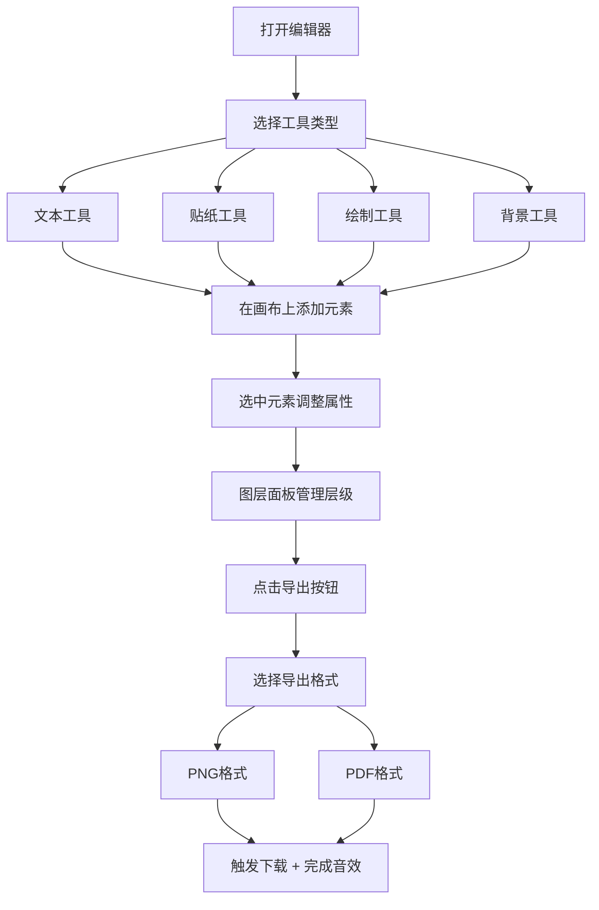

## 1. 产品概述

在线DIY贺卡设计与生成平台，用户可在浏览器中通过拖放文字、贴纸、背景和绘制图形来创作个性化电子贺卡，支持导出高清PNG和打印PDF格式。

- **核心价值**：零门槛的创意设计工具，让用户轻松制作独特的个性化贺卡
- **目标用户**：普通用户，无需专业设计技能，适用于生日、节日、纪念日等场景
- **使用场景**：生日祝福、节日贺卡、邀请函、感谢卡等个性化电子贺卡制作

## 2. 核心功能

### 2.1 功能模块

1. **画布编辑区**：无限画布，默认600x800px卡片区域，网格辅助线，支持拖拽、缩放、旋转元素
2. **工具栏面板**：左侧浮动工具栏，包含文本、贴纸、绘制、背景、导出五大功能分组
3. **属性面板**：右侧属性面板，根据选中元素类型动态显示对应属性控制
4. **图层面板**：右下角图层缩略图面板，支持层级管理和拖拽排序
5. **导出功能**：支持PNG（透明背景）和PDF（A4，300dpi）两种导出格式

### 2.2 页面详情

| 页面名称 | 模块名称 | 功能描述 |
|-----------|-------------|---------------------|
| 编辑器主页 | 画布编辑区 | 无限画布设计，卡片区域居中，网格辅助线，元素拖拽吸附 |
| 编辑器主页 | 工具栏面板 | 5个功能分组，垂直展开动画，悬停高亮，贴纸拖拽添加 |
| 编辑器主页 | 属性面板 | 动态切换属性控件，实时预览更新，滑块/拾色器/旋钮交互 |
| 编辑器主页 | 图层面板 | 可收起/展开，缩略图显示，拖拽排序，选中高亮 |
| 编辑器主页 | 导出模态框 | 格式选择，预估文件大小，粒子动画，完成音效 |

## 3. 核心流程

### 3.1 主要用户流程

用户打开编辑器 → 从工具栏选择元素类型（文本/贴纸/绘制/背景）→ 在画布上添加或绘制元素 → 通过属性面板调整元素样式 → 通过图层面板管理叠放顺序 → 点击导出按钮 → 选择导出格式 → 确认下载

### 3.2 流程图

## 4. 用户界面设计

### 4.1 设计风格

- **设计理念**：简洁现代、轻盈通透，以内容为中心的创作体验
- **主色调**：品牌色 #6c5ce7（紫色），辅助色 #a29bfe（浅紫）
- **背景色**：主背景 #ffffff，次级背景 #f5f6fa，工具栏背景 #f8f9fa
- **文字色**：深灰 #2d3436 确保高对比度可读性
- **交互反馈**：所有交互元素均有 200-250ms ease-out 平滑过渡动画
- **视觉层次**：通过阴影、圆角、透明度营造深度感和空间层次

### 4.2 页面设计概览

| 页面名称 | 模块名称 | UI 元素 |
|-----------|-------------|-------------|
| 编辑器主页 | 画布编辑区 | 600x800px卡片居中，浅灰网格线，拖拽半透明效果，网格吸附高亮 |
| 编辑器主页 | 工具栏面板 | 左侧浮动，#f8f9fa 背景，12px 圆角，轻微阴影，5个分组图标，垂直展开动画，悬停20%品牌色透明背景 |
| 编辑器主页 | 属性面板 | 右侧280px宽，白色背景，动态表单控件，实时预览 |
| 编辑器主页 | 图层面板 | 右下角半透明，#2d3436 背景，8px 圆角，可收起为圆点，缩略图列表，品牌色竖条高亮 |
| 编辑器主页 | 导出模态框 | 黑色透明遮罩，居中白色卡片，16px 圆角，粒子飞散动画 |

### 4.3 响应式设计

- **桌面端（>768px）**：左侧工具栏浮动，右侧属性面板固定，画布居中显示
- **移动端（<768px）**：工具栏改为底部固定栏，属性面板改为侧滑抽屉，画布自动缩放适配
- **触摸优化**：增大触控目标，支持双指缩放和旋转手势

### 4.4 动画与交互

- **元素拖拽**：被拖元素半透明，跟随鼠标移动，松开后平滑吸附网格线
- **面板展开/收起**：垂直滑入滑出动画，200ms ease-out
- **滑块交互**：实时数值更新，滑块轨道渐变填充
- **模态框呈现**：背景淡入，模态框缩放进入，粒子飞散装饰效果
- **导出完成**：清脆叮咚音效，成功提示动画
