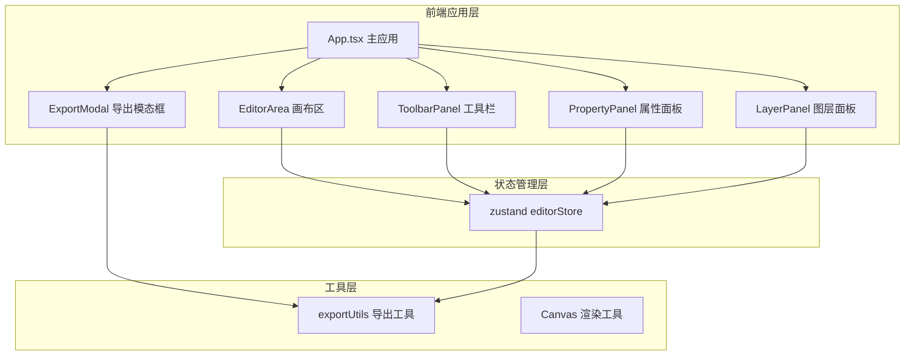

## 1. 架构设计



## 2. 技术选型

- **前端框架**：React 18 + TypeScript
- **构建工具**：Vite
- **状态管理**：zustand（轻量级状态管理）
- **唯一标识**：uuid
- **PDF导出**：jspdf
- **文件保存**：file-saver
- **样式方案**：CSS Modules / 内联样式（用户指定不使用 tailwind）

## 3. 项目结构

```
src/
├── components/
│   ├── EditorArea.tsx      # 画布编辑区组件
│   ├── ToolbarPanel.tsx    # 左侧工具栏组件
│   ├── PropertyPanel.tsx   # 右侧属性面板
│   ├── LayerPanel.tsx      # 图层面板
│   └── ExportModal.tsx     # 导出模态框
├── store/
│   └── editorStore.ts      # zustand 状态管理
├── utils/
│   └── exportUtils.ts      # 导出工具函数
├── App.tsx                 # 主应用组件
└── main.tsx                # 应用入口
```

## 4. 数据模型

### 4.1 画布元素类型定义

```typescript
type ElementType = 'text' | 'sticker' | 'drawing' | 'background';

interface BaseElement {
  id: string;
  type: ElementType;
  x: number;
  y: number;
  zIndex: number;
  width: number;
  height: number;
  rotation: number;
  opacity: number;
}

interface TextElement extends BaseElement {
  type: 'text';
  content: string;
  fontFamily: string;
  fontSize: number;
  lineHeight: number;
  textAlign: 'left' | 'center' | 'right';
  color: string;
  strokeWidth: number;
  strokeColor: string;
}

interface StickerElement extends BaseElement {
  type: 'sticker';
  src: string;
  scale: number;
}

interface DrawingElement extends BaseElement {
  type: 'drawing';
  fill: string;
  stroke: string;
  strokeWidth: number;
  path: Point[];
}

interface BackgroundElement extends BaseElement {
  type: 'background';
  color: string;
  gradient?: { from: string; to: string };
  image?: string;
}
```

### 4.2 Store 状态定义

```typescript
interface EditorState {
  elements: CanvasElement[];
  selectedId: string | null;
  canvasSize: { width: number; height: number };
  gridSize: number;
  showGrid: boolean;
  
  // 操作方法
  addElement: (element: Partial<CanvasElement>) => void;
  selectElement: (id: string | null) => void;
  updateElement: (id: string, updates: Partial<CanvasElement>) => void;
  deleteElement: (id: string) => void;
  reorderElements: (fromIndex: number, toIndex: number) => void;
  setCanvasBackground: (bg: string) => void;
}
```

## 5. 核心功能实现方案

### 5.1 画布渲染与交互

- 使用 DOM 元素 + CSS transform 实现元素渲染，保证 50fps+ 性能
- 使用 requestAnimationFrame 优化拖拽渲染循环
- 网格吸附：拖拽结束时计算最近网格点，使用 CSS transition 平滑过渡

### 5.2 拖拽实现

- 鼠标事件：mousedown → mousemove → mouseup
- 元素跟随：通过 transform: translate(x, y) 实现
- 碰撞检测：边界检测，防止元素拖出卡片区域
- 性能优化：使用 will-change 和 transform 提升渲染性能

### 5.3 导出功能

- **PNG导出**：使用 html2canvas 或手动绘制到 canvas，调用 toBlob() 生成
- **PDF导出**：使用 jspdf 库，A4 尺寸 300dpi，将画布内容绘制到 PDF

### 5.4 性能优化

- 使用 CSS transform 而非 top/left 定位，避免重排
- requestAnimationFrame 统一动画循环
- 组件按需重渲染（zustand selector 优化）
- 虚拟滚动（图层面板，如需要）

## 6. 响应式方案

- 使用 CSS 媒体查询 + React hooks 检测屏幕尺寸
- 桌面端：三栏布局（工具栏 + 画布 + 属性面板）
- 移动端：底部工具栏 + 画布全屏 + 抽屉式属性面板
