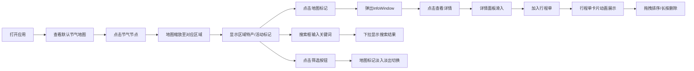

## 1. 产品概述

农事节气与特产地图互动可视化应用，帮助乡村旅游推广，解决游客因不了解当地时令特产和农事活动而错过最佳体验期的问题。目标用户为乡村旅游爱好者，通过直观的互动工具帮助用户规划行程和获取农产品信息，提升乡村旅游体验。

## 2. 核心功能

### 2.1 用户角色

| 角色 | 注册方式 | 核心权限 |
|------|----------|----------|
| 普通用户 | 无需注册 | 浏览地图、查看节气信息、生成行程单 |

### 2.2 功能模块

1. **地图主页面**：24节气时间轴、互动地图、详情面板、行程单管理、搜索筛选

### 2.3 页面详情

| 页面名称 | 模块名称 | 功能描述 |
|----------|----------|----------|
| 地图主页面 | 节气时间轴 | 水平滚动24节气节点，点击切换，带动画效果 |
| 地图主页面 | 互动地图 | OpenStreetMap展示，特产/活动标记，热力图，聚类优化 |
| 地图主页面 | 详情面板 | 展示选中特产或活动详情，支持加入行程 |
| 地图主页面 | 行程单管理 | 卡片列表展示，拖拽排序，长按删除，统计信息 |
| 地图主页面 | 搜索筛选 | 模糊搜索特产/活动，按类型筛选标记 |

## 3. 核心流程

用户打开应用 → 查看默认节气地图展示 → 点击节气节点 → 地图缩放至对应区域 → 点击地图标记 → 查看详情 → 加入行程单 → 管理行程单 → 搜索筛选特产/活动

## 4. 用户界面设计

### 4.1 设计风格

- **主色调**：暖橙色 #ff6b35，橄榄绿 #6b8e23，深褐 #5d4037
- **背景色**：浅米色 #fef9ef
- **字体**：展示字体使用 Noto Serif SC，正文字体使用 Noto Sans SC
- **卡片样式**：圆角12px，细微阴影，悬停上移2px加深阴影
- **动画效果**：节气节点渐变填充，标记弹出动画，行程卡片滑入动画

### 4.2 页面设计概述

| 页面名称 | 模块名称 | UI 元素 |
|----------|----------|----------|
| 地图主页面 | 节气时间轴 | 水平滚动容器，24节气圆形图标节点，月份标签，渐变色填充，微弱阴影 |
| 地图主页面 | 互动地图 | OpenStreetMap底图，半透明高亮多边形，特产/活动标记（苹果/胡萝卜/烟花图标），InfoWindow毛玻璃效果，热力图黄橙红渐变 |
| 地图主页面 | 详情面板 | 右侧滑入，图片展示，详细描述，最佳时间，推荐路线，加入行程按钮 |
| 地图主页面 | 行程单面板 | 右下角浮动，卡片列表，拖拽排序，长按删除按钮，总项目数和天数统计 |
| 地图主页面 | 搜索筛选 | 顶部搜索框，下拉结果列表，筛选按钮组（全部/采摘/节庆/美食） |

### 4.3 响应式设计

桌面端优先，移动端自适应：
- 宽度小于768px时，时间轴变为顶部横条
- 地图占满全屏
- 行程单变为底部固定面板
- 触摸操作优化

### 4.4 视觉细节

- 时间轴节气节点使用渐变色填充和微弱阴影
- InfoWindow背景半透明毛玻璃效果（backdrop-filter: blur(8px)）
- 边框2px品牌色圆角12px
- 信息文字深灰 #2d3436
- 所有卡片和面板圆角12px和细微阴影
- 卡片悬停时上移2px并加深阴影（transition: all 0.2s）
