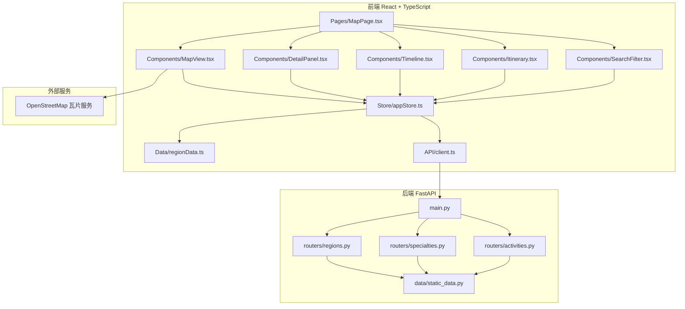
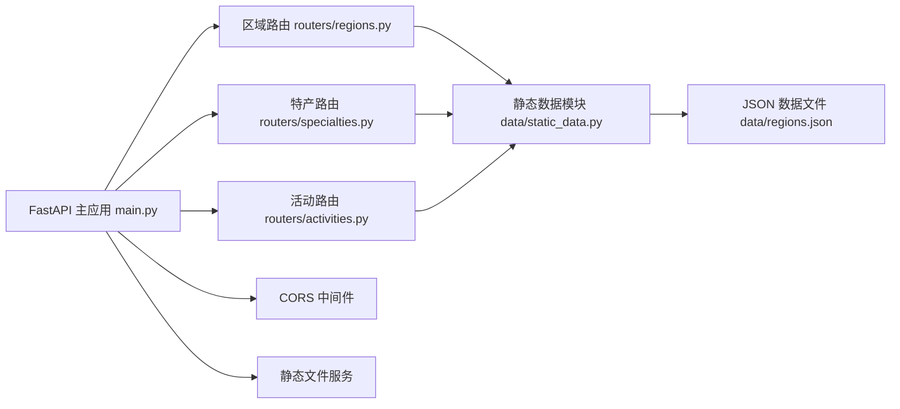
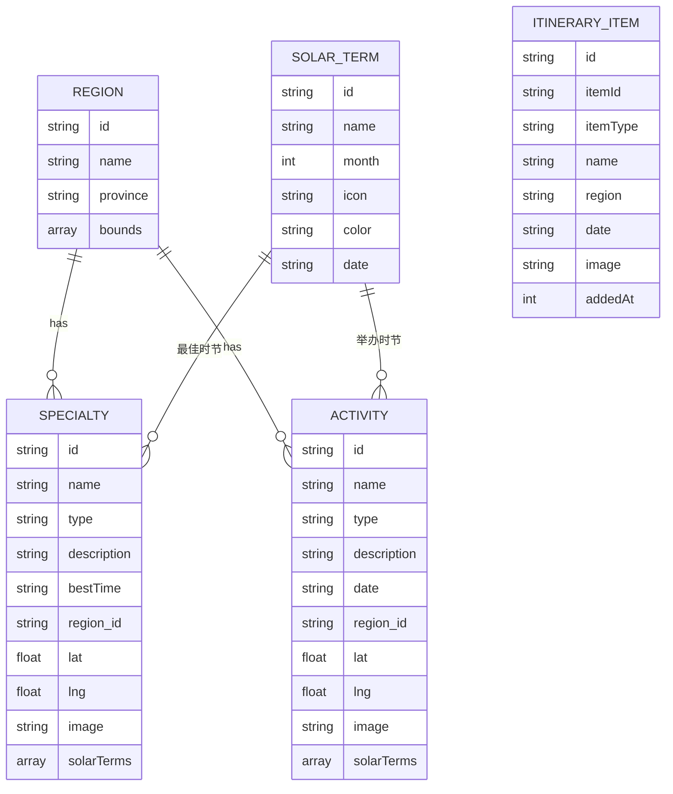

## 1. 架构设计



## 2. 技术描述

- **前端**：React@18 + TypeScript + Vite
- **状态管理**：zustand@4
- **地图组件**：leaflet@1.9 + react-leaflet@4
- **图表组件**：recharts@2
- **HTTP客户端**：axios@1
- **路由管理**：react-router-dom@6
- **工具库**：uuid@9, dayjs@1.11
- **后端**：FastAPI@0.100 + Python@3.11
- **初始化工具**：Vite
- **数据**：前端静态数据 + 后端RESTful API

## 3. 路由定义

| 路由 | 用途 |
|------|------|
| / | 地图主页面 |

## 4. API 定义

### TypeScript 类型定义

```typescript
interface Specialty {
  id: string;
  name: string;
  type: 'fruit' | 'vegetable' | 'craft';
  description: string;
  bestTime: string;
  region: string;
  lat: number;
  lng: number;
  image: string;
  solarTerms: string[];
}

interface Activity {
  id: string;
  name: string;
  type: 'sowing' | 'harvest' | 'festival';
  description: string;
  date: string;
  region: string;
  lat: number;
  lng: number;
  image: string;
  solarTerms: string[];
}

interface Region {
  id: string;
  name: string;
  province: string;
  bounds: [[number, number], [number, number]];
  specialties: Specialty[];
  activities: Activity[];
}

interface SolarTerm {
  id: string;
  name: string;
  month: number;
  icon: string;
  color: string;
  date: string;
}

interface ItineraryItem {
  id: string;
  itemId: string;
  itemType: 'specialty' | 'activity';
  name: string;
  region: string;
  date: string;
  image: string;
  addedAt: number;
}
```

### API 接口定义

| 方法 | 路径 | 描述 |
|------|------|------|
| GET | /api/solar-terms | 获取所有24节气数据 |
| GET | /api/regions | 获取所有区域数据 |
| GET | /api/regions/{id} | 获取指定区域详情 |
| GET | /api/specialties | 获取特产列表（支持按节气筛选） |
| GET | /api/activities | 获取活动列表（支持按节气筛选） |
| GET | /api/search | 搜索特产和活动 |

## 5. 服务器架构图



## 6. 数据模型

### 6.1 数据模型定义



### 6.2 数据文件结构

项目将包含以下静态数据文件：
- `src/data/regionData.ts` - 前端静态数据模块
- `backend/data/regions.json` - 后端数据文件
- `backend/data/static_data.py` - 后端数据加载模块

## 7. 文件结构与调用关系

```
project/
├── frontend/
│   ├── index.html
│   ├── package.json
│   ├── vite.config.js
│   ├── tsconfig.json
│   └── src/
│       ├── main.tsx              # 入口，挂载App
│       ├── App.tsx               # 根组件，路由配置
│       ├── pages/
│       │   └── MapPage.tsx       # 主页面，用户交互 → store
│       ├── components/
│       │   ├── MapView.tsx       # 地图展示，store → 地图标记
│       │   ├── DetailPanel.tsx   # 详情面板，store → 详情展示
│       │   ├── Timeline.tsx      # 节气时间轴，用户选择 → store
│       │   ├── Itinerary.tsx     # 行程单，store → 卡片列表
│       │   └── SearchFilter.tsx  # 搜索筛选，用户输入 → store
│       ├── store/
│       │   └── appStore.ts       # zustand全局状态管理
│       ├── data/
│       │   └── regionData.ts     # 静态数据，为store提供数据源
│       ├── api/
│       │   └── client.ts         # axios API客户端
│       └── types/
│           └── index.ts          # TypeScript类型定义
└── backend/
    ├── main.py                   # FastAPI应用入口
    ├── requirements.txt
    ├── routers/
    │   ├── regions.py
    │   ├── specialties.py
    │   └── activities.py
    └── data/
        ├── static_data.py
        └── regions.json
```

**数据流向**：
1. 用户点击节气节点 → Timeline.tsx → 更新 store 中的 currentSolarTerm
2. store 更新 → MapView.tsx 重新渲染对应区域的标记
3. 用户点击地图标记 → MapView.tsx → 更新 store 中的 selectedMarker
4. store 更新 → DetailPanel.tsx 展示详情
5. 用户点击"加入行程" → DetailPanel.tsx → 更新 store 中的 itinerary
6. store 更新 → Itinerary.tsx 展示行程卡片
7. 用户搜索 → SearchFilter.tsx → 更新 store 中的 searchQuery
8. store 更新 → MapView.tsx 筛选显示标记
