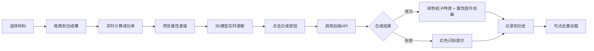

## 1. 产品概述

在线装备合成与属性模拟应用，为游戏玩家提供直观的装备合成预览工具，解决玩家在游戏中无法预览合成组合、成功率和属性变化的痛点。

- **核心价值**：让玩家在游戏外模拟装备合成，评估材料价值和合成风险，优化游戏策略
- **目标用户**：RPG/MMORPG游戏玩家、装备收集爱好者、游戏攻略创作者

## 2. 核心功能

### 2.1 功能模块

1. **主合成页面**：材料选择区、合成面板、3D装备预览区、合成历史侧边栏
2. **材料展示模块**：稀有度色卡、悬停放大效果、详细属性展示
3. **合成计算模块**：成功率计算、属性差值预览、动画效果
4. **3D装备预览模块**：模型旋转、视角控制、粒子特效、材质变化
5. **历史记录模块**：最近10次合成记录、状态标识、一键重加载

### 2.2 页面详情

| 页面名称 | 模块名称 | 功能描述 |
|----------|----------|----------|
| 主合成页面 | 顶部导航栏 | 应用标题、重置按钮、品牌标识 |
| 主合成页面 | 材料列表区 | 网格布局材料卡片、稀有度颜色标识、悬停放大1.1倍显示属性 |
| 主合成页面 | 合成面板 | 3个合成槽位（虚线占位符）、拖拽排序、成功率圆形进度条、属性差值预览、合成按钮 |
| 主合成页面 | 3D预览区 | Three.js装备模型、自动旋转、拖拽视角、粒子特效、材质发光效果 |
| 主合成页面 | 历史侧边栏 | 最近10条记录、成功/失败状态颜色区分、点击重加载组合 |

## 3. 核心流程

用户选择材料 → 拖拽到合成槽位 → 系统实时计算成功率和属性变化 → 3D模型预览效果 → 点击合成按钮 → 调用后端API执行合成 → 显示结果并更新3D模型特效 → 记录到历史

## 4. 用户界面设计

### 4.1 设计风格

- **主题色调**：深色游戏风格，主背景 `#1a1a2e`，面板背景 `#16213e`，品牌色 `#e94560`
- **色彩系统**：
  - 材料稀有度：白色(普通)、绿色(优秀)、蓝色(精良)、紫色(史诗)、金色(传说)
  - 成功率：>80%绿色、50-80%橙色、<50%红色
  - 属性变化：绿色+箭头(增益)、红色-箭头(减益)
- **字体**：标题使用游戏风格字体，正文使用清晰易读的无衬线字体
- **圆角与阴影**：所有卡片和面板圆角12px，背景模糊 `backdrop-filter: blur(10px)`
- **动画风格**：流畅的过渡动画，悬停放大效果，粒子扩散特效，按压反馈

### 4.2 页面设计概览

| 页面名称 | 模块名称 | UI元素 |
|----------|----------|--------|
| 主合成页面 | 顶部导航栏 | 固定定位、深色背景、品牌色标题、重置按钮渐变边框 |
| 主合成页面 | 材料列表 | 网格布局(桌面3列、平板2列、手机滚动)、彩色边框、悬停缩放1.1倍 |
| 主合成页面 | 合成面板 | 居中靠左布局、虚线槽位占位、圆形进度条带百分比、渐变色合成按钮 |
| 主合成页面 | 3D预览区 | 右侧自适应宽度、深色背景、模型居中、旋转控制 |
| 主合成页面 | 历史侧边栏 | 右侧悬浮、滚动列表、成功绿色背景/失败半透明红色、时间戳 |

### 4.3 响应式设计

- **桌面端(>768px)**：三栏布局 - 材料列表(左)、合成面板(中)、3D预览+历史(右)
- **平板端(480-768px)**：材料列表2列，3D预览区移至合成面板下方
- **移动端(<480px)**：材料列表改为水平滚动单行，垂直堆叠布局

### 4.4 3D场景指导

- **环境**：深色星空背景，使用环境贴图营造深邃空间感
- **光照**：主光源(白色) + 轮廓光(品牌色`#e94560`) + 环境光，突出装备金属质感
- **相机**：透视相机，初始角度45度俯视角，支持OrbitControls拖拽旋转缩放
- **动画**：自动360度缓慢旋转(0.5rpm)，合成成功时播放粒子爆发动画
- **特效**：属性提升时模型边缘发光，材料对应颜色粒子从中心向外扩散
- **后处理**：Bloom发光效果，增强金属质感和光效表现
