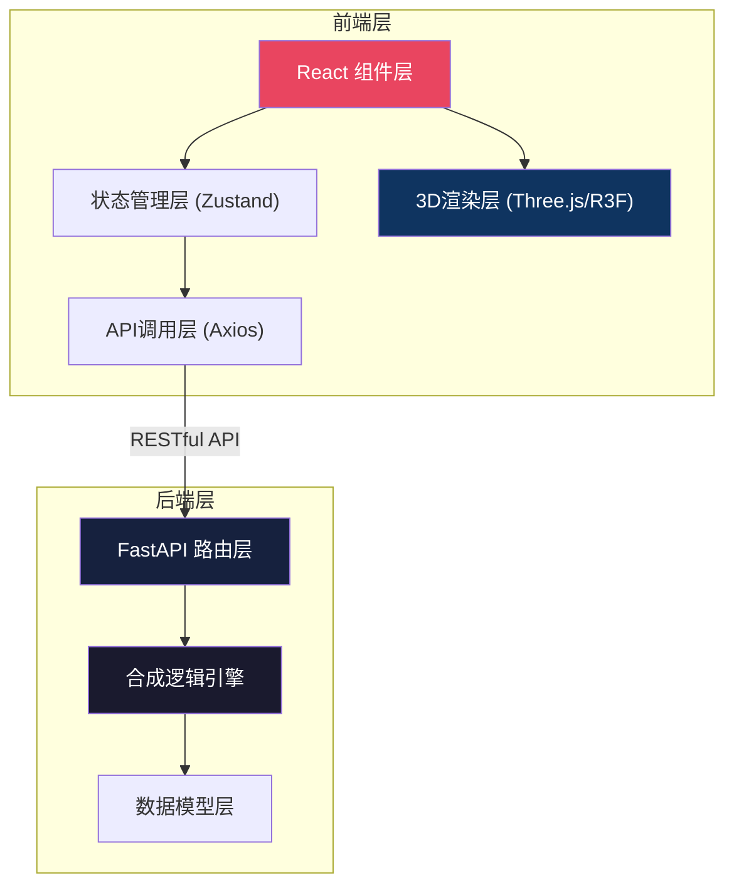
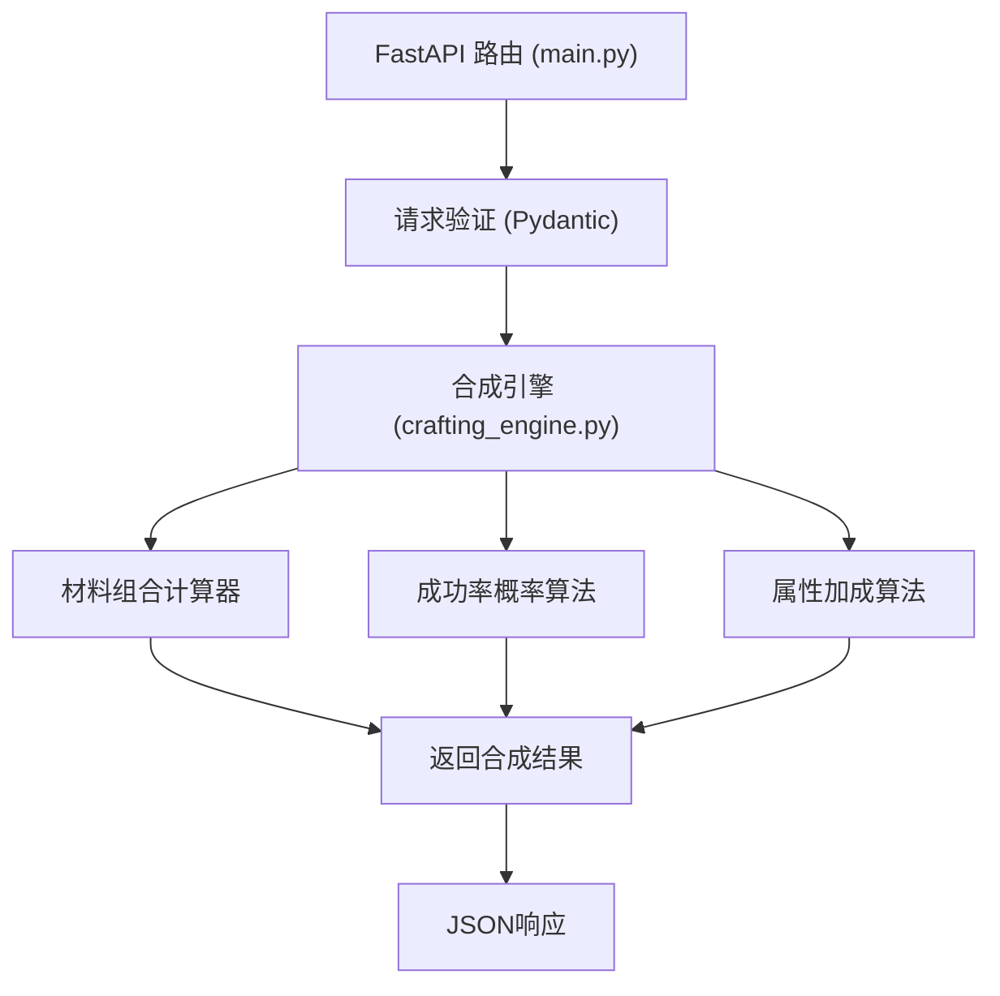

## 1. 架构设计



## 2. 技术描述

- **前端框架**：React@18 + TypeScript@5
- **构建工具**：Vite@5 + @vitejs/plugin-react@4
- **状态管理**：Zustand@4
- **HTTP客户端**：Axios@1
- **路由**：React Router DOM@6
- **3D渲染**：Three@0.160 + @react-three/fiber@8 + @react-three/drei@9
- **后端框架**：FastAPI@0.104 + Python@3.11
- **后端服务**：Uvicorn (ASGI服务器)
- **类型系统**：TypeScript严格模式 + Pydantic数据验证

## 3. 目录结构

```
auto88/
├── src/
│   ├── components/
│   │   ├── CraftingPanel.tsx      # 合成面板组件
│   │   ├── EquipmentViewer.tsx    # 3D装备渲染组件
│   │   ├── MaterialCard.tsx       # 材料卡片组件
│   │   ├── MaterialSlot.tsx       # 合成槽位组件
│   │   ├── SuccessRateCircle.tsx  # 成功率圆形进度条
│   │   ├── AttributeDiff.tsx      # 属性差值预览
│   │   ├── HistorySidebar.tsx     # 历史记录侧边栏
│   │   └── Navbar.tsx             # 顶部导航栏
│   ├── hooks/
│   │   └── useCrafting.ts         # 合成逻辑自定义钩子
│   ├── api/
│   │   └── craftingApi.ts         # API调用模块
│   ├── store/
│   │   └── useCraftingStore.ts    # Zustand全局状态
│   ├── types/
│   │   └── index.ts               # TypeScript类型定义
│   ├── utils/
│   │   └── animations.ts          # 动画工具函数
│   ├── App.tsx
│   ├── main.tsx
│   └── index.css
├── backend/
│   ├── main.py                    # FastAPI应用入口
│   ├── crafting_engine.py         # 合成逻辑引擎
│   ├── models.py                  # Pydantic数据模型
│   └── data/
│       └── materials.json         # 材料数据
├── package.json
├── vite.config.js
├── tsconfig.json
└── index.html
```

## 4. 数据流向

```
用户交互 → CraftingPanel → useCrafting Hook → craftingApi → 
FastAPI (main.py) → crafting_engine.py → 返回结果 → 
Zustand Store → EquipmentViewer 更新3D模型
```

## 5. API 定义

### TypeScript 类型定义

```typescript
interface Material {
  id: string;
  name: string;
  rarity: 'common' | 'uncommon' | 'rare' | 'epic' | 'legendary';
  attributes: {
    attack?: number;
    defense?: number;
    magic?: number;
    durability?: number;
  };
  color: string;
  icon: string;
}

interface Equipment {
  id: string;
  name: string;
  type: 'weapon' | 'armor' | 'accessory';
  baseAttributes: {
    attack: number;
    defense: number;
    magic: number;
    durability: number;
  };
  modelPath: string;
}

interface CraftingRequest {
  equipmentId: string;
  materialIds: string[];
}

interface CraftingResponse {
  success: boolean;
  successRate: number;
  originalAttributes: Record<string, number>;
  newAttributes: Record<string, number>;
  attributeDiff: Record<string, number>;
  message: string;
  timestamp: string;
}

interface CraftingHistoryItem {
  id: string;
  materials: Material[];
  result: CraftingResponse;
  timestamp: string;
}
```

### FastAPI 路由定义

| 方法 | 路径 | 描述 |
|------|------|------|
| GET | `/api/materials` | 获取所有材料列表 |
| GET | `/api/equipment` | 获取基础装备列表 |
| GET | `/api/equipment/{id}` | 获取装备详情 |
| POST | `/api/crafting/calculate` | 预计算合成成功率和属性变化 |
| POST | `/api/crafting/execute` | 执行合成操作 |

## 6. 后端架构



## 7. 合成算法设计

### 7.1 成功率计算公式
```
基础成功率 = 70%
稀有度加成 = Σ(材料稀有度系数) / 材料数量
材料兼容性加成 = 材料组合匹配奖励(%)
最终成功率 = 基础成功率 + 稀有度加成 + 兼容性加成
范围限制: 10% ≤ 最终成功率 ≤ 95%
```

### 7.2 属性加成算法
```
属性增益 = Σ(材料对应属性值 × 稀有度倍率 × 成功率因子)
稀有度倍率: 普通×1.0, 优秀×1.2, 精良×1.5, 史诗×2.0, 传说×3.0
成功率因子: 1 - (成功率 / 200) → 高风险高回报
```

## 8. 性能优化策略

1. **3D渲染优化**：
   - 使用InstancedMesh渲染粒子特效
   - 模型LOD(Level of Detail)技术
   - 按需渲染，静止时降低帧率

2. **前端优化**：
   - React.memo避免不必要重渲染
   - Zustand状态选择器精确订阅
   - 材料列表虚拟滚动(量大时)

3. **后端优化**：
   - 合成计算纯函数无副作用
   - 结果缓存相同材料组合
   - Pydantic数据验证前置
