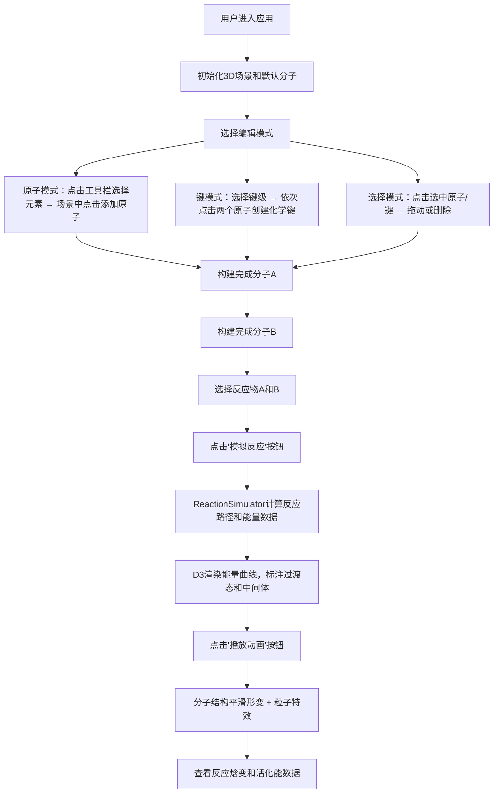

## 1. 产品概述
分子工坊是一款在线交互式3D分子结构编辑器与反应路径预测应用，面向化学研究人员、学生和爱好者，提供分子构建编辑、反应路径模拟和能量变化可视化能力。
- 主要目的：让用户以直观的3D交互方式构建分子模型，模拟化学反应过程，理解反应能量变化机制
- 目标用户：化学专业学生、科研人员、化学教育工作者、分子建模爱好者
- 产品价值：降低分子建模门槛，提供高质量3D可视化和反应动力学模拟，支持化学教学与科研探索

## 2. 核心功能

### 2.1 功能模块
1. **3D分子编辑器**：原子添加/删除/移动、化学键连接、官能团预设
2. **反应路径模拟器**：反应路径计算、能量曲线生成、过渡态/中间体标识
3. **反应动画播放器**：分子形变动画、粒子特效、播放控制
4. **信息展示面板**：原子属性详情、反应结果摘要、能量统计图表

### 2.2 页面详情
| 页面名称 | 模块名称 | 功能描述 |
|---------|---------|---------|
| 主工作台 | 3D场景渲染区 | 渲染分子3D模型，支持旋转/平移/缩放交互 |
| 主工作台 | 左侧控制面板 | 原子工具栏、化学键选择、反应模拟控制、能量曲线图表 |
| 主工作台 | 右侧信息面板 | 选中原子详情、反应摘要数据、状态信息 |
| 主工作台 | 顶部导航栏 | 编辑模式切换、项目名称显示、操作快捷按钮 |

## 3. 核心流程
用户主要操作流程：进入应用 → 选择编辑模式（原子/键/选择）→ 在工具栏选择原子类型 → 在3D场景中点击添加原子 → 选择键类型并连接原子形成分子 → 选择两个反应物分子 → 点击模拟反应 → 查看能量曲线和过渡态 → 播放反应动画观察分子形变过程。

## 4. 用户界面设计

### 4.1 设计风格
- 主色调：深色背景 `#0d1117`，面板背景 `#161b22`
- 赛博朋克霓虹配色：霓虹绿 `#39ff14`、紫色 `#bf00ff`、青色 `#00ffff`
- 原子配色：C-深灰 `#404040`、N-蓝 `#3050F8`、O-红 `#FF0D0D`、H-白 `#FFFFFF`、S-黄 `#FFFF30`、P-橙 `#FF8000`、Cl-绿 `#1FF01F`、Br-深红 `#A62929`、I-紫 `#940094`
- 按钮样式：圆角矩形，悬停时放大1.1倍并带有霓虹光晕，0.2秒缓动过渡
- 字体：`'JetBrains Mono', 'Fira Code', monospace` 等宽字体
- 布局风格：中央3D场景为主，左右浮动面板，顶部透明导航条
- 动效：面板展开/收起0.3秒滑动动画，按钮悬停柔光过渡，粒子发光特效

### 4.2 页面设计概览
| 页面名称 | 模块名称 | UI元素 |
|---------|---------|-------|
| 主工作台 | 3D场景区 | 分子球体模型、化学键圆柱、星空粒子背景、地面网格线、选中辅助坐标轴 |
| 主工作台 | 左侧控制面板 | 原子工具栏按钮（带元素符号和颜色圆点）、键级单选组、反应物下拉菜单、模拟按钮、D3能量曲线图 |
| 主工作台 | 右侧信息面板 | 原子详情卡片（元素/坐标/电荷/键数）、反应摘要卡片（类型/焓变/活化能） |
| 主工作台 | 顶部导航栏 | 编辑模式切换按钮组、项目标题、播放控制按钮组 |

### 4.3 响应式
- 桌面优先设计，适配 1920×1080 及以上分辨率
- 屏幕宽度小于1200px时，面板改为可折叠抽屉式
- 触控设备支持双指缩放和单指旋转

### 4.4 3D场景指导
- 环境：深色星空粒子背景（缓慢自转），地面网格辅助线（`#ffffff` 透明度0.1）
- 光照：环境光（强度0.4）+ 方向光（强度0.8，带阴影投射）+ 点光源（为选中原子提供高光）
- 相机：PerspectiveCamera，初始距离15，fov 60°，支持OrbitControls（左键旋转/右键平移/滚轮缩放）
- 构图：分子居中，选中原子高亮显示，边缘显示XYZ坐标轴辅助线
- 交互：点击选中原子/键，拖动微调位置，Delete键删除
- 后处理：Bloom泛光效果（粒子和选中原子发光），无ToneMapping
- 性能预算：200原子以内稳定60FPS，反应动画不低于24FPS
