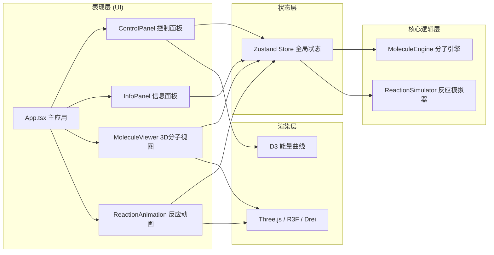

## 1. 架构设计



## 2. 技术说明
- 前端框架：React@18 + TypeScript@5 + Vite@5
- 3D渲染：three@0.160 + @react-three/fiber@8 + @react-three/drei@9
- 图表库：d3@7 + d3-scale
- 状态管理：zustand@4
- 工具库：uuid、dayjs
- 样式方案：纯CSS（global.css） + CSS变量，不使用Tailwind

## 3. 目录结构
```
src/
├── App.tsx                 # 主应用组件
├── main.tsx               # 应用入口
├── vite-env.d.ts          # Vite类型声明
├── modules/
│   ├── MoleculeEngine.ts  # 分子构建编辑核心逻辑
│   └── ReactionSimulator.ts # 反应路径模拟和能量计算
├── components/
│   ├── MoleculeViewer.tsx     # 3D分子渲染组件
│   ├── ReactionAnimation.tsx  # 反应动画组件
│   ├── ControlPanel.tsx       # 控制面板
│   └── InfoPanel.tsx          # 信息面板
├── store/
│   └── useMoleculeStore.ts    # Zustand状态管理
└── styles/
    └── global.css             # 全局样式
```

## 4. 数据模型

### 4.1 类型定义
```typescript
// 原子数据
interface Atom {
  id: string;
  element: 'C' | 'N' | 'O' | 'H' | 'S' | 'P' | 'Cl' | 'Br' | 'I';
  position: { x: number; y: number; z: number };
  charge: number;
}

// 化学键数据
interface Bond {
  id: string;
  atomA: string;
  atomB: string;
  order: 1 | 2 | 3; // 单键/双键/三键
}

// 分子结构
interface Molecule {
  id: string;
  name: string;
  atoms: Atom[];
  bonds: Bond[];
}

// 反应路径点
interface ReactionPoint {
  coordinate: number;   // 反应坐标 0~1
  energy: number;       // 能量 kJ/mol
  molecule: Molecule;   // 当前分子结构
  label?: 'reactant' | 'transition' | 'intermediate' | 'product';
}

// 反应模拟结果
interface ReactionResult {
  path: ReactionPoint[];
  enthalpy: number;     // 焓变
  activationEnergy: number; // 活化能
  reactionType: string;
}
```

## 5. 核心模块说明

### 5.1 MoleculeEngine（分子引擎）
- `addAtom(element, position)`: 添加原子，自动检查邻近原子并提示成键
- `removeAtom(id)`: 删除原子及关联化学键
- `updateAtomPosition(id, position)`: 更新原子坐标
- `addBond(atomA, atomB, order)`: 创建化学键，自动计算键长
- `removeBond(id)`: 删除化学键
- `getMolecule()`: 导出完整分子结构数据
- `getAtomsNear(position, threshold)`: 查找阈值范围内的原子

### 5.2 ReactionSimulator（反应模拟器）
- `simulate(reactantA, reactantB)`: 执行反应模拟，生成路径和能量数据
- `calculateEnergy(molecule)`: 基于键能近似计算分子总能量
- `interpolatePath(start, end, steps)`: 在反应物和产物间插值生成中间帧
- `identifyTransitionStates(path)`: 识别能量峰值作为过渡态

### 5.3 Zustand Store
- `atoms`, `bonds`: 当前分子的原子和键列表
- `selectedAtomId`, `selectedBondId`: 选中对象
- `editMode`: 'atom' | 'bond' | 'select'
- `currentBondOrder`: 1 | 2 | 3
- `reactionResult`: 模拟结果数据
- `animationProgress`: 0~1 动画进度
- `animationPlaying`: 是否播放中
- actions: 对应各引擎方法的封装

## 6. 性能优化
- InstancedMesh 渲染多个同类原子球体，减少DrawCall
- 化学键复用Geometry，按材质分组
- 粒子特效使用Points + BufferGeometry
- 能量曲线仅在数据变化时重绘
- requestAnimationFrame 驱动动画，自动降级帧率
- 原子数量超过100时关闭阴影投射
