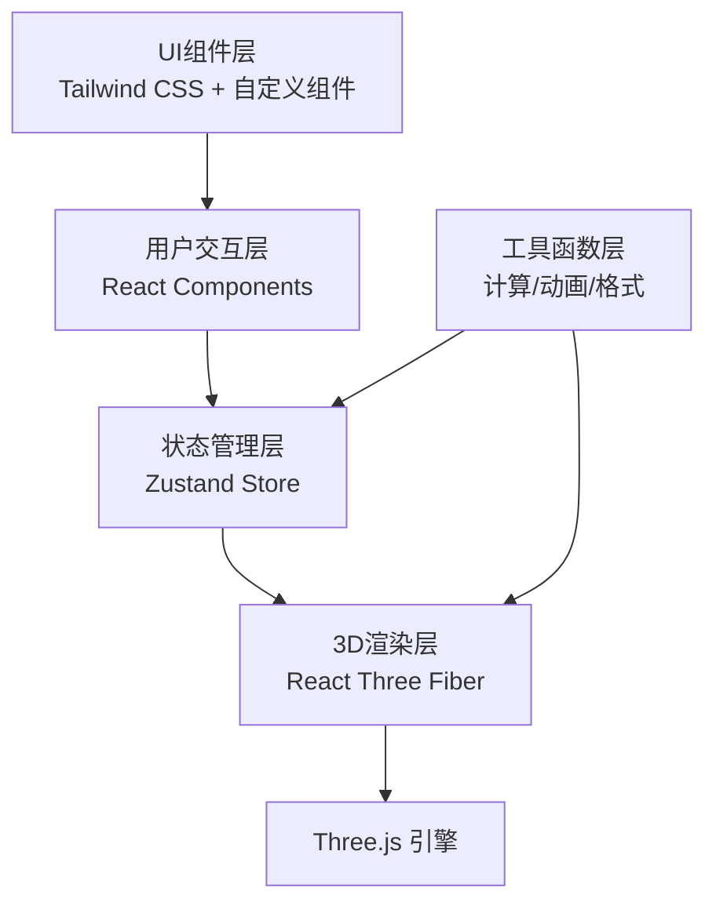
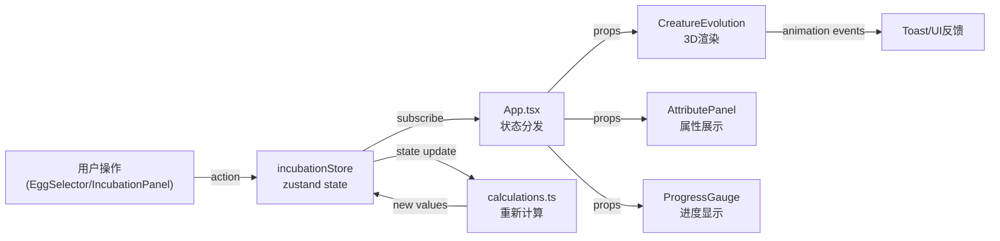
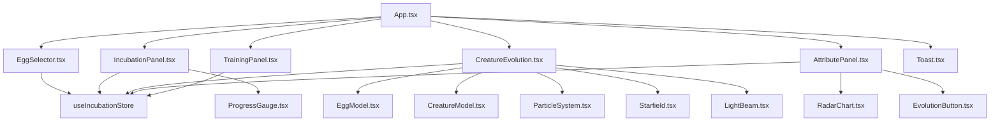

## 1. 架构设计



## 2. 技术描述

- **前端框架**：React 18 + TypeScript
- **构建工具**：Vite 5
- **状态管理**：Zustand 4
- **3D渲染**：Three.js + @react-three/fiber + @react-three/drei + @react-three/postprocessing
- **样式方案**：Tailwind CSS 3
- **图标库**：lucide-react
- **动画库**：CSS动画 + Three.js动画系统

## 3. 目录结构

```
src/
├── App.tsx                    # 主应用组件，全局布局与状态分发
├── main.tsx                   # 应用入口
├── index.css                  # 全局样式与Tailwind配置
├── store/
│   └── incubationStore.ts     # Zustand状态管理（核心状态与操作）
├── components/
│   ├── EggSelector.tsx        # 灵兽蛋选择卡片列表
│   ├── IncubationPanel.tsx    # 孵化环境控制与进度面板
│   ├── CreatureEvolution.tsx  # 3D场景与灵兽模型渲染
│   ├── AttributePanel.tsx     # 幼兽属性雷达图与成长树
│   ├── TrainingPanel.tsx      # 培养操作面板（喂食/训练）
│   ├── EvolutionButton.tsx    # 进化按钮组件
│   ├── ProgressGauge.tsx      # 圆形进度仪表盘
│   ├── RadarChart.tsx         # 六维属性雷达图
│   ├── Toast.tsx              # Toast提示组件
│   └── ThreeScene/            # 3D相关子组件目录
│       ├── EggModel.tsx       # 灵兽蛋3D模型
│       ├── CreatureModel.tsx  # 灵兽3D模型（三个阶段）
│       ├── ParticleSystem.tsx # 粒子系统组件
│       ├── Starfield.tsx      # 星空背景
│       └── LightBeam.tsx      # 进化光柱特效
├── hooks/
│   ├── useIncubation.ts       # 孵化逻辑Hook
│   └── useEvolution.ts        # 进化动画Hook
├── utils/
│   ├── calculations.ts        # 成功率计算、属性生成
│   ├── constants.ts           # 常量定义（灵兽数据、配置）
│   └── types.ts               # TypeScript类型定义
└── types/
    └── index.ts               # 共享类型定义
```

## 4. 数据流向图



## 5. 核心类型定义

```typescript
// 灵兽类型
type CreatureType = 'phoenix' | 'dragon' | 'wolf' | 'tortoise';

// 进化阶段
type EvolutionStage = 'egg' | 'baby' | 'adult' | 'evolved';

// 灵兽属性
interface CreatureStats {
  health: number;      // 0-100
  attack: number;      // 0-100
  defense: number;     // 0-100
  speed: number;       // 0-100
  spirit: number;      // 0-100
  potential: number;   // 0-100 成长潜力
}

// 灵兽蛋配置
interface EggConfig {
  id: CreatureType;
  name: string;
  rarity: 'common' | 'rare' | 'epic' | 'legendary';
  baseSuccessRate: number;
  color: string;
  glowColor: string;
  element: 'fire' | 'ice' | 'thunder' | 'earth';
}

// 环境参数
interface EnvironmentParams {
  temperature: number;  // -10 至 50
  humidity: number;     // 0 至 100
  aura: number;         // 0 至 200
}

// 孵化状态
interface IncubationState {
  selectedEgg: CreatureType | null;
  environment: EnvironmentParams;
  successRate: number;
  incubationProgress: number;  // 0-100
  isIncubating: boolean;
  remainingTime: number;       // 秒
  evolutionStage: EvolutionStage;
  creatureStats: CreatureStats | null;
  level: number;
  experience: number;
  feedingCount: number;
  trainingCount: number;
  canEvolve: boolean;
  isEvolving: boolean;
}
```

## 6. 状态管理设计

**incubationStore** (zustand):

```typescript
interface IncubationStore extends IncubationState {
  // Actions
  selectEgg: (type: CreatureType) => void;
  setEnvironment: (params: Partial<EnvironmentParams>) => void;
  startIncubation: () => void;
  updateProgress: (delta: number) => void;
  completeIncubation: () => void;
  feedCreature: () => void;
  trainCreature: () => void;
  evolve: () => void;
  reset: () => void;
  calculateSuccessRate: () => number;
}
```

## 7. 组件调用关系



## 8. 性能优化策略

1. **3D性能**：
   - 模型面数控制在10k三角面以内
   - 粒子系统数量≤500
   - 使用InstancedMesh渲染重复元素
   - 材质复用，减少draw call
   - 按需启用后处理效果

2. **React性能**：
   - 使用React.memo避免不必要重渲染
   - Zustand选择器细粒度订阅状态
   - useMemo/useCallback缓存计算结果和回调
   - 列表项使用唯一key

3. **动画性能**：
   - CSS动画优先使用transform和opacity
   - Three.js动画使用requestAnimationFrame
   - 进化动画使用帧插值，避免卡顿
   - 粒子动画使用GPU加速的Points材质

## 9. 响应式断点

| 断点 | 布局变化 |
|------|----------|
| > 1200px | 三栏标准布局，左右面板各300px |
| 900-1200px | 左右面板各260px，3D视口自适应 |
| ≤ 900px | 垂直堆叠布局，面板可滚动，3D视口60vh |
