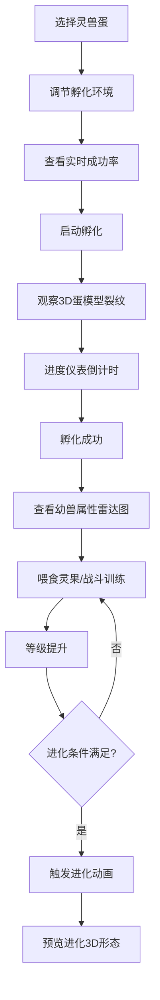

## 1. 产品概述

灵兽孵化与进化模拟器是一款面向奇幻主题游戏玩家的3D交互应用，用户可以选择不同属性的灵兽蛋，调节孵化环境参数，实时预览孵化过程，培养灵兽并触发进化形态。

- 核心价值：为玩家提供直观的灵兽培养预览体验，帮助理解不同环境参数对孵化结果的影响
- 目标用户：奇幻RPG游戏玩家、灵兽收集爱好者
- 市场定位：游戏辅助工具与互动展示平台

## 2. 核心功能

### 2.1 用户角色

| 角色 | 注册方式 | 核心权限 |
|------|----------|----------|
| 普通用户 | 无需注册 | 使用所有孵化、培养、进化功能 |

### 2.2 功能模块

1. **灵兽蛋选择模块**：展示四种灵兽蛋（火凤、冰龙、雷狼、岩龟）卡片，支持选择
2. **孵化环境控制模块**：温度、湿度、灵气场三个滑块调节，实时计算孵化成功率
3. **3D孵化预览模块**：实时显示灵兽蛋3D模型，随进度展示裂纹动画
4. **孵化进度仪表模块**：圆形进度仪表盘，显示倒计时和完成度
5. **幼兽属性面板模块**：六边形雷达图展示六维属性，成长树显示进化阶段
6. **进化动画模块**：满足条件后触发进化动画，展示3D进化形态
7. **培养系统模块**：喂食灵果和战斗训练提升等级和经验

### 2.3 页面详情

| 页面名称 | 模块名称 | 功能描述 |
|----------|----------|----------|
| 主页面 | 灵兽蛋选择 | 卡片列表展示四种灵兽蛋，点击选择后高亮显示 |
| 主页面 | 环境控制 | 三个滑块调节参数，实时显示成功率百分比和图标动效 |
| 主页面 | 3D孵化场景 | 中央3D视口展示灵兽蛋/灵兽模型，支持旋转查看 |
| 主页面 | 进度仪表 | 右侧圆形仪表盘显示孵化进度和倒计时 |
| 主页面 | 属性面板 | 孵化成功后展示雷达图和成长树 |
| 主页面 | 培养操作 | 喂食灵果和战斗训练按钮，提升成长值 |
| 主页面 | 进化功能 | 条件满足时显示进化按钮，点击触发进化动画 |

## 3. 核心流程

用户从选择灵兽蛋开始，调节环境参数优化孵化成功率，启动孵化后观察3D蛋模型的裂纹变化和进度仪表，孵化成功后查看幼兽属性，通过喂食和训练提升等级，最终触发进化动画预览最终形态。

## 4. 用户界面设计

### 4.1 设计风格

- **主色调**：深色奇幻风格，背景 `#0d0d1a`，面板 `#1a1a2e`（半透明磨砂玻璃效果）
- **品牌色**：紫色 `#6c63ff`（按钮），悬停 `#8b83ff`
- **高亮色**：金色 `#ffd700`（进度完成、属性点）
- **边框色**：`#2d2d44`
- **字体色**：`#b0b0d0`（发光字体）
- **按钮风格**：圆角8px，悬停上浮2px阴影，点击缩放0.95弹性反馈
- **字体**：使用Cinzel Decorative（标题）+ Lato（正文）组合，营造奇幻氛围
- **图标**：lucide-react图标库，火焰、水滴、闪电等元素图标
- **布局**：三栏布局，左右浮动面板，中央3D视口为主区域

### 4.2 页面设计概述

| 页面名称 | 模块名称 | UI元素 |
|----------|----------|--------|
| 主页面 | 灵兽蛋选择 | 卡片网格，每个卡片有独特颜色、光效、稀有度标签，悬停缩放1.02 |
| 主页面 | 环境控制 | 垂直滑块组，每个滑块底部有图标，拖动时图标脉冲放大，成功率颜色根据阈值变化 |
| 主页面 | 3D孵化场景 | 深色星空背景，柔和环境光，模型居中展示，支持鼠标拖拽旋转 |
| 主页面 | 进度仪表 | 圆形进度条，颜色从蓝渐变至橙，中央MM:SS倒计时，孵化完成时粒子爆发 |
| 主页面 | 属性面板 | 六边形雷达图，半透明蓝色网格，金色属性点带呼吸光效，下方线性成长树 |
| 主页面 | 培养操作 | 两个操作按钮，带计数显示，点击有粒子反馈 |
| 主页面 | 进化功能 | 金色闪烁按钮，进化时1.5秒旋转缩放+粒子漩涡动画，2秒光柱特效 |
| 主页面 | Toast提示 | 底部滑入，5秒淡出，成功孵化/进化时触发 |

### 4.3 响应式设计

- 桌面端（>900px）：三栏布局，左右浮动面板，中央3D视口
- 移动端（≤900px）：垂直堆叠布局，左右面板改为上下排列，可滚动，3D视口高度60vh
- 触摸优化：按钮最小44x44px，滑块增加触摸区域

### 4.4 3D场景指导

- **环境**：深色星空背景，使用Shader创建星云粒子效果，营造奇幻氛围
- **光照**：主方向光+环境光+点光源，根据灵兽属性调整光源颜色（火凤偏红橙，冰龙偏蓝白）
- **相机**：PerspectiveCamera，fov 50，初始距离3，支持OrbitControls旋转缩放
- **模型**：
  - 灵兽蛋：椭球体几何，程序化生成裂纹纹理，随孵化进度增加裂纹数量和深度
  - 灵兽：程序化生成低模（<10k三角面），三个进化阶段使用不同几何和材质
  - 粒子系统：Points实现，数量≤500，用于孵化完成、进化动画、光柱特效
- **动画**：
  - 孵化过程：蛋壳裂纹从中心向四周扩散
  - 呼吸动画：模型轻微上下浮动
  - 进化动画：0.5秒快速旋转缩放，粒子漩涡包裹1.5秒，2秒光柱特效
- **后处理**：Bloom效果增强发光元素，SSAO增加场景深度感
- **性能**：模型面数<10k，粒子数<500，目标帧率60FPS
