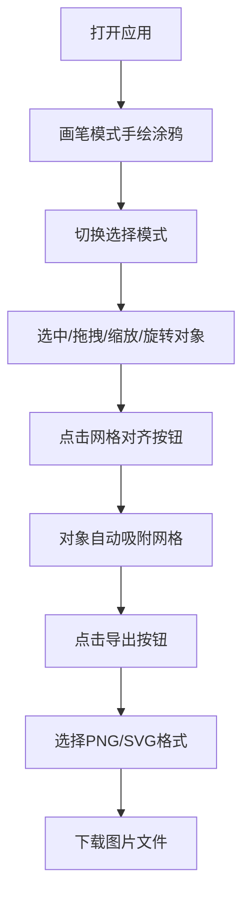

## 1. 产品概述

手绘涂鸦排版工具是一款在线白板应用，让用户在无限画布上自由手绘涂鸦，并通过网格对齐功能一键整理成PPT风格的整洁布局，最终导出为PNG或SVG图片。

- 核心价值：结合自由手绘的创意表达与PPT化的规整排版，满足创意工作者快速构思、整理、导出视觉内容的需求
- 目标用户：设计师、产品经理、教师、学生等需要快速绘制和整理视觉想法的人群

## 2. 核心功能

### 2.1 用户角色
| 角色 | 注册方式 | 核心权限 |
|------|----------|----------|
| 普通用户 | 无需注册，直接使用 | 自由绘制、选择编辑、网格对齐、导出图片 |

### 2.2 功能模块
1. **无限画布**：支持平移、缩放的无限绘制区域
2. **画笔工具**：多种笔触粗细和颜色的自由手绘
3. **选择工具**：对象选中、拖拽、缩放、旋转、删除
4. **网格对齐**：一键将选中对象吸附到网格交叉点
5. **导出功能**：PNG/SVG格式图片导出

### 2.3 页面详情
| 页面名称 | 模块名称 | 功能描述 |
|-----------|-------------|---------------------|
| 主画布页 | 浮动工具条 | 画笔/选择工具切换、笔触设置、网格对齐、导出按钮 |
| 主画布页 | 无限画布 | 浅米色背景、圆点网格辅助线、手绘笔迹渲染 |
| 主画布页 | 状态栏 | 显示当前模式、选中对象数、画布坐标、缩放比例 |
| 主画布页 | 导出对话框 | PNG/SVG格式选择、导出执行、成功提示 |

## 3. 核心流程

用户打开应用 → 在画笔模式下自由手绘涂鸦 → 切换到选择模式框选对象 → 拖拽/缩放/旋转调整位置 → 点击网格对齐按钮自动排版 → 点击导出按钮选择格式 → 下载图片文件

## 4. 用户界面设计

### 4.1 设计风格
- **主色调**：浅米色(#faf3e0)背景、品牌色#e67e22作为交互强调色
- **辅助色**：浅灰色(#e0d8c8)网格、蓝色虚线选中框、#8a7f6e文字
- **按钮风格**：圆角16px，半透明浮动，柔和阴影，悬停微放大效果
- **字体**：小号优雅字体，状态信息简洁呈现
- **布局风格**：画布中心区+左上浮动工具条+底部状态栏，极简专注
- **图标风格**：简洁线性图标，选中状态高亮显示

### 4.2 页面设计概览
| 页面名称 | 模块名称 | UI元素 |
|-----------|-------------|-------------|
| 主画布页 | 浮动工具条 | 半透明背景rgba(255,247,240,0.9)、圆角16px、柔和阴影、画笔/选择/网格/导出四个图标按钮 |
| 主画布页 | 画笔展开面板 | 1-20px粗细滑块、8种预设颜色色块、选中色块放大1.2倍+#e67e22光晕 |
| 主画布页 | 无限画布 | #faf3e0背景、30px间距#e0d8c8圆点网格、平滑缩放过渡 |
| 主画布页 | 选中状态 | 蓝色虚线边框、8个缩放控制点、顶部圆形旋转手柄、中央角度标签 |
| 主画布页 | 状态栏 | #f0e8d8背景、40px高度、1px #d4cbb8顶部分隔线、#8a7f6e小号字体、悬停加粗 |
| 主画布页 | 导出对话框 | 半透明遮罩、居中对话框、PNG/SVG两个格式按钮、成功toast提示 |

### 4.3 响应式
- 桌面端优先设计，完整功能支持
- 移动端适配触摸手势：双指平移、捏合缩放
- 工具条在小屏幕上自动调整位置避免遮挡

### 4.4 动效设计
- 色块选中：1.2倍缩放 + #e67e22光晕淡入
- 网格对齐：吸附后轻微弹跳动画（bounce easing）
- 缩放/平移：平滑过渡动画
- 导出成功：toast淡入淡出提示
- 工具条按钮：悬停时背景加深、轻微上浮
