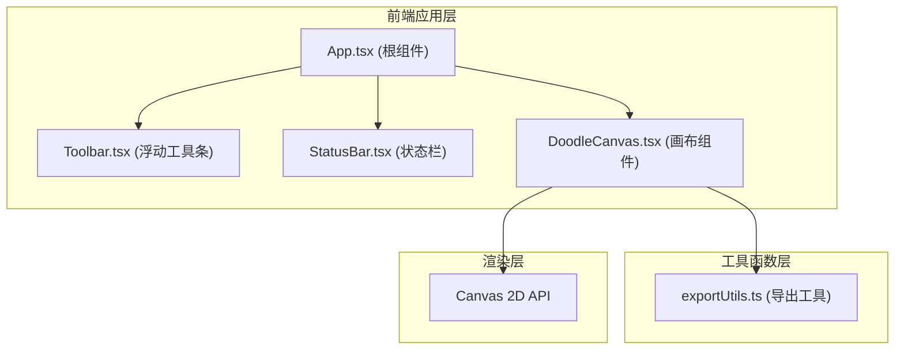

## 1. 架构设计



## 2. 技术描述
- **前端框架**：React@18 + TypeScript + Vite
- **UI构建**：原生HTML/CSS，不引入额外UI库
- **图标**：lucide-react 线性图标库
- **渲染引擎**：Canvas 2D API 实现高性能手绘渲染
- **状态管理**：React useState/useRef 管理局部状态，无全局状态库
- **初始化工具**：Vite脚手架

## 3. 数据结构定义

### 3.1 涂鸦对象数据模型

```typescript
interface Point {
  x: number;
  y: number;
}

interface DoodleStroke {
  id: string;
  points: Point[];
  color: string;
  thickness: number;
  // 变换属性
  x: number;           // 对象X坐标（bounding box左上角）
  y: number;           // 对象Y坐标
  width: number;       // 对象宽度
  height: number;      // 对象高度
  rotation: number;    // 旋转角度（弧度）
  scaleX: number;      // X轴缩放比例
  scaleY: number;      // Y轴缩放比例
}

interface CanvasState {
  offsetX: number;     // 画布水平偏移
  offsetY: number;     // 画布垂直偏移
  zoom: number;        // 缩放比例 0.1-5
}

type ToolMode = 'brush' | 'select';
```

## 4. 核心模块说明

### 4.1 DoodleCanvas.tsx
- 职责：画布渲染、手势处理、对象管理、导出功能
- 主要功能：
  - 背景网格渲染（圆点30px间距）
  - 笔迹实时绘制（贝塞尔曲线+抖动+笔锋效果）
  - 鼠标/触摸平移（带惯性）
  - 滚轮/捏合缩放（0.1x-5x平滑过渡）
  - 对象命中测试与选择
  - 对象拖拽、缩放（Shift等比）、旋转
  - Delete键删除
  - 网格对齐吸附（带弹跳动画）
  - SVG矢量导出（保留贝塞尔曲线）

### 4.2 Toolbar.tsx
- 职责：工具模式切换、画笔参数设置、导出入口
- 主要功能：
  - 画笔/选择工具切换按钮
  - 笔触粗细滑块（1-20px）
  - 8种预设颜色选择（选中状态放大+光晕）
  - 网格对齐触发按钮
  - 导出按钮（弹出格式选择对话框）

### 4.3 StatusBar.tsx
- 职责：显示画布状态信息
- 主要功能：
  - 当前模式显示
  - 选中对象数量
  - 鼠标/触摸画布坐标
  - 缩放比例百分比显示

### 4.4 exportUtils.ts
- 职责：图片导出工具函数
- 主要功能：
  - `canvasToPNG`: Canvas转PNG并下载
  - `canvasToSVG`: 涂鸦数据转SVG矢量格式并下载

## 5. 性能优化策略

### 5.1 渲染优化
- 使用离屏Canvas缓存静态内容（背景网格）
- requestAnimationFrame驱动渲染循环
- 局部重绘：仅重绘变更区域
- 笔迹绘制时使用Path2D批量渲染

### 5.2 交互优化
- 手势节流：mousemove/touchmove事件使用requestAnimationFrame调度
- 平移惯性：使用速度衰减算法实现平滑滚动
- 命中测试优化：使用空间索引或bounding box快速排除

### 5.3 内存管理
- 及时释放临时Canvas资源
- 限制历史撤销栈大小
- 大画布导出时使用分块处理

## 6. 文件结构

```
auto93/
├── index.html
├── package.json
├── vite.config.js
├── tsconfig.json
└── src/
    ├── main.tsx
    ├── App.tsx
    ├── canvas/
    │   └── DoodleCanvas.tsx
    ├── ui/
    │   ├── Toolbar.tsx
    │   └── StatusBar.tsx
    └── utils/
        └── exportUtils.ts
```
