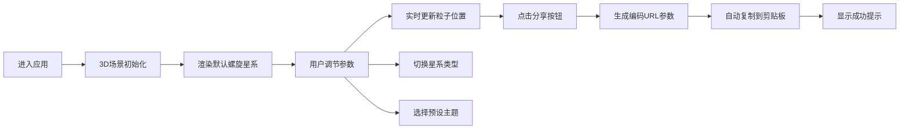

## 1. 产品概述

在线交互式3D粒子星系生成与参数调优应用，用户可在三维场景中创建并控制数千个粒子组成的星系形态，通过调节粒子运动参数实时改变星系外观，并支持将当前状态保存为可分享的URL参数片段。

- 核心功能：三种星系形态切换、参数实时调节、粒子视觉效果、状态保存分享、预设主题切换
- 目标用户：天文爱好者、设计师、创意工作者
- 产品价值：提供沉浸式的星系可视化体验，支持参数化创作和社交分享

## 2. 核心 Features

### 2.1 Feature Module

1. **3D星系场景**：粒子系统渲染、相机轨道控制、粒子动画更新
2. **参数控制面板**：星系形态选择、参数滑块调节、步进按钮控制
3. **状态管理系统**：全局参数状态、粒子位置数据、动画过渡逻辑
4. **分享功能**：URL参数编码、剪贴板复制、成功提示
5. **预设主题系统**：三套预设参数、缩略预览图、平滑过渡切换

### 2.2 Page Details

| Page Name | Module Name | Feature description |
|-----------|-------------|---------------------|
| 主页面 | 3D场景区域 | 全屏Three.js渲染，粒子星系动画，鼠标拖拽旋转视角，滚轮缩放 |
| 主页面 | 左侧控制面板 | 星系类型下拉选择，4个参数滑块（旋转速度、引力强度、色散范围、粒子数量），FPS和名称显示 |
| 主页面 | 预设主题卡片 | 底部三卡（银河、仙女座、风车），点击渐变过渡，带Mini Canvas缩略图 |
| 主页面 | 分享按钮 | 右下角链接图标按钮，生成URL参数，自动复制，成功提示 |
| 主页面 | 背景星光层 | 随机闪烁星光粒子，深度排序最底层 |

## 3. 核心流程

用户进入应用 → 3D场景初始化加载默认螺旋星系 → 拖动参数滑块实时调节星系形态 → 选择不同星系类型平滑过渡 → 点击预设卡片应用主题 → 调整满意后点击分享按钮生成URL → 分享链接给他人查看相同配置

## 4. 用户界面设计

### 4.1 Design Style

- **设计风格**：深空科技风格，沉浸式3D体验
- **主色调**：深空背景 #0d0d1a → #1a1a2e 径向渐变
- **强调色**：亮青色 #64ffda（数值显示），暖橙色 #ff6b35（星系内圈），冷蓝色 #4dabf7（星系外圈）
- **辅助色**：浅蓝灰 #a0b0d0（标签文字），深色卡片 #232340
- **按钮风格**：圆角8px，悬停轻微上浮+亮度提升，0.2s过渡动画
- **字体**：使用 Orbitron 作为标题字体，JetBrains Mono 作为数值显示字体，避免 Inter 等通用字体
- **布局**：左侧30%控制面板（半透明），右侧70% 3D场景
- **图标**：线性科技风格图标

### 4.2 Page Design Overview

| Page Name | Module Name | UI Elements |
|-----------|-------------|-------------|
| 主页面 | 3D场景区域 | 全屏Three.js Canvas，深空径向渐变背景，随机闪烁星光粒子层，轨道控制器，粒子发光效果 |
| 主页面 | 左侧控制面板 | 背景rgba(20,20,40,0.85)，圆角16px，左侧与底部20px间距，深色参数卡片（#232340，圆角12px，间距8px），标签#a0b0d0，数值#64ffda，顶部显示星系名称和FPS |
| 主页面 | 参数滑块 | 轨道高度8px，圆形滑块直径20px，实时数值显示，+/-步进按钮（步长1） |
| 主页面 | 预设卡片 | 宽80px高50px，圆角8px，Mini Canvas缩略图（10x10），悬停上浮+亮度提升，底部排列 |
| 主页面 | 分享按钮 | 右下角链接图标，悬停缩放1.1倍，点击生成编码URL |
| 主页面 | 成功提示 | 淡入1.5秒后消失，亮青色调 |

### 4.3 Responsiveness

- **桌面优先设计**：针对大屏幕优化，1920x1080为基准分辨率
- **响应式适配**：窗口大小变化时3D场景自适应，控制面板最小宽度300px
- **触控优化**：支持移动端双指缩放、单指旋转视角

### 4.4 3D Scene Guidance

- **环境**：纯深空背景，径向渐变从 #0d0d1a 到 #1a1a2e
- **光照**：使用点光源模拟星系中心发光，粒子自发光效果
- **相机**：PerspectiveCamera，初始位置(0, 50, 150)，fov 60度，近裁面0.1，远裁面1000
- **相机运动**：OrbitControls 轨道控制，支持自动旋转（可切换），阻尼效果
- **粒子系统**：Three.js Points + BufferGeometry，自定义着色器实现颜色渐变和大小衰减
- **材质**：PointsMaterial，使用圆形透明贴图实现发光效果，sizeAttenuation 开启
- **动画**：requestAnimationFrame 循环，每秒更新粒子位置，参数变化响应延迟≤50ms
- **后处理**：轻微Bloom效果增强粒子发光感，无需ToneMapping
- **性能预算**：5000粒子时≥30fps，GPU内存≤200MB
