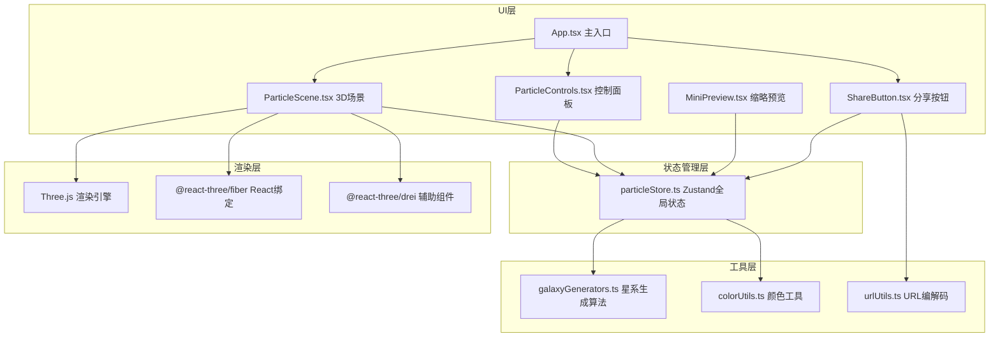

## 1. Architecture Design



## 2. Technology Description

- **前端框架**：React@18 + TypeScript@5
- **构建工具**：Vite@5
- **3D渲染**：three@0.160 + @react-three/fiber@8 + @react-three/drei@9
- **状态管理**：zustand@4
- **唯一ID**：uuid@9
- **类型定义**：@types/react、@types/react-dom、@types/three
- **样式方案**：CSS Modules + CSS Variables（避免使用tailwindcss以获得更精细的动画控制）

## 3. 项目文件结构

| 文件路径 | 作用 |
|---------|------|
| `package.json` | 依赖配置，启动脚本 npm run dev |
| `vite.config.js` | React+TypeScript 构建配置 |
| `tsconfig.json` | TypeScript 严格模式配置 |
| `index.html` | 入口页面，挂载点，字体引入 |
| `src/main.tsx` | React 入口渲染 |
| `src/App.tsx` | 主应用组件，布局容器 |
| `src/types.ts` | 类型定义：星系形态枚举、粒子位置、参数配置接口 |
| `src/particleStore.ts` | Zustand 全局状态，参数与粒子位置管理 |
| `src/ParticleScene.tsx` | Three.js 场景，粒子系统，相机控制 |
| `src/ParticleControls.tsx` | 参数控制面板，滑块组件 |
| `src/utils/galaxyGenerators.ts` | 三种星系形态生成算法 |
| `src/utils/colorUtils.ts` | 颜色插值、渐变工具 |
| `src/utils/urlUtils.ts` | URL 参数编解码 |
| `src/components/MiniPreview.tsx` | 预设卡片缩略图组件 |
| `src/components/ShareButton.tsx` | 分享按钮组件 |
| `src/components/CustomSlider.tsx` | 自定义滑块组件 |
| `src/components/StarBackground.tsx` | 背景星光层 |
| `src/styles/global.css` | 全局样式，CSS Variables |

## 4. 核心数据类型定义

```typescript
// src/types.ts
export enum GalaxyType {
  SPIRAL = 'spiral',       // 螺旋星系
  BARRED = 'barred',       // 棒旋星系
  ELLIPTICAL = 'elliptical' // 椭圆星系
}

export interface ParticlePosition {
  x: number;
  y: number;
  z: number;
  originalX: number;
  originalY: number;
  originalZ: number;
  angle: number;
  radius: number;
  color: [number, number, number];
  size: number;
}

export interface GalaxyParams {
  type: GalaxyType;
  rotationSpeed: number;   // 0-100
  gravityStrength: number; // 0-100
  dispersionRange: number; // 0-100
  particleCount: number;   // 500-5000
}

export interface PresetTheme {
  id: string;
  name: string;
  params: GalaxyParams;
}
```

## 5. 状态管理设计

### 5.1 Zustand Store 定义

```typescript
// src/particleStore.ts
interface ParticleState {
  params: GalaxyParams;
  particles: ParticlePosition[];
  targetParticles: ParticlePosition[];
  isTransitioning: boolean;
  transitionProgress: number;
  fps: number;
  
  // Actions
  setParams: (params: Partial<GalaxyParams>) => void;
  generateParticles: (type: GalaxyType, count: number) => void;
  updateParticlePositions: (deltaTime: number) => void;
  startTransition: (newType: GalaxyType) => void;
  applyPreset: (preset: PresetTheme) => void;
  encodeToURL: () => string;
  decodeFromURL: (hash: string) => void;
  setFps: (fps: number) => void;
}
```

## 6. 星系生成算法设计

### 6.1 螺旋星系 (Spiral)
- 使用对数螺线公式：r = a * e^(b*θ)
- 粒子沿4条螺线臂分布
- 添加随机径向扰动模拟色散
- 角度范围：0 ~ 4π

### 6.2 棒旋星系 (Barred)
- 中央生成水平棒状密集区（长度约为半径的30%）
- 棒的两端延伸出螺线臂
- 中央区域粒子密度提高2倍
- 螺线从棒的两端开始

### 6.3 椭圆星系 (Elliptical)
- 三维高斯分布
- 使用 Box-Muller 变换生成正态分布
- 沿Z轴压缩（椭率0.6）
- 中心密度高，向外逐渐降低

### 6.4 平滑过渡动画
- 动画时长：1500ms
- 缓动函数：easeOutCubic
- 粒子位置插值：current = start + (target - start) * progress
- 颜色和大小同步插值

## 7. 性能优化策略

1. **BufferGeometry 复用**：使用单个 BufferGeometry 存储所有粒子位置、颜色、大小数据，避免频繁创建对象
2. **TypedArray 直接操作**：直接更新 Float32Array，避免数组遍历开销
3. **requestAnimationFrame 节流**：参数变化时标记脏数据，在下一帧统一更新
4. **粒子数量限制**：滑块限制在500-5000范围，实时重建粒子系统
5. **材质共享**：所有粒子使用同一 PointsMaterial，减少Draw Call
6. **透明贴图预生成**：圆形发光贴图使用 Canvas 预生成，避免重复创建
7. **frustumCulled 关闭**：粒子系统禁用视锥剔除，确保粒子始终可见
8. **FPS 监控**：实时计算帧率，低于30时自动降低粒子数量（可选降级）

## 8. 预设主题配置

```typescript
export const PRESET_THEMES: PresetTheme[] = [
  {
    id: 'milky-way',
    name: '银河',
    params: {
      type: GalaxyType.SPIRAL,
      rotationSpeed: 45,
      gravityStrength: 60,
      dispersionRange: 25,
      particleCount: 3000
    }
  },
  {
    id: 'andromeda',
    name: '仙女座',
    params: {
      type: GalaxyType.BARRED,
      rotationSpeed: 35,
      gravityStrength: 75,
      dispersionRange: 20,
      particleCount: 4000
    }
  },
  {
    id: 'pinwheel',
    name: '风车',
    params: {
      type: GalaxyType.SPIRAL,
      rotationSpeed: 70,
      gravityStrength: 40,
      dispersionRange: 35,
      particleCount: 3500
    }
  }
];
```

## 9. URL 编码设计

```typescript
// 编码流程：参数对象 → JSON序列化 → Base64编码 → URL参数
// 解码流程：读取URL hash → Base64解码 → JSON解析 → 应用参数

// 示例URL: https://galaxy-app.com/#eyJ0eXBlIjoic3BpcmFsIiwicm90YXRpb25TcGVlZCI6NDUsImdyYXZpdHlTdHJlbmd0aCI6NjAsImRpc3BlcnNpb25SYW5nZSI6MjUsInBhcnRpY2xlQ291bnQiOjMwfQ==
```
