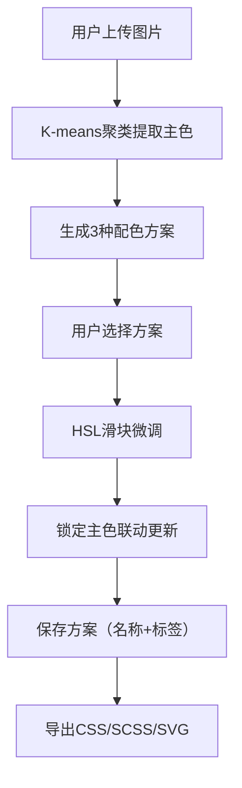

## 1. 产品概述

调色大师是一款面向设计师和前端开发者的在线交互式调色板生成与色彩方案管理工具，帮助用户快速从灵感图片中提取主色调、生成协调配色方案并导出为可用的代码格式。

- 核心价值：解决设计师和前端开发者在项目初期难以快速从灵感图片中提取主色、生成协调配色方案的痛点
- 目标用户：UI设计师、前端开发者、品牌设计师
- 产品定位：轻量级、高效率的在线色彩设计工具

## 2. 核心功能

### 2.1 用户角色
| 角色 | 注册方式 | 核心权限 |
|------|----------|----------|
| 普通用户 | 无需注册，本地存储 | 上传图片、提取颜色、生成配色方案、保存/管理方案、导出代码 |

### 2.2 功能模块
1. **图片色彩提取模块**：K-means聚类算法提取5种主色调，按频率排序展示
2. **配色方案生成模块**：基于主色生成单色渐变、互补色、三元色三种方案
3. **配色编辑模块**：HSL滑块微调，锁定主色，实时联动更新
4. **方案管理模块**：本地存储保存方案，标签筛选，关键字搜索
5. **导出模块**：CSS变量、SCSS变量、SVG调色板图片导出
6. **主题切换模块**：深色/浅色模式一键切换，300ms缓动动画

### 2.3 页面详情
| 页面名称 | 模块名称 | 功能描述 |
|----------|----------|----------|
| 主应用页面 | 顶部导航栏 | Logo展示、主题切换、导出按钮 |
| 主应用页面 | 左侧面板 | 图片上传区、色彩提取结果色块卡片 |
| 主应用页面 | 中间编辑区 | 三种配色方案对比展示、HSL滑块调整 |
| 主应用页面 | 右侧面板 | 已保存方案列表、标签筛选、搜索框 |
| 主应用页面 | 导出模态框 | CSS/SCSS代码预览复制、SVG图片下载 |

## 3. 核心流程

### 主使用流程
用户上传图片 → 系统自动提取5种主色调 → 生成3种配色方案 → 用户选择并调整配色 → 保存方案到本地 → 导出为CSS/SCSS/SVG格式

## 4. 用户界面设计

### 4.1 设计风格
- **设计理念**：极简材质设计（Material Design变体），以内容为中心，减少视觉干扰
- **主色调**：品牌色 #7c5cfc（紫色），用于交互元素和强调
- **浅色模式**：背景 #fafafa，卡片 #ffffff，文字 #333333，边框 #d0d0d0
- **深色模式**：背景 #121212，卡片 #1e1e2e，文字 #e0e0e0，边框 #333333
- **字体**：使用 'Inter' 作为主要字体，搭配 'Noto Sans SC' 支持中文
- **圆角规范**：上传区 16px，卡片 12px，按钮 8px
- **动画规范**：所有交互过渡 300ms ease-in-out，色块点击放大 400ms 弹性动画
- **阴影规范**：轻微卡片阴影 `0 2px 8px rgba(0,0,0,0.06)`

### 4.2 页面设计概述
| 页面名称 | 模块名称 | UI 元素 |
|----------|----------|----------|
| 主应用 | 顶部导航栏 | 磨砂玻璃效果（backdrop-filter: blur(12px)），Logo图标，主题切换开关，导出按钮 |
| 主应用 | 左侧上传区 | 虚线边框拖放区域，上传图标，提示文字，拖放时品牌色高亮 |
| 主应用 | 色彩提取结果 | 5个色块卡片横向排列，HEX值显示，悬停放大镜效果，点击放大动画 |
| 主应用 | 配色方案区 | 3排色条并排显示，每排50px高度，色块等分无缝排列，点击锁定主色 |
| 主应用 | HSL调整区 | 色相(H)、饱和度(S)、明度(L)三个滑动条，实时预览调整效果 |
| 主应用 | 右侧方案列表 | 卡片列表，6个色块缩略图预览，名称标签显示，点击加载 |
| 主应用 | 导出模态框 | 代码高亮显示，一键复制，下载按钮，格式切换标签 |

### 4.3 响应式设计
- **桌面端（1440px+）**：三栏布局，左300px / 自适应 / 右320px
- **中端（1024px-1440px）**：三栏布局，比例适当压缩
- **移动端（<1024px）**：右侧方案列表自动隐藏，变为侧滑抽屉模式，可通过按钮呼出

### 4.4 交互细节
- **拖放上传**：文件拖入时边框变为品牌色，背景填充30%透明度品牌色
- **色块点击**：transform: scale(1.1) 然后弹性回弹，400ms 动画
- **滑块拖动**：60FPS 实时更新，响应时间 <16ms
- **主题切换**：所有元素 300ms 缓动过渡
- **卡片悬停**：轻微上浮 + 阴影加深效果

## 5. 性能指标
- 图片色彩提取：< 2秒（图片限制800x800像素）
- 滑块调整响应：< 16ms（60FPS）
- 本地存储加载：< 500ms
- 首次渲染：< 1.5秒
