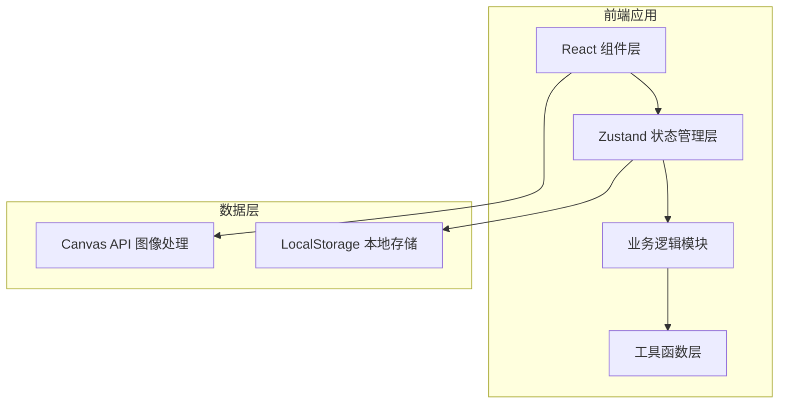

## 1. 架构设计



## 2. 技术描述

- **前端框架**：React 18 + TypeScript
- **构建工具**：Vite 5
- **状态管理**：Zustand 4
- **样式方案**：TailwindCSS 3 + CSS 变量
- **图标库**：Lucide React
- **工具库**：uuid（唯一ID生成）、dayjs（日期格式化）
- **图像处理**：Canvas API（原生）
- **算法实现**：K-means聚类（原生TypeScript实现）

## 3. 目录结构

```
src/
├── components/          # UI组件
│   ├── Header.tsx       # 顶部导航栏
│   ├── ColorCard.tsx    # 色块卡片
│   ├── PalettePanel.tsx # 配色编辑面板
│   ├── UploadArea.tsx   # 图片上传区
│   ├── SavedPalettes.tsx # 已保存方案列表
│   ├── ExportModal.tsx  # 导出模态框
│   ├── HSLSliders.tsx   # HSL调整滑块
│   └── ThemeToggle.tsx  # 主题切换按钮
├── modules/             # 业务逻辑模块
│   ├── colorExtractor.ts # 色彩提取（K-means）
│   └── paletteGenerator.ts # 配色方案生成
├── store/               # 状态管理
│   └── useAppStore.ts   # Zustand store
├── utils/               # 工具函数
│   ├── colorUtils.ts    # 颜色转换工具
│   └── exportUtils.ts   # 导出工具
├── types/               # TypeScript类型定义
│   └── index.ts
├── App.tsx              # 主应用组件
├── main.tsx             # 入口文件
└── index.css            # 全局样式
```

## 4. 数据模型

### 4.1 类型定义

```typescript
// 颜色对象
interface Color {
  hex: string;
  hsl: { h: number; s: number; l: number };
  rgb: { r: number; g: number; b: number };
  frequency?: number;
}

// 配色方案
interface Palette {
  id: string;
  name: string;
  tags: string[];
  colors: Color[];
  createdAt: string;
  type: 'monochromatic' | 'complementary' | 'triadic';
  lockedIndex?: number;
}

// 应用状态
interface AppState {
  themeMode: 'light' | 'dark';
  imageData: ImageData | null;
  extractedColors: Color[];
  currentPalettes: {
    monochromatic: Palette;
    complementary: Palette;
    triadic: Palette;
  } | null;
  savedPalettes: Palette[];
  activePaletteType: 'monochromatic' | 'complementary' | 'triadic';
}
```

## 5. 核心算法

### 5.1 K-means 色彩提取算法
1. 从 Canvas 获取 ImageData 像素数据
2. 采样像素（步长优化性能）
3. 初始化5个聚类中心
4. 迭代计算像素到中心的距离（欧氏距离）
5. 更新聚类中心为簇内平均值
6. 收敛后按簇大小排序输出主色

### 5.2 配色方案生成算法
- **单色渐变**：基于主色调整明度，生成5个阶梯色
- **互补色**：主色 + 色相偏移180°的互补色 + 中间过渡色
- **三元色**：主色 + 色相偏移120°和240°的两个颜色 + 过渡色

## 6. 状态管理

### Zustand Store 方法
```typescript
interface AppActions {
  setThemeMode: (mode: 'light' | 'dark') => void;
  setImage: (imageData: ImageData | null) => void;
  extractColors: (imageData: ImageData) => void;
  generatePalettes: (baseColor: Color) => void;
  updatePaletteColor: (type: PaletteType, index: number, color: Color) => void;
  lockColor: (type: PaletteType, index: number) => void;
  savePalette: (name: string, tags: string[]) => void;
  deletePalette: (id: string) => void;
  loadPalette: (palette: Palette) => void;
  filterPalettes: (keyword: string, tag: string) => Palette[];
  exportPalette: (type: 'css' | 'scss' | 'svg') => string;
}
```

## 7. 性能优化策略

1. **Canvas 图像处理优化**：
   - 图片上传后自动压缩到800x800以内
   - 像素采样步长动态调整（大图片增加步长）
   - 使用 Web Worker 处理 K-means 计算（可选）

2. **渲染性能优化**：
   - HSL 滑块使用 requestAnimationFrame 批量更新
   - 色块组件使用 React.memo 避免不必要重渲染
   - 使用 CSS transform 实现动画，避免 layout thrashing

3. **存储优化**：
   - LocalStorage 数据分片存储
   - 方案列表懒加载渲染
   - 图片数据不持久化，仅保存颜色数据

## 8. 响应式断点

```
- >= 1440px: 三栏完整布局
- 1024px - 1440px: 三栏压缩布局
- < 1024px: 右侧抽屉模式
- < 768px: 移动端单列布局
```
