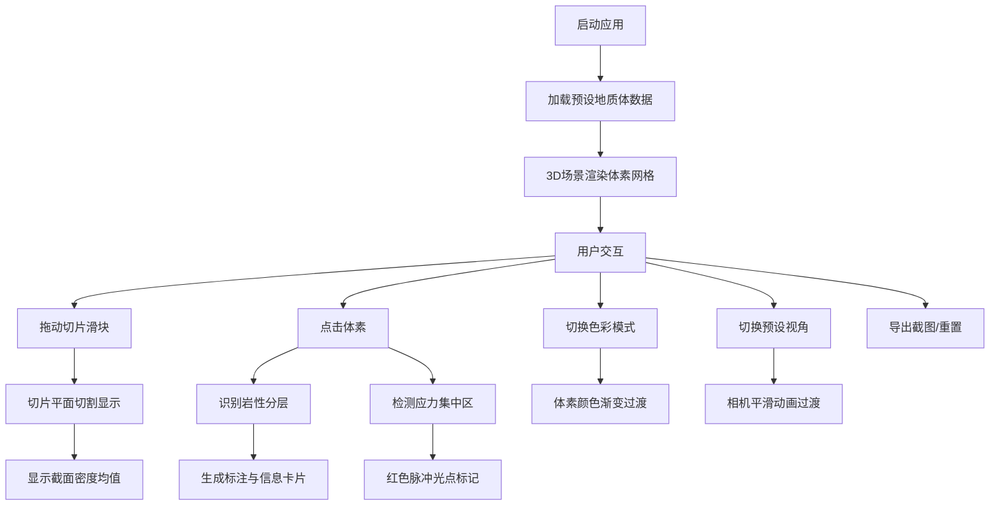

## 1. 产品概述

3D地质断层扫描数据可视化分析应用，提供交互式地质体三维可视化与分析工具，支持地质数据上传、三维切片查看、岩性分层自动标注与应力集中区域识别。面向地质勘探工程师、矿业从业者和科研人员，帮助其直观理解地下地质结构，提高分析效率。

## 2. 核心功能

### 2.1 功能模块

1. **3D场景模块**：地质体体素渲染、切片平面、标注点、视角控制
2. **控制面板模块**：数据加载、切片控制、色彩映射、视角预设、导出功能
3. **状态管理模块**：地质数据、切片位置、视口参数、标注列表统一管理
4. **标注分析模块**：岩性分层识别、应力集中区自动检测、点击标注交互

### 2.2 页面详情

| 页面名称 | 模块名称 | 功能描述 |
|---------|---------|----------|
| 主页面 | 3D场景区 | 地质体体素网格渲染、切片切割、标注显示、鼠标交互 |
| 主页面 | 控制面板区 | 文件上传、预设选择、切片滑块、色彩模式切换、视角按钮、导出重置 |
| 主页面 | 信息悬浮层 | 切片坐标显示、密度均值、相机状态、岩性信息卡片 |

## 3. 核心流程

用户打开应用 → 默认加载预设圆柱形岩层数据 → 3D场景渲染地质体 → 用户拖动切片滑块查看内部结构 → 系统自动计算截面密度均值 → 用户点击体素查看岩性信息 → 系统自动标注应力集中区 → 用户切换视角或色彩模式 → 导出截图或重置状态

## 4. 用户界面设计

### 4.1 设计风格

- **主色调**：深空色背景 `#0a0b10`，品牌蓝 `#4a6cf7`，主文字 `#e0e6f0`，辅助文字 `#6b7280`
- **布局风格**：左右分栏布局，左侧70%为3D场景，右侧30%为控制面板（固定宽度380px）
- **设计方向**：科技感、专业地质分析工具风格，深色主题突出3D可视化效果
- **字体**：Inter字体家族，清晰易读的无衬线字体
- **动效**：平滑过渡动画，切片响应迅速，色彩模式切换0.5秒渐变

### 4.2 页面设计概述

| 页面名称 | 模块名称 | UI元素 |
|---------|---------|--------|
| 主页面 | 3D场景区 | 深空背景、体素网格（伪彩色）、绿色切片平面、标注球体、脉冲光点、信息悬浮卡片 |
| 主页面 | 控制面板区 | 深色面板背景（#13151c）、圆角设计、自定义滑块样式、下拉选择框、按钮组 |
| 主页面 | 悬浮信息层 | 左上角切片坐标与密度均值、右上角相机状态、岩性信息卡片 |

### 4.3 响应式

- 桌面端（≥1024px）：左右分栏布局，控制面板固定宽度380px
- 移动端（<1024px）：控制面板折叠为底部抽屉条（高度60px），点击后向上滑出完整面板
- 触控优化：支持触摸手势旋转、缩放

### 4.4 3D场景指引

- **环境**：深空色背景 `#0a0b10`，无环境贴图，营造专业分析氛围
- **光照**：环境光 + 方向光，确保体素网格清晰可见，切片平面有发光边缘效果
- **相机**：透视相机，默认45°视角，支持OrbitControls惯性阻尼
- **交互**：鼠标拖拽旋转、滚轮缩放、点击选择体素、hover高亮
- **性能**：使用InstancedMesh优化体素渲染，4096个体素稳定30FPS以上
