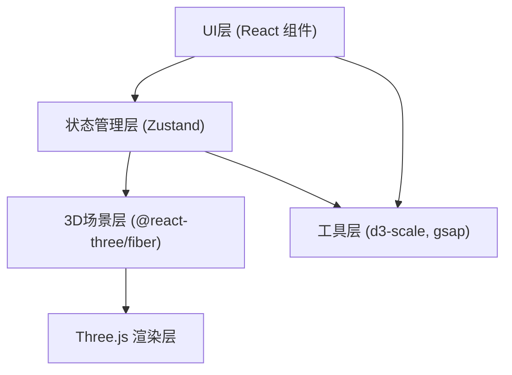

## 1. 架构设计



## 2. 技术描述

- **前端框架**：React 18 + TypeScript 5 + Vite 5
- **3D渲染**：Three.js + @react-three/fiber + @react-three/drei
- **状态管理**：Zustand 4
- **色彩映射**：d3-scale
- **动画库**：gsap
- **唯一标识**：uuid
- **构建工具**：Vite，配置 `@` 别名指向 `src` 目录

## 3. 文件结构

```
d:\P\tasks\auto99/
├── index.html                 # 入口页面
├── package.json               # 项目依赖
├── vite.config.js             # Vite配置
├── tsconfig.json              # TypeScript配置
└── src/
    ├── main.tsx               # React入口
    ├── App.tsx                # 主应用组件
    ├── store/
    │   └── useGeoStore.ts     # Zustand状态管理
    ├── scene/
    │   ├── Scene3D.tsx        # 3D场景主组件
    │   ├── GeoVolume.tsx      # 地质体体素网格
    │   └── CrossSection.tsx   # 切片平面组件
    └── ui/
        └── ControlPanel.tsx   # 控制面板组件
```

## 4. 状态管理 (Zustand Store)

### 4.1 Store 数据结构

| 状态字段 | 类型 | 说明 |
|---------|------|------|
| geoData | `number[][][]` | 三维密度数据数组 [x][y][z] |
| gridSize | `{x:number, y:number, z:number}` | 体素网格尺寸 |
| sliceX | `number` | X方向切片位置 (0-100) |
| sliceY | `number` | Y方向切片位置 (0-100) |
| sliceZ | `number` | Z方向切片位置 (0-100) |
| colorMode | `'rainbow'\|'heat'\|'grayscale'` | 色彩映射模式 |
| annotations | `Annotation[]` | 标注点列表 |
| stressPoints | `StressPoint[]` | 应力集中点列表 |
| cameraPosition | `{x:number, y:number, z:number}` | 相机位置 |

### 4.2 Store 方法

| 方法名 | 参数 | 说明 |
|-------|------|------|
| setGeoData | `data: number[][][]` | 设置地质体数据 |
| setSliceX/Y/Z | `value: number` | 设置切片位置 |
| setColorMode | `mode: ColorMode` | 设置色彩模式 |
| addAnnotation | `annotation: Annotation` | 添加标注 |
| clearAnnotations | - | 清空所有标注 |
| setCameraPosition | `pos: Vector3` | 更新相机位置 |
| resetAll | - | 重置所有状态 |
| computeStressPoints | - | 计算应力集中区域 |

## 5. 核心组件设计

### 5.1 GeoVolume 组件

- 使用 `InstancedMesh` 优化体素渲染性能
- 根据密度值应用伪彩色映射
- 支持透明度渐变效果
- 鼠标 hover 高亮显示
- 点击触发岩性标注

### 5.2 CrossSection 组件

- 根据切片位置生成裁剪平面
- 半透明绿色材质 + 边缘发光线框
- 显示截面密度分布
- 支持拖拽移动切片位置

### 5.3 ControlPanel 组件

- 文件上传按钮（支持JSON格式地质数据）
- 预设地质体下拉选择
- X/Y/Z 三轴切片滑块
- 色彩映射模式切换
- 预设视角按钮（俯视/侧视/剖视/全局）
- 重置与导出按钮

### 5.4 Scene3D 组件

- Canvas 场景容器
- 环境光与方向光配置
- OrbitControls 相机控制
- 集成 GeoVolume、CrossSection、标注组件
- 导出 canvas 截图方法

## 6. 数据模型

### 6.1 地质体数据格式

```typescript
interface GeoData {
  size: { x: number; y: number; z: number };
  densities: number[][][]; // 三维密度数组，值范围 0-1
}
```

### 6.2 预设地质体

- 圆柱形岩层（默认）：含3层球状矿脉 + 倾斜裂缝
- 长方体矿脉：矩形矿体模型
- 溶洞结构：含空洞的地质体

### 6.3 岩性分层定义

| 岩性 | 密度范围 | 颜色参考 |
|------|---------|----------|
| 沉积岩 | 0.0 - 0.3 | 蓝绿色调 |
| 变质岩 | 0.3 - 0.7 | 黄绿色调 |
| 火成岩 | 0.7 - 1.0 | 红橙色调 |

## 7. 性能优化策略

1. **InstancedMesh**：4096个体素使用实例化网格，减少draw call
2. **按需更新**：仅切片位置或色彩模式变化时重计算
3. **缓存优化**：密度数据、色彩映射结果缓存
4. **帧率控制**：稳定30FPS以上，切片更新延迟<200ms
