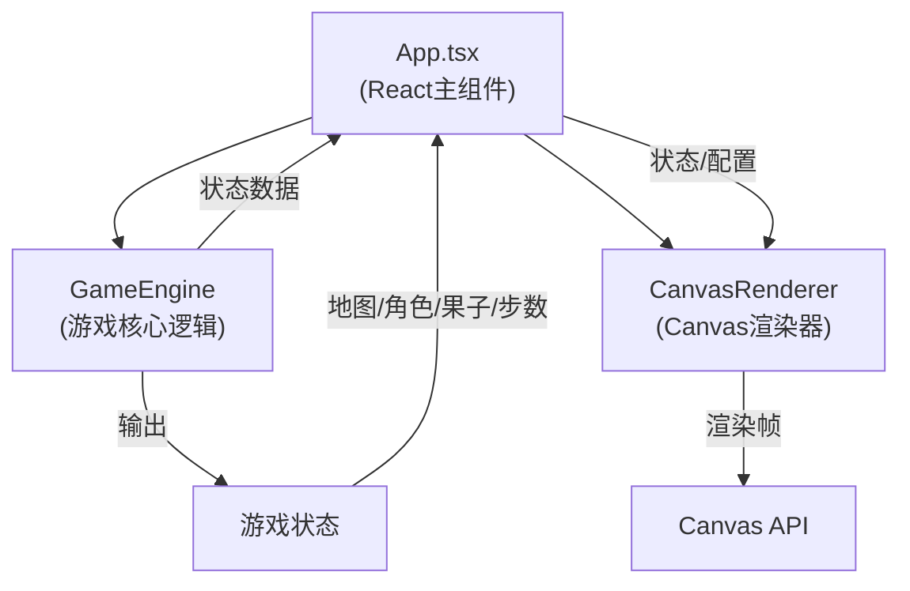

## 1. 架构设计



## 2. 技术描述

- **前端框架**：React@18 + TypeScript@5
- **构建工具**：Vite@5
- **渲染引擎**：原生Canvas 2D API (requestAnimationFrame)
- **状态管理**：React useState/useRef，GameEngine独立纯逻辑层
- **动画方案**：CSS transition (UI) + Canvas逐帧绘制 (游戏画面)

## 3. 目录结构

```
src/
├── main.tsx              # React入口
├── App.tsx               # 主组件：状态管理、UI布局、事件绑定
├── game/
│   └── GameEngine.ts     # 游戏引擎：地图生成、移动规则、碰撞、体力、果子
└── renderer/
    └── CanvasRenderer.ts # Canvas渲染器：绘制网格、地形、角色、果子、动画
```

## 4. 核心数据模型

### 4.1 地形类型

```typescript
enum TerrainType {
  GRASS = 0,    // 草地，消耗1
  BUSH = 1,     // 灌木，消耗2
  MUD = 2,      // 泥潭，消耗3
  RIVER = 3,    // 河流，不可通行
}
```

### 4.2 游戏状态

```typescript
interface GameState {
  grid: TerrainType[][];           // 10x8地形网格
  cheetahPos: Position;            // 猎豹位置
  antelopePos: Position;           // 羚羊位置
  cheetahStamina: number;          // 猎豹体力 (初始50)
  antelopeStamina: number;         // 羚羊体力 (初始50)
  fruits: Position[];              // 果子位置数组
  steps: number;                   // 总步数
  round: number;                   // 回合数
  isGameOver: boolean;             // 游戏是否结束
  winner: 'cheetah' | 'antelope' | null; // 胜者
  currentTurn: 'cheetah' | 'antelope';   // 当前回合
  animatingCharacter: 'cheetah' | 'antelope' | null; // 正在动画的角色
  animationProgress: number;       // 动画进度 0~1
  fromPosition: Position | null;   // 动画起始位置
  toPosition: Position | null;     // 动画目标位置
  selectedCell: Position | null;   // 选中的格子
  afterimages: Afterimage[];       // 残影列表
}
```

## 5. 核心算法

### 5.1 地图生成
- 10列 × 8行，随机分布：草地50%、灌木25%、泥潭15%、河流10%
- 确保猎豹和羚羊初始位置周围为可通行地形

### 5.2 移动规则
- 仅允许移动到上下左右相邻4格
- 河流格不可通行
- 目标格需要检查体力是否足够扣除对应地形消耗

### 5.3 碰撞检测
- 移动完成后检查猎豹与羚羊坐标是否相同
- 相同则猎豹胜利

### 5.4 果子系统
- 每5步刷新3个果子在随机可通行空格上
- 羚羊移动到果子格自动食用，+15体力并从列表移除

## 6. 渲染优化

- 使用双缓存或脏矩形减少重绘区域
- 角色动画使用离屏Canvas缓存图案
- requestAnimationFrame统一调度所有动画
- 残影对象带衰减透明度，超过寿命自动清理
