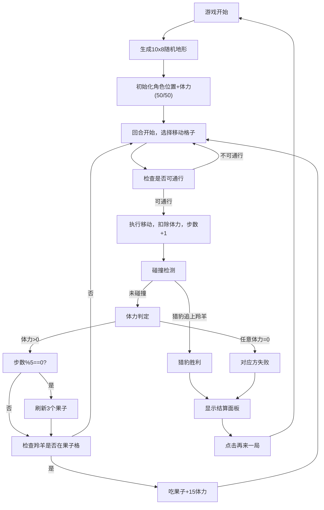

## 1. 产品概述

丛林追逐是一款回合制策略小游戏，玩家操控猎豹追逐羚羊，羚羊需躲避追捕并通过吃果子恢复体力。游戏基于10×8随机生成的地形网格，不同地形消耗不同移动体力，通过Canvas实现流畅的动画渲染。

- 核心玩法：回合制追逐策略，猎豹追求最短路径追击，羚羊需要兼顾躲避与补给
- 目标用户：休闲游戏爱好者，短时间娱乐场景

## 2. 核心功能

### 2.1 功能模块

1. **游戏主界面**：状态栏、游戏画布、重置按钮、结算面板
2. **地图系统**：10×8随机地形网格，4种地形类型，通行消耗规则
3. **角色系统**：猎豹与羚羊，各自位置、体力、移动消耗
4. **移动系统**：相邻格子点击移动，平滑动画+残影效果
5. **果子系统**：每5步随机刷新3个果子，拾取恢复15体力
6. **结算系统**：胜负判定，数据展示，重新开始

### 2.2 页面详情

| 页面名称 | 模块名称 | 功能描述 |
|-----------|-------------|---------------------|
| 游戏主界面 | 状态栏 | 显示游戏名称、回合数、双方体力圆形进度条 |
| 游戏主界面 | 游戏画布 | Canvas渲染网格地形、角色、果子、动画效果 |
| 游戏主界面 | 选中高亮 | 点击格子显示脉动金色光圈 |
| 游戏主界面 | 移动动画 | 角色0.3秒平滑移动，中途残影效果 |
| 游戏主界面 | 重置按钮 | 右下角浮动圆形按钮，旋转反馈 |
| 游戏主界面 | 结算面板 | 胜负文字、剩余体力、总步数、再来一局按钮 |

## 3. 核心流程

## 4. 用户界面设计

### 4.1 设计风格

- **主色调**：深绿色渐变背景(#0f3b0f → #1b5e1b)，丛林自然风格
- **地形颜色**：草地浅绿(#7ec850)、灌木深绿(#3a7d2c)、泥潭褐色(#8b5a2b)、河流蓝色(#3b82f6)
- **角色颜色**：猎豹橘色带斑点圆形、羚羊棕色带白点三角形
- **果子**：红色小圆点带微弱发光
- **状态栏**：半透明毛玻璃效果(rgba(255,255,255,0.15)，模糊10px)
- **进度条**：猎豹橙红渐变、羚羊绿青渐变
- **按钮**：绿青渐变按钮，悬停0.95缩放加深阴影
- **结算面板**：圆角矩形，rgba(0,0,0,0.75)毛玻璃，模糊16px

### 4.2 页面设计概览

| 页面名称 | 模块名称 | UI元素 |
|-----------|-------------|-------------|
| 游戏主界面 | 状态栏 | 毛玻璃容器、游戏名称(金色)、回合数、圆形进度条x2 |
| 游戏主界面 | 网格 | 不同颜色填充、1px半透明白边框、选中脉动金色光圈 |
| 游戏主界面 | 角色 | 橘色斑点圆形(猎豹)、棕色白点三角形(羚羊)、移动残影 |
| 游戏主界面 | 果子 | 红色圆点、glow发光效果 |
| 游戏主界面 | 重置按钮 | 圆形深色背景、重新加载图标、旋转动画反馈 |
| 游戏主界面 | 结算面板 | 毛玻璃面板、胜负文字、数据列表、再来一局按钮 |

### 4.3 响应式

- Desktop-first设计，画布固定尺寸居中显示
- 状态栏宽度100%自适应

### 4.4 性能

- 60FPS流畅动画，requestAnimationFrame驱动
- 移动和碰撞检测响应时间≤50ms
- Canvas优化渲染，避免不必要的重绘
