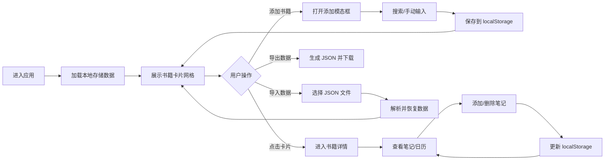

## 1. 产品概述

个人阅读书单管理应用，为热爱阅读的用户提供统一的书籍管理、阅读笔记和进度追踪平台，解决阅读记录分散、缺乏整理和习惯追踪的痛点。

## 2. 核心功能

### 2.1 用户角色
| 角色 | 注册方式 | 核心权限 |
|------|----------|----------|
| 普通用户 | 无需注册，本地使用 | 管理书籍、记录笔记、导出导入数据 |

### 2.2 功能模块
1. **书籍总览页**：卡片网格展示所有书籍、进度条、状态筛选
2. **书籍详情页**：笔记列表、阅读日历、笔记增删管理
3. **添加书籍模态框**：OpenLibrary API 搜索、手动输入书籍信息
4. **数据管理**：JSON 导出、JSON 导入

### 2.3 页面详情
| 页面名称 | 模块名称 | 功能描述 |
|---------|----------|----------|
| 总览页 | 书籍卡片网格 | 三列响应式布局，展示封面、书名、进度条、最后更新日期 |
| 总览页 | 顶部操作区 | 应用标题、毛玻璃效果操作按钮（添加书籍、导出/导入） |
| 详情页 | 书籍信息区 | 封面大图、书名作者、阅读状态、进度、起止日期 |
| 详情页 | 笔记列表 | 按日期排序，支持标签过滤，显示日期、内容、标签 |
| 详情页 | 阅读日历 | 当月有笔记的日期高亮显示为小圆点 |
| 详情页 | 添加笔记表单 | 日期选择、内容输入（支持换行）、标签选择/自定义 |

## 3. 核心流程

## 4. 用户界面设计

### 4.1 设计风格
- **主色调**：暖白色背景 `#faf7f0`，深灰色文字 `#2c2c2c`
- **强调色**：浅蓝到深蓝渐变进度条，浅金色 `#e6c88a` 呼吸光晕
- **分割线**：浅灰色 `#e8e2d6` 1px 实线
- **字体**：标题使用 Georgia 衬线字体，正文使用系统无衬线字体
- **按钮风格**：半透明毛玻璃效果（backdrop-filter: blur(10px)），圆角设计
- **卡片风格**：悬停时轻微上移（translateY(-4px)），阴影加深，0.25s ease 过渡
- **选中效果**：0.5s 呼吸光晕动画，浅金色边框脉动

### 4.2 页面设计概述
| 页面名称 | 模块名称 | UI 元素 |
|---------|----------|----------|
| 总览页 | 顶部标题区 | Georgia 衬线大标题、右侧毛玻璃操作按钮组 |
| 总览页 | 卡片网格 | 响应式布局、圆角进度条、悬停动画、选中光晕 |
| 详情页 | 头部信息 | 封面图、书名、作者、状态标签、进度条 |
| 详情页 | 笔记区 | 时间线布局、标签色块、内容换行显示 |
| 详情页 | 日历区 | 当月日历网格、小圆点标记有笔记的日期 |
| 模态框 | 添加书籍 | 搜索框、结果列表、手动输入表单、确认按钮 |

### 4.3 响应式设计
- **桌面端**（>768px）：三列卡片布局
- **平板端**（≤768px）：两列卡片布局
- **移动端**（≤480px）：单列卡片布局
- **卡片最小宽度**：280px
- **触摸优化**：按钮最小点击区域 44px×44px

### 4.4 性能指标
- 书籍列表刷新响应时间：≤ 500ms
- 导出 JSON 触发下载：≤ 200ms
- 动画帧率：60fps
