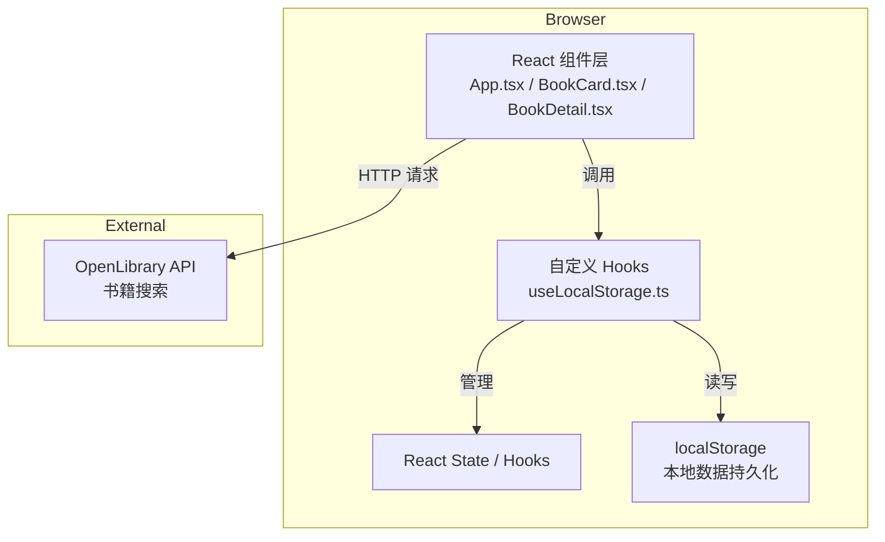
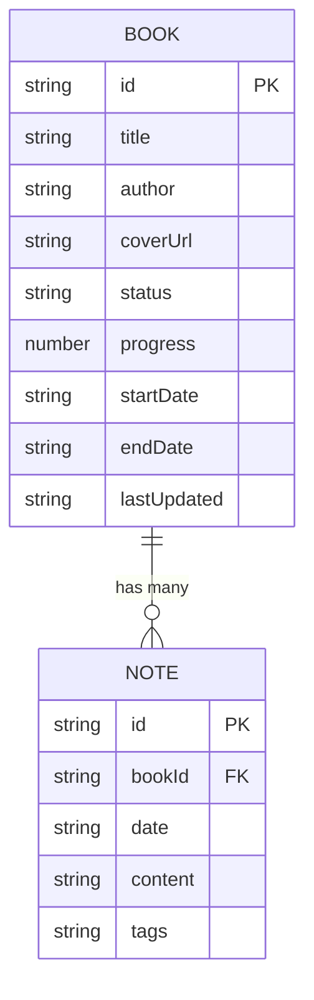

## 1. 架构设计



## 2. 技术栈说明

- **前端框架**：React 18 + TypeScript 5
- **构建工具**：Vite 5
- **状态管理**：React Hooks（useState、useEffect、自定义 useLocalStorage）
- **样式方案**：原生 CSS + CSS Variables（不使用第三方 UI 库）
- **数据存储**：浏览器 localStorage
- **外部 API**：OpenLibrary Search API（https://openlibrary.org/search.json）

## 3. 项目结构

```
auto10/
├── package.json
├── index.html
├── vite.config.js
├── tsconfig.json
└── src/
    ├── main.tsx          # React 挂载入口
    ├── App.tsx           # 主组件，路由与全局状态
    ├── types.ts          # TypeScript 类型定义
    ├── hooks/
    │   └── useLocalStorage.ts  # localStorage 自定义 Hook
    └── components/
        ├── BookCard.tsx       # 书籍卡片组件
        └── BookDetail.tsx     # 书籍详情组件
```

## 4. 类型定义

### 4.1 BookStatus
```typescript
type BookStatus = 'unread' | 'reading' | 'finished';
```

### 4.2 Note
```typescript
interface Note {
  id: string;
  date: string;        // YYYY-MM-DD 格式
  content: string;     // 纯文本，支持换行
  tags: string[];      // 自定义标签数组
}
```

### 4.3 Book
```typescript
interface Book {
  id: string;
  title: string;
  author: string;
  coverUrl: string;
  status: BookStatus;
  progress: number;    // 0-100
  startDate: string;   // YYYY-MM-DD
  endDate: string;     // YYYY-MM-DD
  lastUpdated: string; // ISO 时间戳
  notes: Note[];
}
```

## 5. 路由定义
| 路由 | 用途 |
|------|------|
| / | 书籍总览页（卡片网格） |
| /book/:id | 书籍详情页（笔记与日历） |

*使用 React Router 或简单的状态驱动路由实现*

## 6. 数据模型

### 6.1 ER 图



### 6.2 localStorage 存储结构
```typescript
interface AppData {
  books: Book[];
  version: string; // 数据版本号，用于迁移
}

// 存储键名
const STORAGE_KEY = 'reading_list_app_data';
```

## 7. 核心 Hook 设计

### useLocalStorage
```typescript
function useLocalStorage<T>(key: string, initialValue: T): [
  T,
  (value: T | ((prev: T) => T)) => void,
  () => void,
  (data: T) => void,
  () => void
]
```
- 返回值：`[state, setState, clear, importData, exportData]`
- 自动监听 localStorage 变化
- 导出：生成 JSON Blob 并触发下载
- 导入：解析 JSON 文件并验证数据结构

## 8. 性能优化策略

1. **数据持久化防抖**：状态变更后 100ms 防抖写入 localStorage
2. **组件记忆化**：使用 React.memo 包装 BookCard 避免不必要重渲染
3. **列表虚拟化**：书籍超过 50 本时考虑虚拟滚动
4. **图片懒加载**：封面图使用原生 loading="lazy"
5. **API 请求防抖**：搜索输入 300ms 防抖后发起请求
