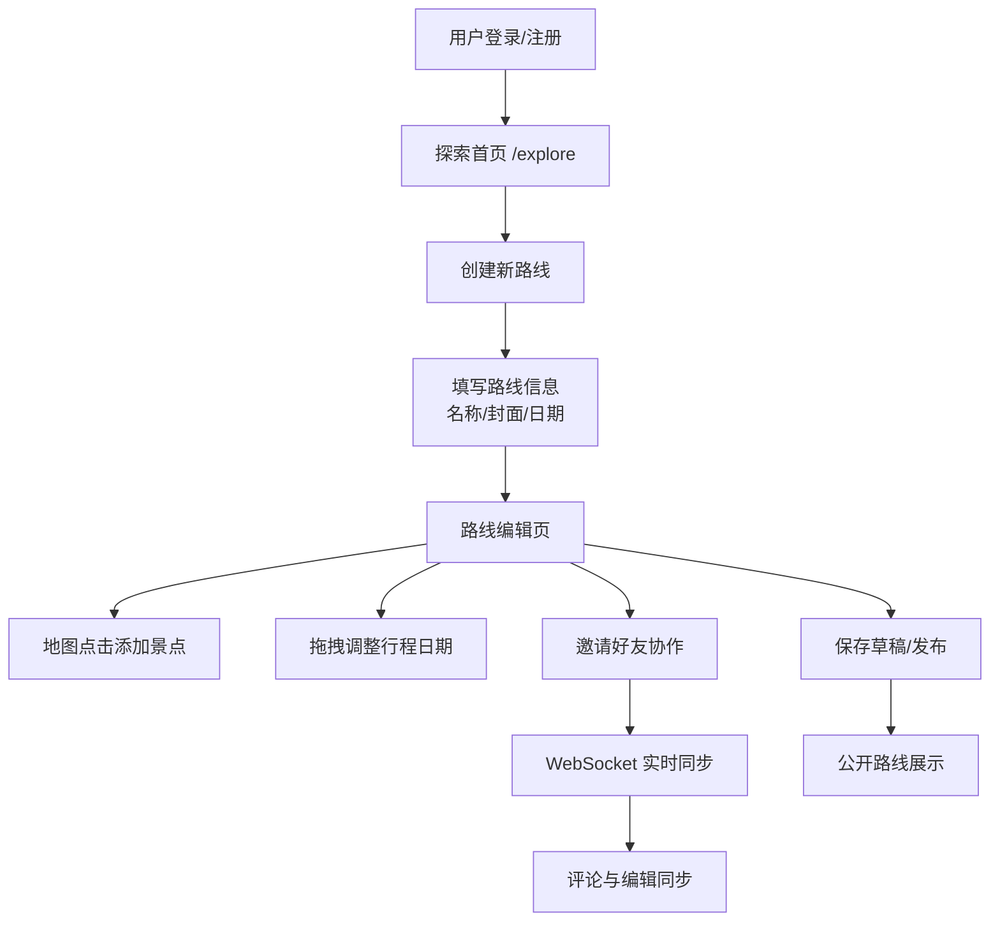

## 1. 产品概述

旅行路线规划与协作分享应用，让用户创建自定义旅行计划，添加每日行程、景点、住宿和交通信息，并邀请好友共同编辑和评论。

- 主要目的：为用户提供可视化、协作式的旅行路线规划工具
- 目标用户：热爱旅行、喜欢规划行程的个人和团体
- 市场价值：填补地图可视化 + 实时协作的旅行规划市场空白

## 2. 核心功能

### 2.1 用户角色
| 角色 | 注册方式 | 核心权限 |
|------|----------|----------|
| 普通用户 | 用户名/密码注册 | 创建路线、编辑路线、邀请协作、点赞收藏 |
| 协作用户 | 被邀请后登录 | 编辑景点备注、添加评论、查看路线 |

### 2.2 功能模块
1. **认证模块**：用户注册、登录、Token 管理
2. **路线创建**：新建旅行路线，设置名称、封面、日期
3. **地图交互**：点击添加景点标记、拖拽调整位置、折线连接
4. **行程管理**：每日行程列表、拖拽排序、景点详情编辑
5. **协作分享**：邀请好友、实时同步、评论系统
6. **探索首页**：公开路线展示、点赞、收藏

### 2.3 页面详情
| 页面名称 | 模块名称 | 功能描述 |
|----------|----------|----------|
| 登录/注册页 | 认证表单 | 用户登录、注册、表单验证 |
| 探索首页 | 路线卡片网格 | 展示公开路线、点赞、收藏、搜索 |
| 路线创建页 | 创建表单 | 填写旅行名称、选择封面图、设置日期 |
| 路线编辑页 | 左侧行程 + 右侧地图 | 核心编辑界面，拖拽、添加景点、协作编辑 |
| 个人主页 | 用户信息 + 收藏路线 | 查看个人创建和收藏的路线 |

## 3. 核心流程

## 4. 用户界面设计

### 4.1 设计风格
- 主色：#1a73e8（蓝色）
- 辅色：#34a853（绿色）
- 背景色：#f8f9fa（浅灰）
- 卡片样式：白色圆角阴影卡片，border-radius: 12px，box-shadow: 0 2px 8px rgba(0,0,0,0.08)
- 布局风格：左侧固定侧边栏 + 右侧可伸缩地图区域
- 图标风格：lucide-react 线性图标
- 交互动画：opacity 和 transform 微妙过渡，高度动画 transition: height 0.3s ease

### 4.2 页面设计概览
| 页面名称 | 模块名称 | UI 元素 |
|----------|----------|---------|
| 登录页 | 认证表单 | 居中卡片、蓝绿色渐变背景、输入框带图标 |
| 探索首页 | 路线卡片网格 | 响应式网格布局、卡片悬停上浮效果、心形点赞按钮 |
| 路线编辑页 | 侧边栏 + 地图 | 左侧 380px 固定宽度、右侧全屏地图、底部浮动按钮（移动端） |
| 每日行程卡片 | DayCard | 日期标题、景点列表、展开/收起动画、评论输入框 |

### 4.3 响应式
- 桌面端：左侧 380px 侧边栏 + 右侧地图区域
- 移动端（<768px）：全屏地图，底部浮动按钮切换显示侧边栏
- 触摸优化：拖拽支持触摸操作，按钮最小 44px 点击区域

### 4.4 性能要求
- 地图拖拽和标记移动 FPS 不低于 30
- 景点列表超过 50 条时使用虚拟滚动（react-window）
- WebSocket 消息延迟不超过 200ms
