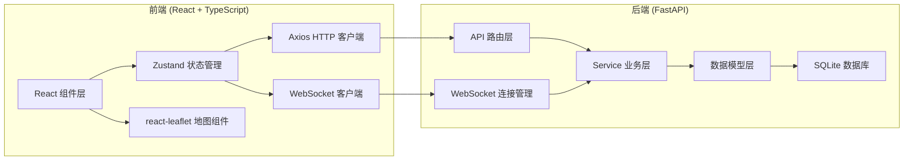
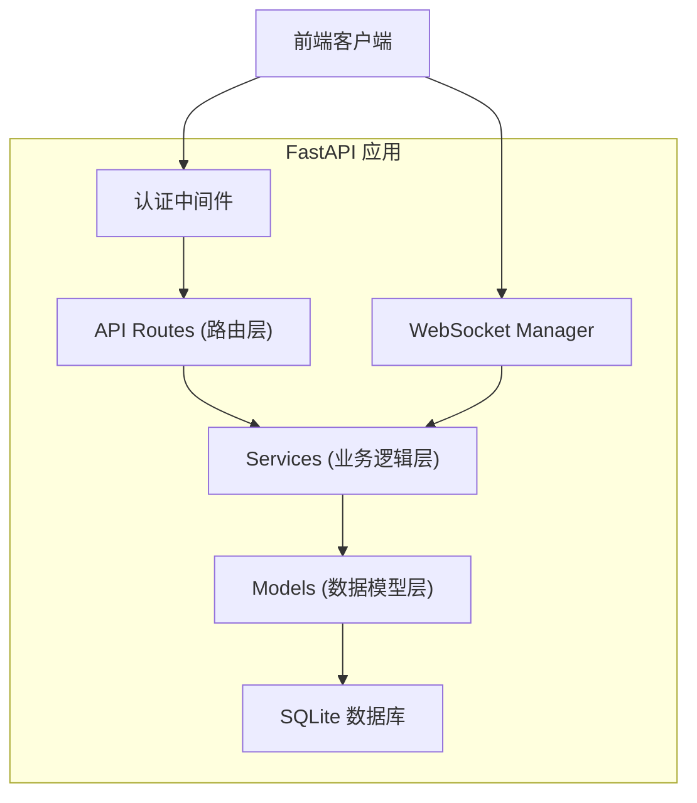
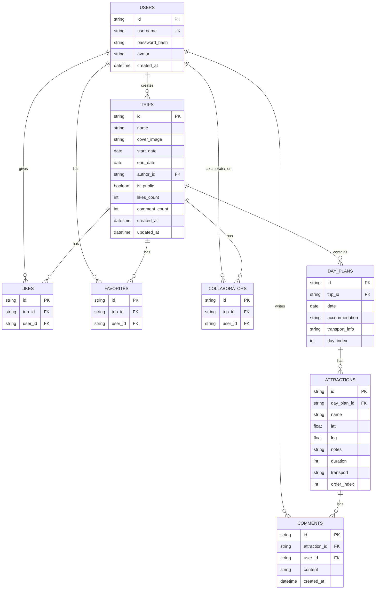

## 1. 架构设计



## 2. 技术描述

- **前端**：React 18 + TypeScript + Vite
- **状态管理**：Zustand（含撤销/重做队列）
- **地图库**：react-leaflet + leaflet
- **路由**：react-router-dom
- **HTTP 客户端**：axios
- **实时通信**：WebSocket（浏览器原生）
- **虚拟滚动**：react-window
- **图标**：lucide-react
- **后端**：FastAPI (Python)
- **数据库**：SQLite（开发环境）

## 3. 路由定义

| 路由 | 用途 |
|------|------|
| /login | 登录页面 |
| /register | 注册页面 |
| /explore | 探索首页 - 公开路线列表 |
| /create | 创建新路线 |
| /trip/:id | 路线编辑页 |
| /profile | 个人主页 |

## 4. API 定义

### 4.1 TypeScript 类型定义

```typescript
// 用户
interface User {
  id: string;
  username: string;
  avatar?: string;
  createdAt: string;
}

// 景点
interface Attraction {
  id: string;
  name: string;
  lat: number;
  lng: number;
  notes?: string;
  duration?: number; // 预计停留时间（分钟）
  transport?: 'walk' | 'car' | 'bus' | 'plane';
  dayIndex: number;
  order: number;
  comments: Comment[];
}

// 评论
interface Comment {
  id: string;
  userId: string;
  username: string;
  avatar?: string;
  content: string;
  createdAt: string;
}

// 每日行程
interface DayPlan {
  date: string;
  attractions: Attraction[];
  accommodation?: string;
  transportInfo?: string;
}

// 旅行路线
interface Trip {
  id: string;
  name: string;
  coverImage: string;
  startDate: string;
  endDate: string;
  days: DayPlan[];
  authorId: string;
  authorName: string;
  isPublic: boolean;
  likes: number;
  isLiked: boolean;
  isFavorited: boolean;
  commentCount: number;
  collaborators: string[];
  createdAt: string;
  updatedAt: string;
}

// WebSocket 消息
interface WSMessage {
  type: 'attraction_add' | 'attraction_update' | 'attraction_delete' 
       | 'attraction_move' | 'comment_add' | 'invite' | 'notification';
  data: any;
  tripId: string;
  userId: string;
  timestamp: number;
}
```

### 4.2 REST API 端点

| 方法 | 路径 | 描述 |
|------|------|------|
| POST | /api/auth/register | 用户注册 |
| POST | /api/auth/login | 用户登录 |
| GET | /api/auth/me | 获取当前用户信息 |
| GET | /api/trips | 获取路线列表（探索页） |
| POST | /api/trips | 创建新路线 |
| GET | /api/trips/:id | 获取路线详情 |
| PUT | /api/trips/:id | 更新路线信息 |
| DELETE | /api/trips/:id | 删除路线 |
| POST | /api/trips/:id/publish | 发布路线 |
| POST | /api/trips/:id/like | 点赞/取消点赞 |
| POST | /api/trips/:id/favorite | 收藏/取消收藏 |
| POST | /api/trips/:id/invite | 邀请协作者 |
| GET | /api/trips/:id/attractions | 获取景点列表 |
| POST | /api/trips/:id/attractions | 添加景点 |
| PUT | /api/attractions/:id | 更新景点 |
| DELETE | /api/attractions/:id | 删除景点 |
| POST | /api/attractions/:id/comments | 添加评论 |
| GET | /api/user/favorites | 获取收藏列表 |
| GET | /api/user/trips | 获取我的路线 |

### 4.3 WebSocket 端点

| 路径 | 描述 |
|------|------|
| /ws/trip/:id | 路线协作实时通信 |

## 5. 服务器架构图



## 6. 数据模型

### 6.1 ER 图



### 6.2 项目文件结构

```
├── package.json
├── index.html
├── tsconfig.json
├── vite.config.js
├── src/
│   ├── main.tsx
│   ├── App.tsx
│   ├── modules/
│   │   ├── auth/
│   │   │   └── AuthService.ts
│   │   ├── map/
│   │   │   ├── MapView.tsx
│   │   │   └── RouteLayer.tsx
│   │   └── trip/
│   │       ├── TripPlanner.tsx
│   │       └── DayCard.tsx
│   ├── stores/
│   │   └── tripStore.ts
│   ├── pages/
│   ├── components/
│   └── utils/
└── backend/
    ├── main.py
    ├── models.py
    ├── schemas.py
    └── database.py
```
