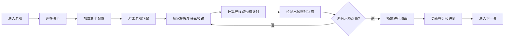

## 1. 产品概述

"光影捕手"是一款基于光学折射原理的益智解谜游戏，玩家通过操控三棱镜折射光线来点亮场景中的光之水晶。游戏融合了物理光学知识与解谜乐趣，适合所有年龄段玩家。

- **核心玩法**：移动和旋转三棱镜，利用光线折射原理将分解后的彩色光束引导至对应水晶
- **目标用户**：喜欢益智解谜、物理类游戏的玩家
- **产品价值**：在娱乐中学习光学折射知识，锻炼空间思维和逻辑推理能力

## 2. 核心功能

### 2.1 功能模块

1. **游戏主界面**：Canvas游戏画布、三棱镜拖拽交互、光线路径实时渲染
2. **关卡系统**：5个递进难度关卡、关卡选择面板、平滑过渡动画
3. **物理引擎**：光线折射计算、碰撞检测、水晶状态管理
4. **成就系统**：得分记录、水晶点亮进度、胜利动画
5. **辅助系统**：操作提示、推荐路径显示、游戏暂停/重置

### 2.2 页面详情

| 页面名称 | 模块名称 | 功能描述 |
|---------|---------|----------|
| 游戏主界面 | 游戏画布 | 渲染光源、三棱镜、障碍物、水晶、光线路径和粒子特效 |
| 游戏主界面 | 控制面板 | 关卡选择下拉菜单、提示按钮、得分和进度显示 |
| 游戏主界面 | 交互系统 | 三棱镜拖拽旋转、鼠标事件处理 |
| 胜利界面 | 胜利动画 | 彩色粒子特效、得分展示、下一关按钮 |

## 3. 核心流程

## 4. 用户界面设计

### 4.1 设计风格
- **主色调**：深色背景 #1a1a2e，营造神秘光影氛围
- **强调色**：三棱镜半透明蓝 #87CEEB，水晶彩色光 #FF4500/#32CD32/#1E90FF
- **材质效果**：毛玻璃控制面板、发光光晕效果、半透明渲染
- **动画风格**：平滑过渡、脉冲光晕、粒子飞散

### 4.2 页面设计概述

| 页面名称 | 模块名称 | UI元素 |
|---------|---------|--------|
| 游戏主界面 | 游戏画布 | 左侧70%区域，深色背景，黄色光源，半透明三棱镜，六边形水晶，灰色障碍物 |
| 游戏主界面 | 控制面板 | 右侧30%区域，毛玻璃效果，圆角12px，关卡下拉菜单，提示按钮 |
| 游戏主界面 | 顶部状态栏 | 居中显示当前得分和已点亮水晶数 |
| 胜利界面 | 粒子特效 | 50个彩色粒子从水晶位置飞散，大小2-4px，渐变消失 |

### 4.3 响应式
- 桌面端优先设计，画布占70%宽度居左，控制面板固定右侧
- 支持窗口大小变化时自动调整画布尺寸
- 鼠标交互优化，拖拽体验流畅

### 4.4 视觉特效
- **光线效果**：白色入射光带半透明光晕，折射后分解为红绿蓝三束彩光
- **水晶效果**：暗灰色初始状态，点亮后散发对应颜色脉冲光晕（0.5秒周期，透明度0.3-1.0循环）
- **障碍物**：半透明灰色矩形，发生漫反射时光强衰减50%
- **过渡效果**：关卡切换0.3秒淡入淡出，提示路径0.3秒淡入
