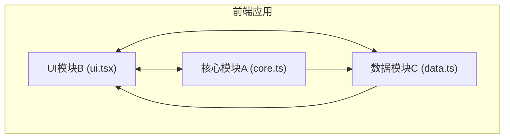

## 1. 架构设计



## 2. 技术描述

- **前端框架**：React@18 + TypeScript@5
- **构建工具**：Vite@5
- **状态管理**：Zustand@4
- **渲染引擎**：HTML5 Canvas API
- **UI渲染**：requestAnimationFrame 60fps游戏循环

### 模块职责划分：

| 模块 | 文件名 | 职责 |
|------|--------|------|
| 核心模块A | src/core.ts | 光线折射与反射物理引擎，碰撞检测，路径计算 |
| UI模块B | src/ui.tsx | React组件，Canvas渲染，拖拽交互，关卡面板，胜利动画 |
| 数据模块C | src/data.ts | 关卡配置，水晶状态管理，玩家进度，得分记录 |

## 3. 核心数据结构定义

### 3.1 关卡数据结构

```typescript
interface Point {
  x: number;
  y: number;
}

interface Prism {
  id: string;
  position: Point;
  rotation: number;
  size: number;
}

interface Crystal {
  id: string;
  position: Point;
  color: 'red' | 'green' | 'blue';
  isLit: boolean;
  litTime: number;
  requiredTime: number;
}

interface Obstacle {
  id: string;
  position: Point;
  width: number;
  height: number;
  rotation: number;
}

interface LightSource {
  position: Point;
  direction: number;
}

interface Level {
  id: number;
  name: string;
  lightSource: LightSource;
  prisms: Prism[];
  crystals: Crystal[];
  obstacles: Obstacle[];
}

interface LightSegment {
  start: Point;
  end: Point;
  color: string;
  intensity: number;
}

interface Particle {
  x: number;
  y: number;
  vx: number;
  vy: number;
  color: string;
  life: number;
  maxLife: number;
  size: number;
}
```

## 4. 核心算法说明

### 4.1 光线折射算法 (斯涅尔定律)

```
n1 * sin(θ1) = n2 * sin(θ2)

其中:
- n1 = 1.0 (空气折射率)
- n2 = 1.5 (玻璃折射率)
- θ1 = 入射角
- θ2 = 折射角
```

### 4.2 三棱镜色散计算
- 红光：折射率约1.51
- 绿光：折射率约1.52
- 蓝光：折射率约1.53

### 4.3 碰撞检测
- 线段与三角形相交检测
- 线段与矩形相交检测
- 线段与六边形相交检测

### 4.4 性能优化
- 空间分割加速碰撞检测
- 粒子数超过500时降低渲染频率至30fps
- 光线路径计算控制在2ms以内

## 5. 文件结构

```
d:\P\tasks\auto108\
├── package.json
├── index.html
├── vite.config.js
├── tsconfig.json
└── src\
    ├── core.ts      # 物理引擎
    ├── ui.tsx      # UI组件
    └── data.ts      # 数据管理
```

## 6. 模块接口定义

### 6.1 core.ts 导出接口

```typescript
// 计算折射光线
export function calcRefraction(
  prism: Prism,
  lightSource: LightSource,
  obstacles: Obstacle[],
  crystals: Crystal[]
): {
  segments: LightSegment[];
  hitCrystals: string[];
};

// 线段碰撞检测
export function checkLineIntersection(
  start: Point,
  end: Point,
  obstacles: Obstacle[]
): {
  hit: boolean;
  point: Point;
  normal: Point;
} | null;
```

### 6.2 data.ts 导出接口

```typescript
// Zustand store
export const useGameStore = create<GameState>((set, get) => ({
  currentLevel: 1,
  score: 0,
  crystals: [],
  prisms: [],
  isVictory: false,
  setPrismRotation: (prismId: string, rotation: number) => void,
  checkCrystalLit: (crystalId: string, color: string, intensity: number) => void,
  loadLevel: (levelId: number) => void,
  resetLevel: () => void,
}));
```
