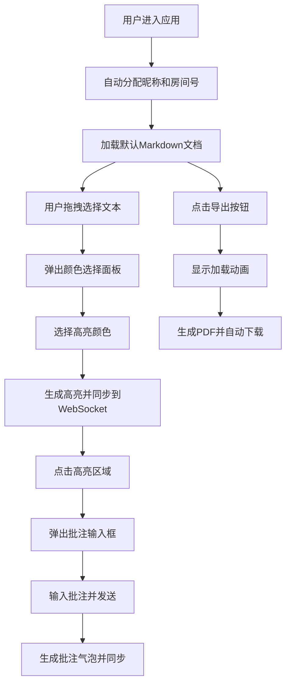

## 1. 产品概述
在线交互式文档高亮标注与协作批注应用，解决远程办公和在线教学场景下团队成员与师生在网页上对文档内容进行高亮标注和讨论的需求，提供轻量、实时同步的协作标注工具。
- 主要目标：让用户在Markdown或纯文本文档上自由高亮标注、添加批注评论，实现多用户实时协作同步
- 目标用户：远程办公团队成员、在线教学师生、文档协作编辑者

## 2. 核心功能

### 2.1 用户角色
| 角色 | 注册方式 | 核心权限 |
|------|----------|----------|
| 协作用户 | 自动分配昵称加入房间 | 创建高亮、添加批注、查看他人标注、导出PDF |

### 2.2 功能模块
1. **文档浏览页面**：文档加载、滚动浏览、白纸风格呈现
2. **高亮标注模块**：鼠标选区、颜色选择面板、半透明高亮渲染
3. **批注讨论模块**：批注输入框、气泡展示、用户昵称与时间戳
4. **实时协作模块**：房间创建/加入、WebSocket同步、用户标识显示
5. **导出模块**：PDF导出、加载动画、自动下载

### 2.3 页面详情
| 页面名称 | 模块名称 | 功能描述 |
|----------|----------|----------|
| 主页面 | 顶部工具栏 | 应用图标名称、房间号显示、用户头像列表、导出按钮 |
| 主页面 | 文档区域 | 白纸风格文档渲染、支持滚动、Markdown内容展示 |
| 主页面 | 颜色选择器 | 5种预设高亮色浮动面板、hover放大效果 |
| 主页面 | 批注弹窗 | 批注输入框、气泡展示、fade/slide动画 |

## 3. 核心流程
用户进入应用后自动分配昵称和房间，可编辑默认文档内容。鼠标拖拽选择文本后弹出颜色选择器，点击颜色完成高亮。点击高亮区域弹出批注输入框，输入内容后发送生成批注气泡。所有操作通过WebSocket实时同步给同房间其他用户。点击导出按钮生成包含标注和批注的PDF文件并下载。

## 4. 用户界面设计

### 4.1 设计风格
- 主色调：白色#ffffff、浅灰色#f0f2f5
- 高亮强调色：黄#FFE066、绿#75D701、蓝#7EC8E3、粉#FFB7B2、紫#C3AED6
- 按钮主色：蓝色#4A90D9
- 按钮风格：圆角6px、hover时放大1.05倍、亮度提升
- 字体：系统无衬线字体、行高1.8、段落间距16px
- 布局：顶部固定导航+居中白纸卡片、极简主义风格
- 图标：使用lucide-react图标库

### 4.2 页面设计概述
| 页面名称 | 模块名称 | UI元素 |
|----------|----------|--------|
| 主页面 | 顶部工具栏 | 高度56px、白色背景、底部1px边框、左侧图标+名称、右侧房间号+用户头像+导出按钮 |
| 主页面 | 文档卡片 | 宽度700px、左右内边距40px、白色背景、阴影效果、居中展示 |
| 主页面 | 颜色选择面板 | 圆角设计、5个圆形颜色块、浮动显示在选区附近 |
| 主页面 | 批注弹窗 | 圆角8px、背景#f8f9fa、阴影0 2px 8px rgba(0,0,0,0.12)、fade+slide动画 |

### 4.3 响应式设计
- 桌面端优先（≥768px）：文档宽度700px、左右内边距40px、批注弹窗正常宽度
- 移动端（<768px）：工具栏变两行、文档左右内边距缩小至20px、批注弹窗占全宽
- 触摸优化：增大可点击区域、支持触摸文本选择

### 4.4 动效设计
- 批注弹窗：0.2秒fade透明度变化 + slide-up从下向上移动8px
- 交互元素：hover时放大1.05倍 + 亮度变化
- 导出加载：旋转圆环SVG动画
- 用户高亮悬停：显示用户昵称标签淡入效果
