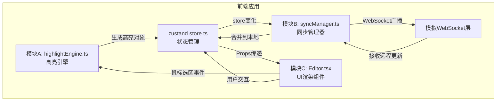
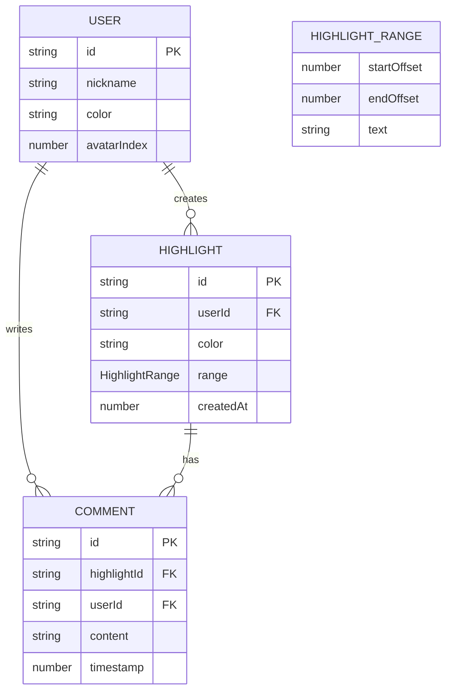

## 1. 架构设计
纯前端应用架构，采用模块化单向数据流设计，各模块通过Props和自定义事件通信。使用WebSocket模拟层实现本地实时同步效果。



## 2. 技术说明
- 前端框架: React@18 + TypeScript
- 构建工具: Vite@5
- 状态管理: zustand@4
- PDF生成: pdf-lib@1
- 工具库: uuid@9
- 图标: lucide-react
- 样式方案: CSS Modules + 全局CSS变量（按用户要求不使用Tailwind，直接使用原生CSS）
- 实时同步: 模拟WebSocket（BroadcastChannel实现本地多标签页同步）

## 3. 文件结构
| 文件路径 | 用途 |
|----------|------|
| package.json | 项目依赖和启动脚本 |
| index.html | 入口页面，加载根组件 |
| src/types.ts | TypeScript类型定义：高亮选区、批注、用户等接口 |
| src/highlightEngine.ts | 模块A：高亮引擎，解析Range生成高亮对象 |
| src/syncManager.ts | 模块B：同步管理器，WebSocket广播与接收 |
| src/components/Editor.tsx | 模块C：UI渲染主组件 |
| src/store.ts | zustand状态管理 |
| src/App.tsx | 应用根组件 |
| src/main.tsx | 应用入口 |
| src/styles.css | 全局样式与CSS类定义 |

## 4. 模块通信设计
### 4.1 单向数据流
```
用户交互 → Editor(UI) → highlightEngine(解析选区) → store(状态更新) → syncManager(同步) → 远端用户
                                                                 ↓
                                                         Editor(重新渲染)
```

### 4.2 模块接口
**highlightEngine.ts（模块A）**
- 输入：鼠标选区事件 (MouseEvent, Selection)
- 输出：Highlight对象，通过回调函数传递给store
- 核心方法：`extractRangeFromSelection(selection: Selection): HighlightRange | null`

**syncManager.ts（模块B）**
- 输入：zustand store订阅变化
- 输出：WebSocket消息（diff数据）
- 核心方法：`broadcastDiff(diff: SyncDiff)`, `handleRemoteUpdate(update: SyncUpdate)`

**Editor.tsx（模块C）**
- 输入：store状态（highlights, comments, users）
- 输出：用户交互事件（onTextSelect, onHighlightClick, onCommentSubmit）
- 子组件：ColorPicker, CommentPopup, CommentBubble, Toolbar

## 5. 数据模型

### 5.1 数据模型定义



### 5.2 TypeScript类型定义
```typescript
// 用户信息
interface User {
  id: string;
  nickname: string;
  color: string;
  avatarIndex: number;
}

// 高亮范围（基于文本偏移量）
interface HighlightRange {
  startOffset: number;
  endOffset: number;
  text: string;
}

// 高亮选区
interface Highlight {
  id: string;
  userId: string;
  color: HighlightColor;
  range: HighlightRange;
  createdAt: number;
}

// 批注
interface Comment {
  id: string;
  highlightId: string;
  userId: string;
  content: string;
  timestamp: number;
}

// 高亮颜色枚举
type HighlightColor = 'yellow' | 'green' | 'blue' | 'pink' | 'purple';

// 同步消息类型
type SyncMessageType = 'highlight:add' | 'highlight:remove' | 'comment:add' | 'user:join' | 'user:leave';

interface SyncMessage {
  type: SyncMessageType;
  payload: Highlight | Comment | User;
  roomId: string;
  senderId: string;
  timestamp: number;
}
```

## 6. 性能优化策略
### 6.1 渲染性能
- 高亮背景使用CSS class切换而非内联样式，避免重排
- 使用CSS变量定义高亮颜色，通过class切换实现
- 长文档采用虚拟滚动（如内容过长）
- 批注弹窗使用React.memo避免不必要重渲染

### 6.2 同步性能
- 消息频率限制：每100ms最多发送一次合并后的diff数据
- 采用增量同步而非全量状态同步
- 使用requestAnimationFrame批量处理DOM更新

### 6.3 启动性能
- 首屏渲染目标<1.5秒
- 代码分割：PDF导出功能懒加载
- 字体使用系统字体，避免网络加载
