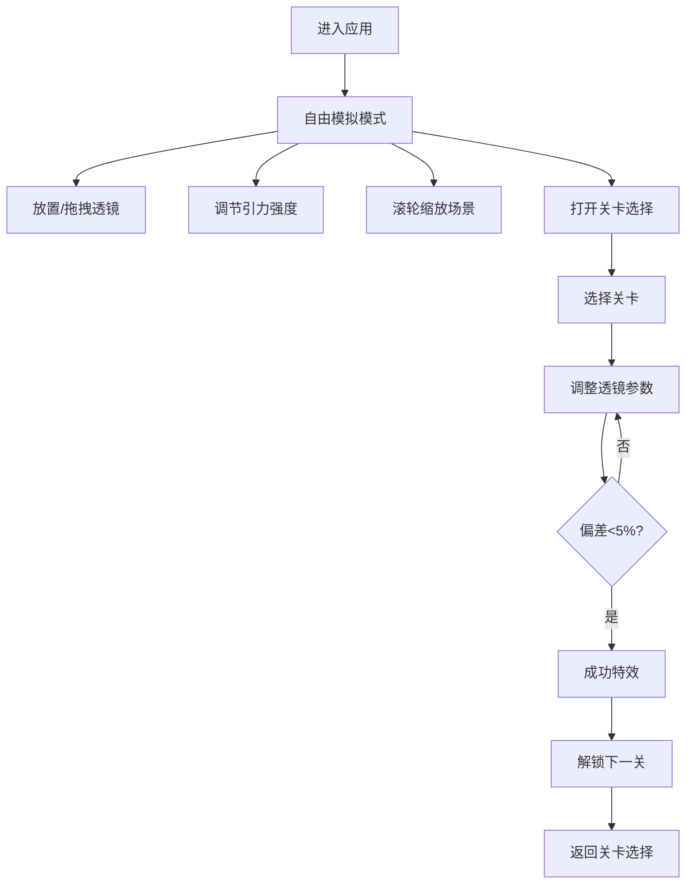

## 1. 产品概述

引力透镜模拟器是一款面向天文教学与科普的交互式Web应用，通过实时物理模拟直观展示强引力场如何弯曲光线并产生多重像。用户可通过拖拽透镜、调节引力强度等交互方式，探索爱因斯坦广义相对论中光线在引力场中的偏折效应。

- **目标用户**：天文教师、学生、天文爱好者
- **核心价值**：将抽象的引力透镜理论转化为可交互、可观测的直观体验

## 2. 核心功能

### 2.1 功能模块

1. **模拟画布**：800x800像素的星场背景，支持恒星、引力透镜、虚像、等势线的实时渲染
2. **透镜交互**：点击放置、拖拽移动、滚轮缩放、强度滑块调节
3. **关卡系统**：5个预设关卡，包含爱因斯坦十字、环形阵、双透镜干涉等经典天文现象
4. **进度管理**：关卡完成状态记录、成功特效、下一关解锁

### 2.2 页面详情

| 页面名称 | 模块名称 | 功能描述 |
|---------|---------|---------|
| 主模拟页面 | 星场画布 | 渲染200-400颗随机分布的白色恒星，黑色深空背景 |
| 主模拟页面 | 引力透镜 | 半透明蓝色球体，支持拖拽移动，带拖尾效果 |
| 主模拟页面 | 等势线环 | 动态渐变虚线环，数量和间距随引力强度变化 |
| 主模拟页面 | 控制面板 | 引力强度滑块（1-10），实时调节偏折效果 |
| 关卡选择 | 关卡卡片 | 网格布局，显示缩略图、完成状态（绿色对勾/灰色锁） |
| 全局 | 成功特效 | 200个金色粒子爆炸效果，持续2秒 |

## 3. 核心流程

用户进入应用后默认进入自由模拟模式，可选择进入关卡模式。在关卡中调整透镜参数至目标配置，偏差小于5%即判定过关，触发成功特效并解锁下一关卡。

## 4. 用户界面设计

### 4.1 设计风格

- **主色调**：深空背景 #0b0c10，恒星纯白 #ffffff
- **透镜色**：半透明蓝色 #4488ff（透明度0.4）
- **渐变色**：等势线从 #00ffff（青色）到 #ff00ff（品红）
- **特效色**：成功粒子金色 #ffd700
- **毛玻璃UI**：backdrop-filter: blur(8px)，背景 rgba(0,0,0,0.5)
- **按钮交互**：hover 时 scale(1.05)，阴影加深
- **过渡动画**：关卡切换淡入淡出 0.3s

### 4.2 页面设计概览

| 页面名称 | 模块名称 | UI 元素 |
|---------|---------|---------|
| 主模拟页 | 画布区域 | 居中800x800 Canvas，黑色背景，星空渲染 |
| 主模拟页 | 右侧面板 | 毛玻璃悬浮卡片，包含强度滑块、当前关卡信息 |
| 主模拟页 | 顶部栏 | 毛玻璃悬浮导航，关卡选择按钮、重置按钮 |
| 关卡选择 | 网格卡片 | 3列布局，卡片带缩略图、锁/对勾图标、关卡名称 |
| 全局 | 成功特效 | 全屏覆盖层，200个金色粒子从中心向外扩散淡出 |

### 4.3 响应性

- 桌面端优先设计，画布区域保持固定比例居中
- 控制面板在宽屏时右侧悬浮，窄屏时底部堆叠
- 触控设备支持触摸拖拽和双指缩放替代滚轮

## 5. 性能指标

- 300颗恒星场景下，单帧渲染 < 16ms（60FPS）
- 虚像位置更新频率 30FPS
- 粒子特效系统独立于主渲染循环
