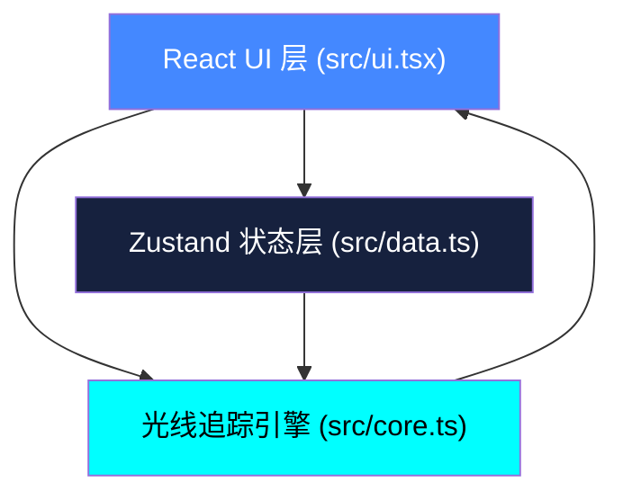

## 1. 架构设计



应用采用三层模块化架构：物理引擎层（core）负责纯计算，状态管理层（data）维护全局状态，UI层（ui）负责Canvas渲染与用户交互，三者通过明确的接口解耦。

## 2. 技术说明

- **前端框架**：React 18 + TypeScript（严格模式）
- **构建工具**：Vite
- **状态管理**：Zustand
- **渲染引擎**：HTML5 Canvas 2D API
- **UI样式**：原生CSS + CSS变量（深空主题）

## 3. 模块定义

### 3.1 模块A - 光线追踪引擎 (src/core.ts)

**类型定义**：
```typescript
interface Star {
  x: number;
  y: number;
  size: number;
  brightness: number;
}

interface Lens {
  x: number;
  y: number;
  radius: number;
  strength: number;
  ellipticity: number;
  rotation: number;
}

interface VirtualImage {
  x: number;
  y: number;
  brightness: number;
  sourceIndex: number;
}
```

**核心函数**：
- `computeDeflectionAngle(starX, starY, lens)`: 计算光线偏折角度（基于点质量引力透镜公式）
- `generateVirtualImages(stars, lens)`: 接收恒星数组和透镜参数，返回虚像位置与亮度列表
- 算法：对每颗恒星沿透镜对称方向生成2-4个虚像，亮度按距离平方反比衰减

### 3.2 模块B - UI交互组件 (src/ui.tsx)

**主要组件**：
- `GravitationalLensCanvas`: 主画布组件，使用 useRef 管理 Canvas，通过 requestAnimationFrame 驱动渲染循环
- `StrengthSlider`: 引力强度滑块组件，受控输入
- `LevelSelectPanel`: 关卡选择面板，网格卡片布局
- `SuccessEffect`: 成功特效覆盖层，200个粒子系统

**渲染流程**：
1. 清空画布（#0b0c10）
2. 绘制背景恒星（白色圆点，1-3px）
3. 绘制半透明原始恒星参考点
4. 调用 core.ts 计算虚像，绘制虚像
5. 绘制等势线环（渐变色虚线）
6. 绘制透镜拖尾
7. 绘制透镜本体

### 3.3 模块C - 数据管理 (src/data.ts)

**Zustand Store**：
```typescript
interface GameState {
  stars: Star[];
  lens: Lens;
  zoom: number;
  currentLevel: number | null;
  completedLevels: number[];
  showSuccess: boolean;
  setLensStrength: (s: number) => void;
  moveLens: (x: number, y: number) => void;
  setZoom: (z: number) => void;
  selectLevel: (id: number) => void;
  completeLevel: (id: number) => void;
  resetLevel: () => void;
}
```

**关卡配置**：
```typescript
interface LevelConfig {
  id: number;
  name: string;
  description: string;
  targetLens: Partial<Lens>;
  tolerance: number; // 5%
  thumbnail: string; // data URL
}
```

预设5个关卡：爱因斯坦十字、爱因斯坦环、双像干涉、弧形拉伸、多重像阵列。

## 4. 性能优化策略

- 恒星数据在初始化时生成并缓存，不随帧重建
- 虚像计算使用 requestAnimationFrame 的 sibling 间隔调度（30FPS更新）
- Canvas 绘制使用离屏路径批量绘制，减少 state 切换
- 粒子特效使用对象池复用粒子实例
- 透镜拖尾使用环形缓冲区存储最近30个位置

## 5. 文件结构

```
src/
├── core.ts      # 模块A：光线追踪算法
├── ui.tsx       # 模块B：UI组件与Canvas渲染
├── data.ts      # 模块C：Zustand状态与关卡数据
├── App.tsx      # 根组件
├── main.tsx     # 入口
└── index.css    # 全局样式
```
