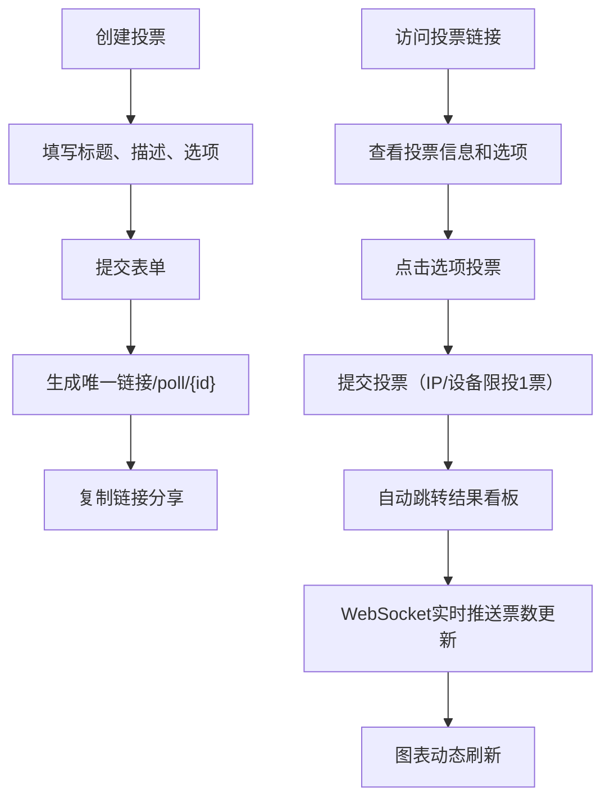

## 1. 产品概述

在线投票与实时结果可视化看板应用，支持用户快速创建投票、分享链接、实时查看投票结果动态图表。解决传统投票工具缺乏实时反馈和数据可视化能力的痛点，适用于会议决策、活动投票、市场调研等场景。

- 核心价值：提供实时、可视化、易用的投票体验
- 目标用户：需要快速收集意见并展示结果的团队、组织和个人

## 2. 核心功能

### 2.1 用户角色
| 角色 | 注册方式 | 核心权限 |
|------|----------|----------|
| 普通用户 | 无需注册，基于设备识别 | 创建投票、参与投票、查看结果、管理自己创建的投票 |

### 2.2 功能模块
1. **首页**：投票创建表单、历史投票列表（最多20条）
2. **投票页面**：投票信息展示、选项选择、投票提交
3. **结果看板页面**：实时票数统计、柱状图、饼图可视化展示

### 2.3 页面详情
| 页面名称 | 模块名称 | 功能描述 |
|----------|----------|----------|
| 首页 | 投票创建表单 | 输入标题、描述、动态添加选项（2-6个）、自定义颜色、提交生成唯一链接 |
| 首页 | 投票历史列表 | 展示用户创建的投票、显示标题/时间/票数/状态、支持进入结果页或删除 |
| 投票页面 | 投票信息展示 | 显示投票标题、描述、选项卡片列表 |
| 投票页面 | 投票交互 | 点击选项投票、投票后高亮选中项、显示确认提示 |
| 结果看板 | 领先选项展示 | 中央展示当前得票最高选项及票数 |
| 结果看板 | 柱状图展示 | 水平柱状图展示各选项票数，圆角柱条，弹性动画 |
| 结果看板 | 饼图展示 | 饼图展示投票占比，扇区分离动画，与选项颜色一致 |

## 3. 核心流程

用户在首页填写投票信息并提交，系统生成唯一投票链接，用户可复制链接分享给他人。参与者访问链接查看选项并投票，投票后自动跳转到结果看板，所有访问者通过WebSocket实时接收票数更新，图表动态刷新。

## 4. 用户界面设计

### 4.1 设计风格
- 主色调：#4a90d9（按钮、强调色）
- 背景色：#f5f7fa（页面背景）、#ffffff（卡片背景）
- 边框色：#e0e0e0（导航栏底部）、#d0d0d0（选项卡片默认边框）
- 预设调色板：#FF6384、#36A2EB、#FFCE56、#4BC0C0、#9966FF、#FF9F40、#FF6384、#C9CBCF、#7BC225、#E7E9ED、#8E5EA2、#3CBA9F
- 按钮样式：圆角8px，白色文字，hover亮度提高10%，点击scale(0.96)动画
- 字体：使用现代无衬线字体，标题18-24px，正文14px，标签12px
- 布局：卡片式布局，圆角12px，内边距24px，hover阴影增强过渡0.2s

### 4.2 页面设计概述
| 页面名称 | 模块名称 | UI元素 |
|----------|----------|--------|
| 首页 | 导航栏 | 高度64px，白色背景，底部1px边框，居中显示应用标题 |
| 首页 | 创建表单卡片 | 表单输入框、选项动态添加删除按钮、颜色选择器、提交按钮 |
| 首页 | 投票列表 | 卡片列表，滚动懒加载，每条显示标题、时间、票数、状态、操作按钮 |
| 投票页面 | 选项卡片 | 圆角8px，带阴影，未选中灰色边框，hover半透明主色边框，选中后主题色边框2px + 背景10%透明度 |
| 结果看板 | 领先展示区 | 大字体显示领先选项名称和票数，居中显示 |
| 结果看板 | 图表区域 | 网格背景，并排展示柱状图和饼图，更新时弹性动画 |

### 4.3 响应式设计
- 桌面端：卡片内边距24px，图表并排，选项卡片每行4个
- 移动端（<768px）：卡片内边距16px，图表上下排列，选项卡片每行2个，导航栏顶部固定
- 触摸优化：按钮最小尺寸44x44px，点击反馈清晰

### 4.4 视觉动效
- 页面加载：元素渐入动画，staggered延迟
- 投票提交：确认弹出动画，0.3s过渡
- 图表更新：柱状图0.5s弹性动画，饼图扇区分离动画
- 连接状态：WebSocket断开时顶部红色提示条，恢复时自动隐藏
