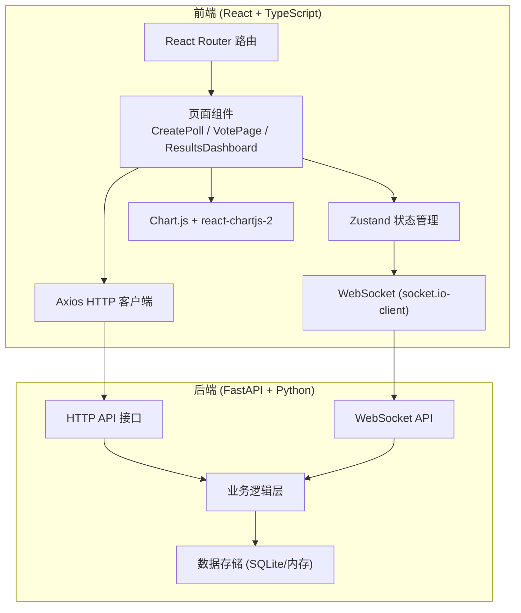
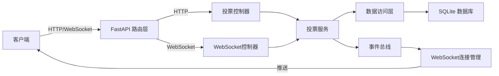
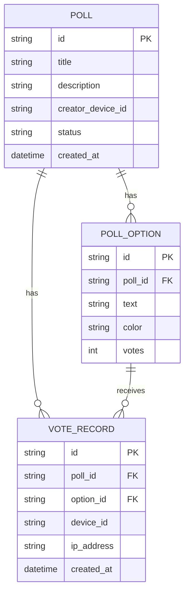

## 1. 架构设计



## 2. 技术描述

- **前端**：React 18 + TypeScript + Vite
- **状态管理**：Zustand
- **路由**：React Router DOM v6
- **图表库**：Chart.js + react-chartjs-2
- **HTTP客户端**：Axios
- **WebSocket**：socket.io-client
- **后端**：FastAPI (Python)
- **WebSocket服务**：python-socketio
- **数据库**：SQLite（开发环境）/ 内存存储

## 3. 路由定义

| 路由 | 页面 | 功能描述 |
|------|------|----------|
| `/` | CreatePoll | 首页，创建投票 + 投票历史列表 |
| `/poll/:id` | VotePage | 投票页面，展示选项并支持投票 |
| `/poll/:id/results` | ResultsDashboard | 结果看板，实时展示投票统计图表 |

## 4. API 定义

### 4.1 TypeScript 类型定义

```typescript
interface PollOption {
  id: string;
  text: string;
  color: string;
  votes: number;
}

interface Poll {
  id: string;
  title: string;
  description: string;
  options: PollOption[];
  createdAt: string;
  status: 'active' | 'closed';
  totalVotes: number;
  creatorDeviceId: string;
}

interface VoteRequest {
  pollId: string;
  optionId: string;
  deviceId: string;
}

interface VoteResponse {
  success: boolean;
  message: string;
  poll: Poll;
}

interface WSMessage {
  type: 'vote_update' | 'poll_closed';
  pollId: string;
  data: Poll | { optionId: string; votes: number };
}
```

### 4.2 HTTP API 接口

| 方法 | 路径 | 描述 | 请求体 | 响应 |
|------|------|------|--------|------|
| POST | `/api/polls` | 创建投票 | `{ title, description, options: [{text, color}] }` | `{ poll, shareUrl }` |
| GET | `/api/polls/:id` | 获取投票详情 | - | `Poll` |
| POST | `/api/polls/:id/vote` | 提交投票 | `{ optionId, deviceId }` | `VoteResponse` |
| GET | `/api/polls` | 获取用户创建的投票列表 | `?deviceId=xxx` | `Poll[]` |
| DELETE | `/api/polls/:id` | 删除投票 | `?deviceId=xxx` | `{ success: boolean }` |
| POST | `/api/polls/:id/close` | 关闭投票 | `?deviceId=xxx` | `{ success: boolean, poll: Poll }` |

### 4.3 WebSocket 事件

| 事件名 | 方向 | 数据 | 描述 |
|--------|------|------|------|
| `join_poll` | 客户端→服务端 | `{ pollId: string }` | 加入投票房间 |
| `leave_poll` | 客户端→服务端 | `{ pollId: string }` | 离开投票房间 |
| `vote_update` | 服务端→客户端 | `{ pollId: string, poll: Poll }` | 投票更新推送 |

## 5. 服务器架构图



## 6. 数据模型

### 6.1 数据模型定义



### 6.2 数据库 DDL

```sql
-- 投票表
CREATE TABLE IF NOT EXISTS polls (
    id TEXT PRIMARY KEY,
    title VARCHAR(50) NOT NULL,
    description TEXT,
    creator_device_id TEXT NOT NULL,
    status TEXT NOT NULL DEFAULT 'active',
    created_at DATETIME DEFAULT CURRENT_TIMESTAMP
);

-- 投票选项表
CREATE TABLE IF NOT EXISTS poll_options (
    id TEXT PRIMARY KEY,
    poll_id TEXT NOT NULL,
    text TEXT NOT NULL,
    color TEXT NOT NULL,
    votes INTEGER NOT NULL DEFAULT 0,
    FOREIGN KEY (poll_id) REFERENCES polls(id) ON DELETE CASCADE
);

-- 投票记录表（用于防重复投票）
CREATE TABLE IF NOT EXISTS vote_records (
    id TEXT PRIMARY KEY,
    poll_id TEXT NOT NULL,
    option_id TEXT NOT NULL,
    device_id TEXT NOT NULL,
    ip_address TEXT,
    created_at DATETIME DEFAULT CURRENT_TIMESTAMP,
    FOREIGN KEY (poll_id) REFERENCES polls(id) ON DELETE CASCADE,
    FOREIGN KEY (option_id) REFERENCES poll_options(id) ON DELETE CASCADE,
    UNIQUE(poll_id, device_id)
);

-- 索引
CREATE INDEX IF NOT EXISTS idx_polls_creator ON polls(creator_device_id);
CREATE INDEX IF NOT EXISTS idx_polls_created ON polls(created_at DESC);
CREATE INDEX IF NOT EXISTS idx_options_poll ON poll_options(poll_id);
CREATE INDEX IF NOT EXISTS idx_votes_poll ON vote_records(poll_id);
```

## 7. 性能优化方案

1. **代码分割**：使用 React.lazy 对页面组件进行懒加载
2. **WebSocket 优化**：消息节流，合并高频更新
3. **图表优化**：Chart.js 动画配置，减少重绘
4. **虚拟滚动**：投票历史列表使用虚拟滚动处理大量数据
5. **本地缓存**：使用 localStorage 缓存用户创建的投票列表
6. **防抖处理**：表单输入和颜色选择器使用防抖
