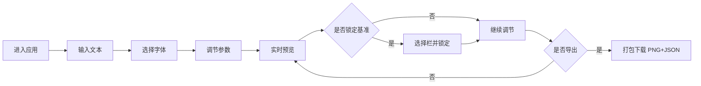

## 1. 产品概述

在线交互式字体排印实验工具，为设计师和开发者提供快速测试不同字体在相同文本上视觉表现的能力，通过调节多个排印参数实时观察页面变化。

- 目标用户：前端开发者、UI/UX 设计师、排印爱好者
- 核心价值：简化字体对比流程，提供直观的参数调节与实时预览体验

## 2. 核心功能

### 2.1 功能模块

1. **主工作页面**：左侧参数控制面板 + 右侧三栏对比视图 + 顶部工具栏

### 2.2 页面详情

| 页面名称 | 模块名称 | 功能描述 |
|-----------|-------------|---------------------|
| 主工作页面 | 文本输入区 | 支持多行文本输入，实时同步到三栏预览 |
| 主工作页面 | 字体选择器 | 从5款预设 Google Fonts 中独立选择每栏字体 |
| 主工作页面 | 参数滑块组 | 调节字号(12-72px)、行高(1.0-2.0)、字间距(-0.1-0.3em) |
| 主工作页面 | 颜色选择器 | 色轮选取文字颜色 |
| 主工作页面 | 锁定基准功能 | 选中栏参数成为参考，显示差值百分比和红色参考线 |
| 主工作页面 | 三栏对比视图 | 实时渲染三栏文本，顶部对齐，字体加载后渲染 |
| 主工作页面 | 导出功能 | 导出三栏独立 PNG + 参数 JSON，打包为 ZIP |

## 3. 核心流程

用户打开应用 → 输入测试文本 → 选择各栏字体 → 调节排印参数（实时预览）→ 可选锁定某栏为基准 → 对比效果满意后导出对比包

## 4. 用户界面设计

### 4.1 设计风格

- 主色调：白色背景 `#ffffff`，深灰文字 `#333333`
- 工具栏：浅灰 `#f5f5f5` 毛玻璃效果，带微妙下阴影
- 分隔线：1px 浅灰虚线 `#ddd`
- 卡片：白色背景圆角卡片，`box-shadow: rgba(0,0,0,0.05)`
- 参考线：红色 `#e74c3c` 1px 细竖线
- 动画：300ms ease-in-out 过渡
- 字体风格：Google Fonts 预设（Roboto / Playfair Display / Fira Code / Lora / Inter）

### 4.2 页面设计概览

| 页面名称 | 模块名称 | UI 元素 |
|-----------|-------------|-------------|
| 主工作页面 | 顶部工具栏 | 毛玻璃背景、导出按钮、标题文字 |
| 主工作页面 | 左侧控制面板 | 圆角卡片、文本域、滑块组、色轮、锁定按钮 |
| 主工作页面 | 右侧对比视图 | 三栏横向布局、虚线分隔、顶部对齐文本 |

### 4.3 响应式

- 桌面端：左侧控制面板（约 320px 固定宽度）+ 右侧三栏均分
- 移动端（<768px）：控制面板在上，三栏自动变为纵向堆叠（每栏宽度 100%）
- 滑块交互：值标签跟随鼠标/手指移动

### 4.4 性能要求

- 拖动滑块时页面帧率 ≥ 55fps
- 参数更新无明显卡顿延迟
- 字体加载使用 Font Face Observer 确保渲染时机
