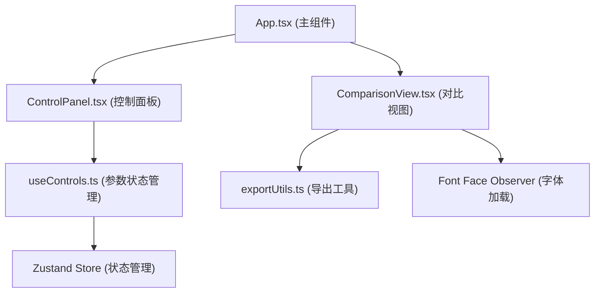

## 1. 架构设计



## 2. 技术说明

- 前端：React 18 + TypeScript + Vite
- 状态管理：Zustand
- 颜色选择器：@hello-pangea/color-picker
- 字体加载：fontfaceobserver
- 打包导出：JSZip
- 样式方案：纯 CSS（CSS Modules 或 inline style），不使用 Tailwind（按用户要求的文件结构和极简风格）

## 3. 路由定义

| 路由 | 用途 |
|-------|---------|
| / | 主工作页面（单页应用） |

## 4. 核心数据模型

```typescript
interface ColumnConfig {
  fontFamily: string;
  fontSize: number;       // 12-72
  lineHeight: number;     // 1.0-2.0
  letterSpacing: number;  // -0.1-0.3
  color: string;          // hex color
}

interface ControlsState {
  text: string;
  columns: [ColumnConfig, ColumnConfig, ColumnConfig];
  selectedColumn: 0 | 1 | 2;
  lockedColumn: 0 | 1 | 2 | null;
}
```

## 5. 文件结构

```
src/
├── modules/
│   ├── panel/
│   │   ├── ControlPanel.tsx    # 左侧参数面板组件
│   │   └── useControls.ts      # 参数状态管理与差值计算
│   └── render/
│       ├── ComparisonView.tsx  # 三栏对比渲染组件
│       └── exportUtils.ts      # 导出打包逻辑
├── App.tsx                     # 主组件
└── main.tsx                    # React 入口
```
