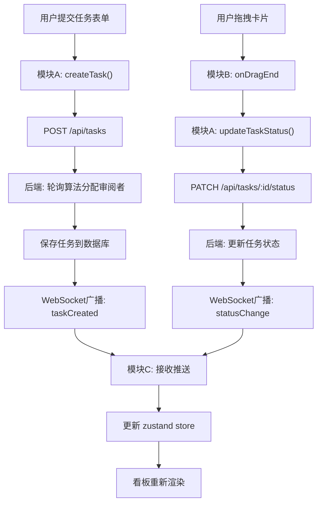

## 1. 产品概述

面向小型独立开发者社区的在线代码审查工作流管理面板，解决审查任务提交、分配、追踪效率低下且易遗漏的问题。
- 核心目标：提供结构化流程，支持任务提交、自动分配、看板追踪、实时协作
- 目标用户：独立开发者社区成员（任务提交者、代码审阅者）

## 2. 核心功能

### 2.1 用户角色

| 角色 | 注册方式 | 核心权限 |
|------|---------|----------|
| 开发者（提交者） | 系统内注册 | 提交审查任务、查看自己提交的任务状态 |
| 审阅者 | 系统内注册 | 接收分配的任务、更新任务审查状态 |

### 2.2 功能模块

1. **任务提交模块（模块A）**：任务表单、自动分配审阅者、任务列表CRUD
2. **看板视图模块（模块B）**：四列看板渲染、拖拽变更状态、任务卡片展示
3. **实时通知模块（模块C）**：WebSocket连接管理、状态变更推送、本地数据同步
4. **侧边栏导航**：应用Logo、新建任务按钮、用户信息
5. **Toast通知系统**：状态变更通知、操作反馈

### 2.3 页面详情

| 页面名称 | 模块名称 | 功能描述 |
|---------|---------|------------|
| 主页面 | 侧边栏 | 深色导航、新建任务按钮（悬停渐变色）、响应式折叠 |
| 主页面 | 新建任务表单 | 标题/描述/仓库链接输入、提交后自动分配审阅者 |
| 主页面 | 四列看板 | 待审查/审查中/已通过/需修改，状态色背景区分 |
| 主页面 | 任务卡片 | 标题、头像缩略图（哈希色）、相对更新时间、悬停动效 |
| 主页面 | 拖拽系统 | 40%缩放拖拽动画、浅灰虚线占位符、放置触发API |
| 主页面 | Toast通知 | 右上角弹出、淡入淡出300ms、状态色匹配背景 |

## 3. 核心流程

用户打开应用 → 初始化WebSocket连接 → 拉取看板数据 → 渲染四列看板
提交任务 → 表单验证 → 调用模块A createTask → 后端轮询分配审阅者 → 任务入库 → WebSocket广播 → 所有用户看板更新
拖拽卡片 → 模块B触发状态变更 → 调用模块A updateTaskStatus → 后端更新 → WebSocket推送statusChange → 模块C接收 → 更新zustand store → 重新渲染 + toast通知

## 4. 用户界面设计

### 4.1 设计风格
- 主色：#e94560（品牌红）、#0f3460（深蓝）
- 背景：#f4f6f8（主区域）、#1a1a2e（侧边栏深色）
- 看板列背景：#f8f9fa（待审查）、#fff3e0（审查中）、#e8f5e9（已通过）、#ffebee（需修改）
- 按钮：240px侧边栏"新建任务"按钮，悬停#e94560→#0f3460渐变，0.2s过渡
- 卡片：白色圆角、box-shadow: 0 2px 4px rgba(0,0,0,0.1)，悬停阴影加深+上移2px
- 字体：现代无衬线字体，标题加粗，正文常规

### 4.2 页面设计概览

| 页面名称 | 模块名称 | UI元素 |
|---------|---------|--------|
| 主页面 | 侧边栏 | 固定宽度240px、深色背景#1a1a2e、白色文字、Logo、新建任务按钮 |
| 主页面 | 看板容器 | 四列flex布局、每列padding、卡片间距16px |
| 主页面 | 任务卡片 | 32px圆形头像（首字母哈希色）、标题、相对时间（"2分钟前"） |
| 主页面 | 拖拽交互 | 拖拽时卡片40%缩放动画、虚线浅灰占位符 |
| 主页面 | Toast | 右上角固定定位、淡入淡出300ms、状态色匹配背景 |

### 4.3 响应式
- 桌面端（≥768px）：左窄右宽SaaS布局，240px固定侧边栏，四列水平看板
- 移动端（<768px）：侧边栏折叠为悬浮按钮，看板列垂直堆叠
- 触摸优化：拖拽支持触控操作，按钮最小44px触控区域

### 4.4 动效与性能
- 页面初始加载 < 3秒
- 拖拽帧率 60fps（CSS transform + GPU加速）
- 状态标签闪烁：0.3s过渡动画
- 服务器响应 < 500ms
