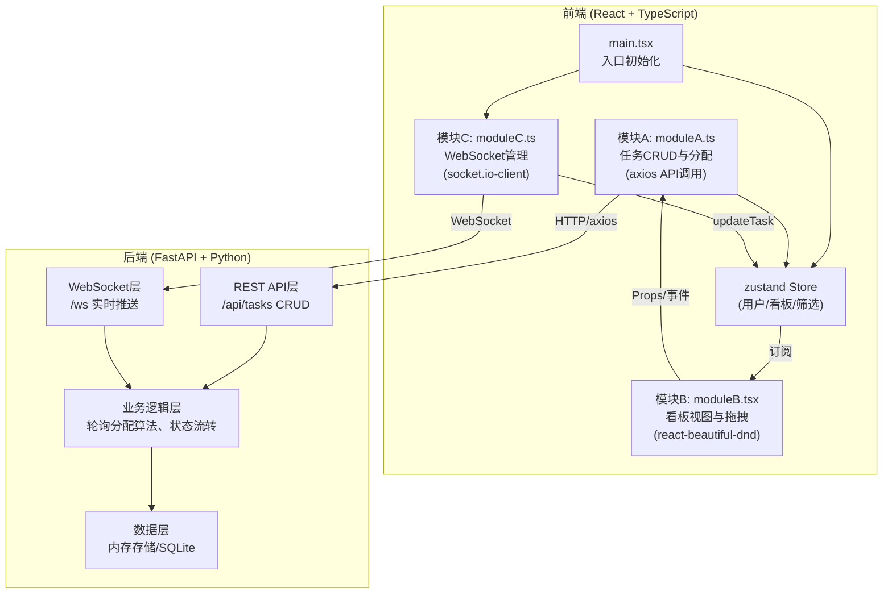
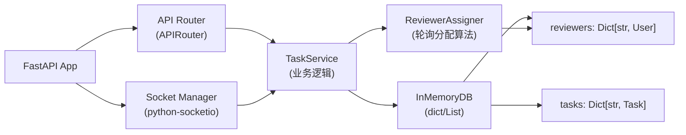
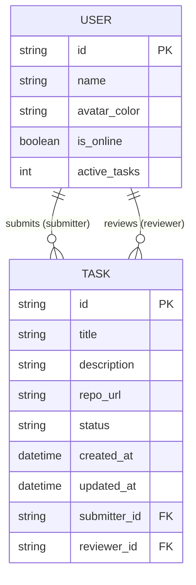

## 1. 架构设计



## 2. 技术描述
- 前端：React@18 + TypeScript@5 + Vite@5 + zustand@4 + axios@1 + react-beautiful-dnd@13 + socket.io-client@4
- 后端：FastAPI@0.100 + Python@3.11 + uvicorn + python-socketio（WebSocket）
- 构建工具：Vite（含代理配置 /api 和 /socket.io 转发）
- 状态管理：zustand（全局单store，模块化actions）
- 通信：REST API（axios）+ WebSocket（socket.io-client）
- 数据库：内存存储（开发演示用，可扩展SQLite）

## 3. 路由定义

| 前端路由 | 用途 |
|---------|------|
| / | 主页面（看板 + 侧边栏 + 新建表单） |

| 后端API路由 | 方法 | 用途 |
|------------|------|------|
| /api/tasks | GET | 获取全部任务列表 |
| /api/tasks | POST | 创建新任务（自动分配审阅者） |
| /api/tasks/{task_id} | GET | 获取单个任务详情 |
| /api/tasks/{task_id} | PATCH | 更新任务状态 |
| /api/tasks/{task_id} | DELETE | 删除任务 |
| /api/reviewers | GET | 获取在线审阅者列表 |
| /socket.io | - | WebSocket连接端点 |

## 4. API定义

### TypeScript 类型定义

```typescript
export type TaskStatus = 'pending' | 'reviewing' | 'approved' | 'changes_needed';

export interface User {
  id: string;
  name: string;
  avatarColor: string;
  isOnline: boolean;
  activeTasks: number;
}

export interface Task {
  id: string;
  title: string;
  description: string;
  repoUrl: string;
  status: TaskStatus;
  createdAt: string;
  updatedAt: string;
  submitter: User;
  reviewer: User | null;
}

export interface CreateTaskPayload {
  title: string;
  description: string;
  repoUrl: string;
  submitterId: string;
}

export interface UpdateStatusPayload {
  taskId: string;
  status: TaskStatus;
}

export interface BoardStore {
  currentUser: User | null;
  tasks: Task[];
  filters: { status?: TaskStatus; reviewerId?: string };
  setCurrentUser: (u: User) => void;
  setTasks: (tasks: Task[]) => void;
  addTask: (task: Task) => void;
  updateTask: (taskId: string, updates: Partial<Task>) => void;
  deleteTask: (taskId: string) => void;
  setFilters: (f: Partial<BoardStore['filters']>) => void;
}
```

### WebSocket 事件

| 事件名 | 方向 | 负载 | 说明 |
|--------|------|------|------|
| connect | 客户端→服务端 | - | 建立连接 |
| statusChange | 服务端→客户端 | { taskId, status, updatedAt } | 任务状态变更推送 |
| taskCreated | 服务端→客户端 | Task | 新任务创建广播 |
| taskDeleted | 服务端→客户端 | { taskId } | 任务删除广播 |
| reviewerStatus | 服务端→客户端 | { reviewers: User[] } | 审阅者在线状态更新 |

## 5. 服务器架构图



## 6. 数据模型

### 6.1 ER图



### 6.2 初始化数据

```python
# 初始审阅者数据
INITIAL_REVIEWERS = [
    {"id": "r1", "name": "张三", "is_online": True, "active_tasks": 0},
    {"id": "r2", "name": "李四", "is_online": True, "active_tasks": 1},
    {"id": "r3", "name": "王五", "is_online": True, "active_tasks": 0},
    {"id": "r4", "name": "赵六", "is_online": False, "active_tasks": 0},
    {"id": "r5", "name": "陈七", "is_online": True, "active_tasks": 2},
]

# 初始任务数据
INITIAL_TASKS = [
    {"id": "t1", "title": "修复用户登录Bug", "status": "pending", ...},
    {"id": "t2", "title": "重构API中间件", "status": "reviewing", ...},
]
```

### 6.3 轮询分配算法逻辑

```
函数 assign_reviewer():
    过滤 is_online == True 的审阅者
    按 active_tasks 升序排序
    取 active_tasks 最小的第一个审阅者
    该审阅者 active_tasks += 1
    返回该审阅者
```
