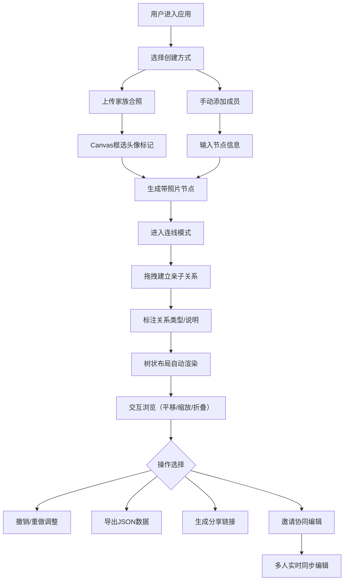

## 1. 产品概述

交互式家谱图谱应用是一款基于Web的家族历史可视化工具，旨在解决家族成员关系难以直观展示和在数字空间中浏览编辑的问题。用户可上传家族合照、标记人物、建立关系连线，生成可交互、可分享、可协同编辑的树状家谱图谱。

- 核心目标：将传统纸质家谱转化为可交互的数字图谱，降低家族历史传承的门槛
- 目标用户：家族历史爱好者、族谱编纂者、希望记录家族渊源的普通用户
- 市场价值：填补家族关系可视化工具的空白，结合协同编辑与社交分享功能，构建具有情感价值的家族记忆平台

## 2. 核心功能

### 2.1 用户角色

| 角色 | 注册方式 | 核心权限 |
|------|----------|----------|
| 编辑用户 | 昵称输入（匿名协同） | 创建/编辑家谱、标记人物、建立关系连线、导出数据、协同编辑 |
| 浏览用户 | 分享链接访问 | 只读浏览家谱图谱、查看成员统计信息 |

### 2.2 功能模块

1. **主编辑页面**：工具栏、Canvas画布、属性面板
2. **图谱生成模块**：照片上传、头像框选标记、节点生成、手动连线
3. **图谱交互模块**：拖拽平移、滚轮缩放、双击折叠/展开分支、节点选中
4. **数据导出模块**：JSON格式导出、只读分享链接生成、统计信息展示
5. **协同编辑模块**：多用户光标同步、实时操作广播、最多5人同时在线

### 2.3 页面详情

| 页面名称 | 模块名称 | 功能描述 |
|----------|----------|----------|
| 主编辑页面 | 顶部工具栏 | 添加成员按钮、连线模式切换、撤销/重做（20步）、导出JSON、生成分享链接 |
| 主编辑页面 | Canvas画布 | 树状图谱渲染、照片上传区域、拖拽标记头像、节点拖拽移动、手动连线绘制 |
| 主编辑页面 | 属性面板 | 节点信息编辑（姓名、照片、代际）、连线关系标注（血亲/姻亲、文字说明） |
| 分享预览页面 | 只读图谱 | 禁用编辑的树状图谱展示、成员总数统计、世代数统计 |

## 3. 核心流程

用户打开应用后进入主编辑页面，可通过两种方式创建家谱：一是上传家族合照，在Canvas上框选头像位置并输入姓名生成节点，然后通过连线模式拖拽建立亲子关系；二是直接点击"添加成员"手动创建节点。建立完整家谱后，可使用撤销/重做调整操作，最终导出JSON数据或生成只读分享链接。协同编辑时，多个用户通过WebSocket实时同步光标位置和编辑操作。

## 4. 用户界面设计

### 4.1 设计风格

- **主色调**：#f5e6d3（柔和米色，仿羊皮纸温暖感）
- **辅助色**：#8b5e3c（温暖棕色，用于连线和边框）
- **强调色**：#c0392b（古典红，用于选中状态和重要操作）
- **背景**：仿羊皮纸纹理，使用CSS线性渐变叠加轻微噪点
- **节点设计**：80x80px圆角方形，内嵌头像缩略图，衬线字体显示人名
- **连接线**：棕色（#8b5e3c）带微弱阴影，曲线连接避免直角
- **选中效果**：强调色边框 + 脉动动画（pulse）
- **按钮风格**：圆角按钮，悬停时颜色加深，0.3s ease过渡
- **字体**：衬线字体（如 Georgia / "Noto Serif SC"）营造古籍家谱氛围
- **布局风格**：顶部固定工具栏 + 中央画布 + 右侧可折叠属性面板
- **动效**：所有交互均有淡入淡出过渡（0.3s ease），节点选中时脉动边框

### 4.2 页面设计概述

| 页面名称 | 模块名称 | UI元素 |
|----------|----------|----------|
| 主编辑页面 | 顶部工具栏 | 圆角按钮组（暖色调）、图标+文字标签、悬停过渡、激活状态高亮、固定定位 |
| 主编辑页面 | Canvas画布 | 仿羊皮纸渐变背景、树状布局节点、曲线连接线、光标指示器（协同用户） |
| 主编辑页面 | 属性面板 | 卡片式面板、表单输入框（圆角）、标签+字段布局、折叠动画 |
| 分享预览页面 | 统计栏 | 顶部统计卡片、成员总数徽章、世代数徽章、柔和阴影 |
| 分享预览页面 | 只读图谱 | 与编辑页相同树状布局、禁用交互光标、水印式"只读"标识 |

### 4.3 响应式设计

- 采用 **Desktop-First** 设计策略
- 主要适配：桌面端（1920x1080及以上）、平板横屏（≥1200px宽度）
- 断点1（≥1200px）：完整三栏布局（工具栏 + 画布 + 属性面板）
- 画布区域自适应：根据视口大小动态调整Canvas尺寸，保持图谱居中显示
- 工具栏：按钮在小屏上紧凑排列，图标优先显示
- 触摸优化：移动端Canvas支持双指缩放手势和单指拖拽平移

### 4.4 视觉细节指引

- **氛围营造**：使用衬线字体和羊皮纸背景营造古典家谱的文化质感
- **节点层次感**：不同代际节点使用微妙的色调深浅区分（年长一代略深）
- **连接线动效**：悬停连线时加粗并显示关系标注标签
- **折叠指示器**：折叠分支使用半透明虚线框 + 展开图标提示
- **协同光标**：每个用户不同颜色圆点 + 昵称标签，跟随移动有平滑过渡
- **性能指标**：Canvas渲染保持60FPS，节点移动响应<400ms，使用离屏Canvas优化缩略图渲染
