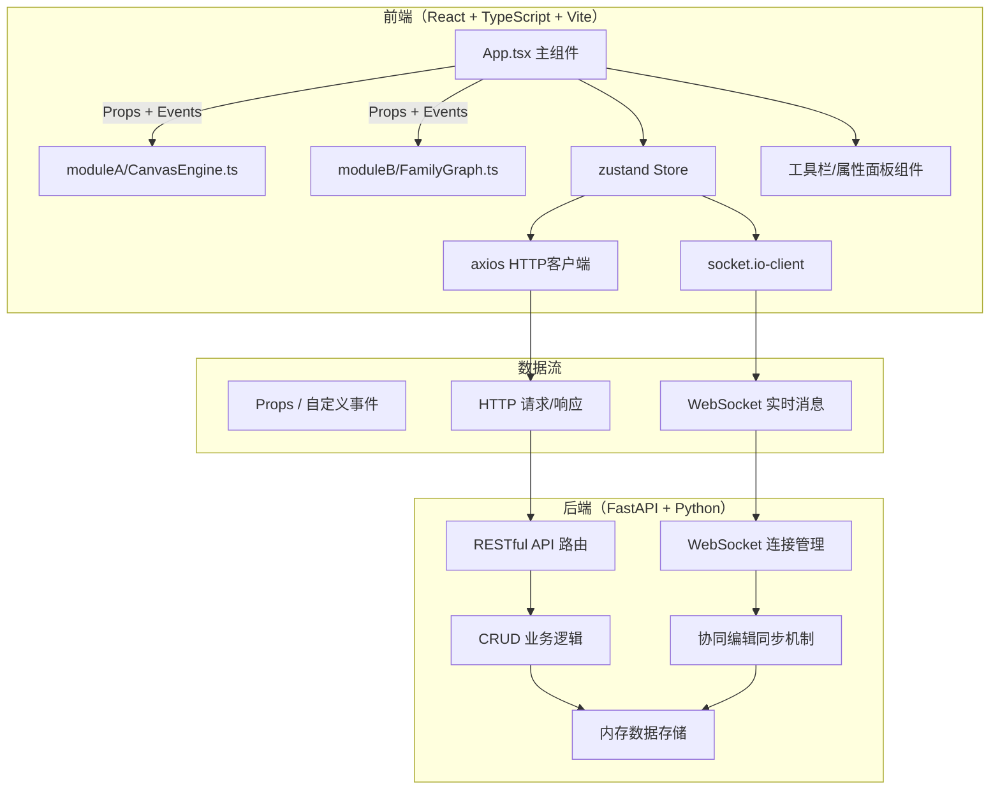
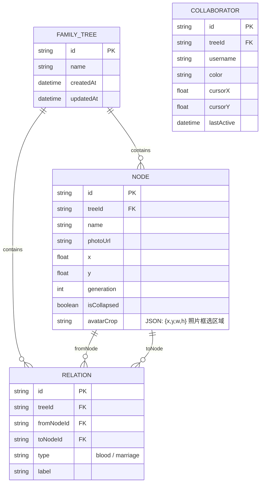

## 1. 架构设计



## 2. 技术描述

- **前端框架**：React 18 + TypeScript 5
- **构建工具**：Vite 5（@vitejs/plugin-react）
- **状态管理**：zustand 4（集中管理应用状态、历史栈、协同状态）
- **HTTP客户端**：axios 1.6
- **实时通信**：socket.io-client 4
- **Canvas渲染**：原生 HTML5 Canvas API + requestAnimationFrame 渲染循环
- **后端框架**：FastAPI 0.109 + Uvicorn
- **数据验证**：Pydantic v2
- **WebSocket**：FastAPI WebSocket 原生支持 + 简易房间管理
- **数据存储**：内存字典存储（开发环境），可扩展至 SQLite/PostgreSQL
- **初始化方式**：按用户指定文件结构手动创建（非标准模板）

## 3. 前端目录与模块职责

| 模块/文件 | 职责说明 |
|-----------|----------|
| `src/moduleA/CanvasEngine.ts` | Canvas渲染引擎：渲染循环、节点/连线绘制、拖拽平移缩放、光标同步、事件坐标输出。独立封装，通过事件回调与外部通信。 |
| `src/moduleB/FamilyGraph.ts` | 数据与图算法：节点/关系数据模型、树形布局算法（层级计算）、折叠展开逻辑、20步历史状态栈。输出布局后的节点位置数组和连线路径数组。 |
| `src/components/App.tsx` | 主UI组件：组合工具栏、Canvas容器、属性面板。连接CanvasEngine与FamilyGraph的数据流向，管理用户交互状态，对接axios和socket.io。 |
| `src/store/useStore.ts` | zustand状态管理：全局状态（当前家谱ID、节点列表、选中节点、视图模式、协同用户列表），暴露操作方法。 |

## 4. API 定义

### 4.1 RESTful API

| Method | Path | 用途 | 请求体 | 响应体 |
|--------|------|------|--------|--------|
| POST | `/api/family-trees` | 创建新家谱 | `{ name: string, nodes: Node[], relations: Relation[] }` | `{ id: string, createdAt: ISOString }` |
| GET | `/api/family-trees/{id}` | 获取家谱详情 | - | `FamilyTreeFull` |
| PUT | `/api/family-trees/{id}` | 更新家谱 | `{ nodes: Node[], relations: Relation[] }` | `{ success: boolean }` |
| DELETE | `/api/family-trees/{id}` | 删除家谱 | - | `{ success: boolean }` |
| GET | `/api/family-trees/{id}/share` | 生成分享链接 | - | `{ shareUrl: string, stats: { totalMembers: number, generations: number } }` |
| GET | `/api/share/{token}` | 获取只读家谱 | - | `FamilyTreeReadOnly` |
| GET | `/api/family-trees/{id}/export` | 导出JSON | - | `application/json` 下载 |

### 4.2 WebSocket 消息协议

连接地址：`/ws/family-trees/{treeId}?user={username}`

| 消息类型 | 方向 | 数据结构 | 用途 |
|----------|------|----------|------|
| `user_joined` | Server→All | `{ userId, username, color }` | 通知新用户加入 |
| `user_left` | Server→All | `{ userId }` | 通知用户离开 |
| `cursor_update` | Client→All | `{ userId, x, y }` | 光标位置同步 |
| `node_added` | Client→All | `{ userId, node: Node }` | 新增节点同步 |
| `node_updated` | Client→All | `{ userId, nodeId, changes }` | 节点更新同步 |
| `node_deleted` | Client→All | `{ userId, nodeId }` | 节点删除同步 |
| `relation_added` | Client→All | `{ userId, relation: Relation }` | 新增连线同步 |
| `relation_deleted` | Client→All | `{ userId, relationId }` | 连线删除同步 |
| `history_patch` | Client→All | `{ userId, patch }` | 历史状态补丁同步 |

## 5. 核心数据模型（Pydantic / TypeScript 双端对齐）

### 5.1 数据模型 ER 图



### 5.2 TypeScript 类型定义

```typescript
interface NodeData {
  id: string;
  name: string;
  photoUrl?: string;
  avatarCrop?: { x: number; y: number; w: number; h: number };
  generation: number;
  isCollapsed: boolean;
  parentIds: string[];
  childrenIds: string[];
}

interface RelationData {
  id: string;
  fromNodeId: string;
  toNodeId: string;
  type: 'blood' | 'marriage';
  label?: string;
}

interface LayoutNode extends NodeData {
  x: number;
  y: number;
  width: number;
  height: number;
  isVisible: boolean;
  collapsedDescendantCount?: number;
}

interface LayoutRelation {
  id: string;
  fromX: number;
  fromY: number;
  toX: number;
  toY: number;
  type: 'blood' | 'marriage';
  label?: string;
}

interface Collaborator {
  id: string;
  username: string;
  color: string;
  cursorX: number;
  cursorY: number;
}
```

## 6. 关键算法与实现要点

### 6.1 树形布局算法（Module B）
- 基于 Reingold-Tilford 树布局算法的简化实现
- 步骤：1) 拓扑排序确定代际（generation）；2) 计算每代节点数确定垂直间距；3) 同代节点水平等距排列；4) 父节点水平居中于子节点之上
- 折叠逻辑：折叠某节点时，标记其所有后代为 `isVisible=false`，并在该节点上记录 `collapsedDescendantCount`

### 6.2 Canvas 渲染优化（Module A）
- 使用 `requestAnimationFrame` 驱动渲染循环，脏检查机制避免不必要重绘
- 节点缩略图使用离屏Canvas（`OffscreenCanvas`）预渲染并缓存
- 虚拟视口：仅渲染当前可见区域（Canvas transform 平移+缩放后做视锥剔除）
- 节点移动响应：使用位置插值（lerp）实现400ms内平滑过渡

### 6.3 历史状态栈（Module B）
- 最大20步，采用 Command 模式存储操作（而非全状态快照）以节省内存
- 操作类型：AddNode、RemoveNode、UpdateNode、AddRelation、RemoveRelation
- undo 时执行反向操作，redo 时重放原操作

### 6.4 协同编辑冲突解决
- 采用 Last-Writer-Wins（LWW）策略，以消息时间戳为准
- 节点删除优先于节点更新：收到已删除节点的更新消息则忽略
- 光标位置高频消息（~30Hz）单独通道，不进入历史栈
