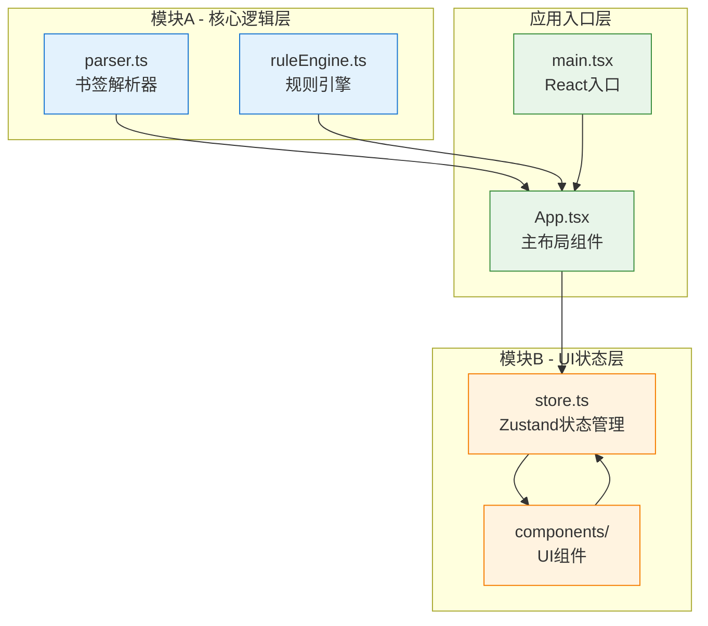
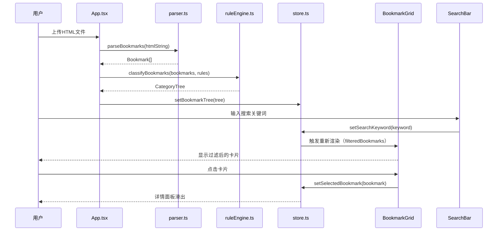

## 1. 架构设计



## 2. 技术描述

- **前端框架**：React 18 + TypeScript
- **构建工具**：Vite 5
- **状态管理**：Zustand 4
- **样式方案**：原生CSS + CSS Modules（不使用Tailwind，按用户需求自定义样式）
- **图标库**：Lucide React
- **初始化工具**：vite-init
- **后端**：无（纯前端应用，数据存储在浏览器内存中）

## 3. 项目结构与调用关系

```
d:\P\tasks\auto119
├── package.json              # 项目依赖配置
├── vite.config.js            # Vite构建配置
├── tsconfig.json             # TypeScript配置（strict模式）
├── index.html                # 入口HTML
└── src/
    ├── main.tsx              # React应用入口 → App.tsx
    ├── App.tsx               # 主布局组件 → parser.ts, ruleEngine.ts, store.ts
    │
    ├── 模块A - 核心逻辑层：
    │   ├── parser.ts         # 书签HTML解析器 → 导出给App.tsx
    │   └── ruleEngine.ts     # 分类规则引擎 → 导出给App.tsx
    │
    ├── 模块B - UI状态层：
    │   ├── store.ts          # Zustand全局状态 → 被App.tsx和所有组件调用
    │   └── components/
    │       ├── SearchBar.tsx       # 搜索框组件 → store
    │       ├── BookmarkGrid.tsx    # 卡片网格组件 ← store
    │       ├── BookmarkCard.tsx    # 书签卡片组件 ← BookmarkGrid
    │       ├── DetailPanel.tsx     # 详情面板 ← store
    │       ├── SettingsPanel.tsx   # 设置面板 ↔ store
    │       ├── CategoryFilter.tsx  # 分类筛选器 ↔ store
    │       └── UndoToast.tsx       # 撤销提示组件 ← store
    │
    └── types/
        └── index.ts          # 全局类型定义
```

### 数据流向图



## 4. 数据模型定义

### 4.1 TypeScript类型定义

```typescript
// src/types/index.ts

export interface Bookmark {
  id: string;
  title: string;
  url: string;
  summary?: string;
  categories: string[];
  addedAt?: number;
}

export interface CategoryRule {
  id: string;
  name: string;
  type: 'url' | 'title';
  keyword: string;
  category: string;
}

export interface CategoryNode {
  name: string;
  bookmarks: Bookmark[];
}

export interface BookmarkState {
  bookmarkTree: CategoryNode[];
  allBookmarks: Bookmark[];
  searchKeyword: string;
  selectedCategory: string | null;
  selectedBookmark: Bookmark | null;
  rules: CategoryRule[];
  deletedBookmark: { bookmark: Bookmark; index: number } | null;
  showSettings: boolean;
  showDetailPanel: boolean;
}

export interface BookmarkActions {
  importBookmarks: (html: string) => void;
  setSearchKeyword: (keyword: string) => void;
  setSelectedCategory: (category: string | null) => void;
  setSelectedBookmark: (bookmark: Bookmark | null) => void;
  setShowDetailPanel: (show: boolean) => void;
  setShowSettings: (show: boolean) => void;
  addRule: (rule: Omit<CategoryRule, 'id'>) => void;
  updateRule: (id: string, rule: Partial<CategoryRule>) => void;
  deleteRule: (id: string) => void;
  deleteBookmark: (id: string) => void;
  undoDelete: () => void;
  clearDeletedBookmark: () => void;
}
```

## 5. 模块A - 核心逻辑层设计

### 5.1 parser.ts - 书签解析器

**职责**：接收浏览器导出的HTML书签文件内容，使用DOMParser解析DOM结构，提取所有书签的标题和URL。

**性能优化**：
- 使用DocumentFragment减少重排
- 递归遍历H3/DT/DD结构（Netscape书签格式）
- 生成唯一ID（crypto.randomUUID）
- 批量处理避免阻塞主线程

**导出函数**：
```typescript
export function parseBookmarks(html: string): Bookmark[]
```

### 5.2 ruleEngine.ts - 分类规则引擎

**职责**：接收原始书签数组和用户规则，基于关键词匹配将书签分配到对应分类。

**内置默认规则**：
1. URL包含"github" → "开发"分类
2. URL包含"stackoverflow" → "技术"分类
3. 标题包含"食谱" → "生活"分类

**匹配逻辑**：
- 支持URL匹配和标题匹配两种类型
- 不区分大小写
- 一个书签可属于多个分类
- 无匹配规则归入"未分类"

**导出函数**：
```typescript
export function classifyBookmarks(
  bookmarks: Bookmark[],
  rules: CategoryRule[]
): { bookmarks: Bookmark[]; tree: CategoryNode[] }

export const defaultRules: CategoryRule[]
```

## 6. 模块B - UI状态层设计

### 6.1 store.ts - Zustand状态管理

**状态结构**：
- `bookmarkTree`：分类后的书签树结构
- `allBookmarks`：扁平的所有书签数组（用于搜索）
- `searchKeyword`：当前搜索关键词
- `selectedCategory`：当前选中的分类筛选
- `selectedBookmark`：当前选中的书签（详情面板用）
- `rules`：用户定义的分类规则
- `deletedBookmark`：待撤销的删除操作
- UI状态：showSettings, showDetailPanel

**选择器优化**：使用Zustand的selector避免不必要的重渲染

### 6.2 组件层级与数据流向

| 组件 | 数据输入 | 数据输出 | 依赖 |
|------|----------|----------|------|
| App.tsx | - | 调用parser/ruleEngine，更新store | parser.ts, ruleEngine.ts, store.ts |
| SearchBar.tsx | store.searchKeyword | store.setSearchKeyword | store.ts |
| CategoryFilter.tsx | store.bookmarkTree, store.selectedCategory | store.setSelectedCategory | store.ts |
| BookmarkGrid.tsx | store.filteredBookmarks (派生) | store.setSelectedBookmark | store.ts |
| BookmarkCard.tsx | bookmark (props) | onDelete, onClick (events) | - |
| DetailPanel.tsx | store.selectedBookmark | store.setShowDetailPanel | store.ts |
| SettingsPanel.tsx | store.rules | addRule, updateRule, deleteRule | store.ts |
| UndoToast.tsx | store.deletedBookmark | undoDelete, clearDeletedBookmark | store.ts |

## 7. 性能优化策略

1. **解析性能**：
   - 使用DOMParser原生API，避免正则表达式解析HTML
   - 使用TreeWalker高效遍历DOM节点
   - 2000书签解析目标：< 500ms

2. **分类性能**：
   - 预编译规则为正则表达式
   - 单次遍历完成所有书签分类
   - 2000书签分类目标：< 300ms

3. **渲染性能**：
   - 使用Zustand selector精确订阅状态
   - React.memo包装纯展示组件
   - 搜索使用useMemo缓存过滤结果
   - 虚拟滚动（如需要）

4. **搜索性能**：
   - 使用indexOf而非正则进行简单匹配
   - debounce搜索输入（100ms）
   - 命中文字高亮使用React组件而非dangerouslySetInnerHTML

## 8. 核心API定义

### 8.1 模块A导出API

```typescript
// parser.ts
export function parseBookmarks(html: string): Bookmark[]

// ruleEngine.ts
export function classifyBookmarks(
  bookmarks: Bookmark[],
  rules: CategoryRule[]
): {
  bookmarks: Bookmark[];
  tree: CategoryNode[];
}

export const defaultRules: CategoryRule[]
```

### 8.2 模块B Store API

```typescript
// store.ts
export const useBookmarkStore = create<BookmarkState & BookmarkActions>()(...)

// Selectors
export const useFilteredBookmarks = () => useBookmarkStore(
  state => computeFilteredBookmarks(state)
)
```
