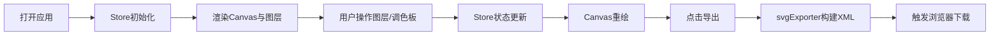

## 1. 产品概述
在线矢量插画图层组合与色彩调色板编辑器，面向创意设计用户提供低学习成本的矢量插画构建工具。
- 解决现有工具学习成本高、多图层属性调整不便的痛点，通过预设矢量图形拖拽组合快速创作风格统一的插画
- 目标价值：降低矢量插画创作门槛，提供所见即所得的图层管理与色彩编辑体验

## 2. 核心功能

### 2.1 用户角色
| 角色 | 注册方式 | 核心权限 |
|------|---------|---------|
| 普通用户 | 无需注册 | 使用全部编辑功能、导出SVG文件 |

### 2.2 功能模块
1. **图层管理面板**：图层列表、缩略图预览、拖拽排序、混合模式选择、不透明度调整
2. **全局调色板**：预设色块网格、选色、增减色块、颜色拾取器
3. **画布渲染区**：矢量图形绘制、图层位置拖拽、属性面板联动
4. **属性编辑面板**：选中图层的缩放、旋转、X/Y位置精确调整
5. **SVG导出模块**：一键导出带时间戳文件名的SVG文件

### 2.3 页面详情
| 页面名称 | 模块名称 | 功能描述 |
|---------|---------|---------|
| 主编辑页 | 顶部工具栏 | 应用标题、汉堡菜单（响应式）、导出按钮 |
| 主编辑页 | 左侧图层面板 | 图层列表+缩略图+拖拽排序+混合模式+不透明度+底部调色板 |
| 主编辑页 | 中央画布区 | 深灰格纹背景、矢量图形渲染、图层拖拽移动 |
| 主编辑页 | 右侧属性面板 | 缩放滑块、旋转滑块、X/Y位置输入框 |

## 3. 核心流程

用户打开应用 → 默认加载初始示例图层 → 从左侧面板选择图层或从预设添加 → 拖拽调整图层顺序/画布位置 → 调整混合模式与不透明度 → 从调色板选色或自定义颜色 → 调整缩放旋转 → 实时预览画布 → 点击导出下载SVG

## 4. 用户界面设计

### 4.1 设计风格
- 主色调：深灰系列（#1e1e2e面板、#2a2a2a画布）
- 强调色：蓝色（rgba(100,150,255,0.2)选中态、蓝色导出按钮）
- 顶部工具栏：半透明毛玻璃效果（rgba(30,30,46,0.9)、backdrop-filter: blur(12px)）
- 按钮风格：圆角按钮，过渡动画0.2s ease-out
- 字体：现代无衬线字体，标题18px白色
- 控件过渡：所有交互（拖拽、滑块、下拉）带0.2s ease-out动画

### 4.2 页面设计概述
| 页面名称 | 模块名称 | UI元素 |
|---------|---------|--------|
| 主编辑页 | 工具栏 | 画笔图标+标题（左/中）、汉堡菜单（左，响应式）、导出按钮（右）、1px底部分割线 |
| 主编辑页 | 左侧面板 | 280px宽、深色背景、图层条目48px高（30x30缩略图+名称+混合模式下拉+不透明度滑块）、悬停变浅、选中变蓝、拖拽浮层半透明、底部200px调色板区域（可滚动） |
| 主编辑页 | 中央画布 | 70%宽度、#2a2a2a+20px格纹、支持选中图层拖拽移动 |
| 主编辑页 | 右侧面板 | 240px宽、仅选中图层时显示、缩放滑块（50-200步进10）、旋转滑块（-180到180）、X/Y数字输入框 |

### 4.3 响应式
- 桌面优先设计（≥1024px三栏布局）
- ＜1024px：左右面板折叠为抽屉（左/右滑入，320px宽），工具栏汉堡图标切换显示
- 触控优化：滑块与按钮最小触控尺寸44px

### 4.4 性能指标
- 画布重绘频率 ≥ 30fps
- 参数修改到画布更新响应 ≤ 60ms
- 20图层内SVG导出 ≤ 500ms
