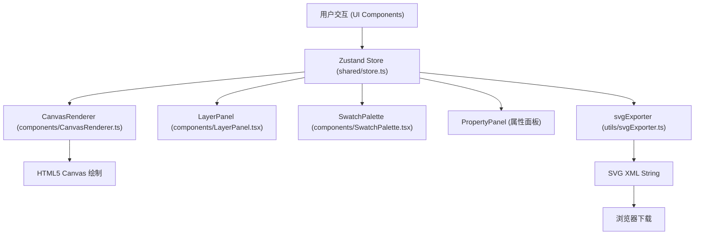

## 1. 架构设计



## 2. 技术说明
- 前端：React@18 + TypeScript@5 + Vite@5
- 状态管理：zustand@4（集中管理图层、调色板、选中态）
- 渲染技术：HTML5 Canvas 2D API（实时绘制）+ SVG DOM序列化（导出）
- 构建工具：Vite（端口3000，HMR）
- 后端：无（纯前端单页应用）
- 路由：react-router-dom（单路由应用，可扩展性预留）
- 图标：lucide-react

## 3. 路由定义
| 路由 | 用途 |
|------|------|
| / | 主编辑器页面（App.tsx直接渲染） |

## 4. 文件结构与调用关系

```
项目根/
├── package.json          # 依赖：react, react-dom, react-router-dom, zustand, typescript, vite
├── vite.config.ts        # 构建配置(端口3000)
├── tsconfig.json         # 严格模式
├── index.html            # 入口，div#root
└── src/
    ├── App.tsx                       # 根组件，布局三栏+工具栏
    │   ├── 使用 useStore 获取状态
    │   ├── 传递 layers/palette/activeColor → CanvasRenderer
    │   ├── 传递 layers/selectedLayerId → LayerPanel
    │   └── 传递 selectedLayer → PropertyPanel
    │
    ├── shared/
    │   └── store.ts                  # Zustand Store
    │       ├── State: layers[], palette[], activeColor, selectedLayerId, exportSvg
    │       ├── Actions: addLayer, removeLayer, reorderLayer, updateLayer,
    │       │          selectLayer, setActiveColor, addSwatch, removeSwatch,
    │       │          updateSwatchColor, setExportSvg
    │       └── 初始数据：20预设色 + 默认示例图层
    │
    ├── components/
    │   ├── CanvasRenderer.ts         # Canvas绘制引擎（非React组件）
    │   │   ├── render(canvas, layers, palette, viewport) → void
    │   │   ├── drawShape(ctx, layer, palette) → void  (单图层绘制)
    │   │   ├── applyBlendMode(ctx, mode) → void
    │   │   ├── getLayerBounds(layer) → {x,y,w,h}
    │   │   ├── generateSvgString(layers, palette) → string  (导出用)
    │   │   └── renderThumbnail(layer, palette, size) → HTMLCanvasElement
    │   │
    │   ├── LayerPanel.tsx            # 图层面板组件
    │   │   ├── 渲染图层列表（LayerItem子组件）
    │   │   ├── 拖拽排序逻辑（原生HTML5 Drag API + 自定义浮层）
    │   │   ├── 每个条目：Thumbnail + Name + BlendSelect + OpacitySlider
    │   │   └── 交互：点击选中、拖拽重排 → 调用 Store actions
    │   │
    │   ├── SwatchPalette.tsx         # 调色板组件
    │   │   ├── 8x4色块网格（28x28px圆角+6px间距）
    │   │   ├── 选中态：2px白色发光边框
    │   │   ├── +/-按钮增减色块（最少8个）
    │   │   ├── 颜色拾取器（点击色块弹出<input type="color">）
    │   │   └── → 调用 setActiveColor / addSwatch / removeSwatch / updateSwatchColor
    │   │
    │   ├── PropertyPanel.tsx         # 右侧属性面板（用户描述中隐含）
    │   │   ├── 缩放滑块(50-200, step 10)
    │   │   ├── 旋转滑块(-180~180)
    │   │   ├── X/Y数值输入框（整数）
    │   │   └── → 调用 updateLayer
    │   │
    │   └── Toolbar.tsx               # 顶部工具栏（可提取）
    │       ├── 汉堡菜单图标（响应式）
    │       ├── 画笔图标 + 标题
    │       └── 导出按钮 → 调用 svgExporter
    │
    └── utils/
        └── svgExporter.ts            # SVG导出工具
            ├── buildSvgDocument(layers, palette) → string
            ├── autoViewBox(layers) → "x y w h"
            ├── layerToSvgElement(layer, palette) → string
            └── triggerDownload(svgString, filename) → void
```

## 5. 数据模型

### 5.1 Layer 数据结构
```typescript
type ShapeType = 'moon' | 'cloud' | 'mountain' | 'tree' | 'bird' | 'star';
type BlendMode = 'normal' | 'multiply' | 'screen' | 'overlay';

interface Layer {
  id: string;                    // UUID
  name: string;                  // 默认"图层+序号"
  type: ShapeType;               // 矢量图形类型
  x: number;                     // X坐标（相对画布）
  y: number;                     // Y坐标（相对画布）
  scale: number;                 // 缩放 50-200 (%)
  rotation: number;              // 旋转角度 -180~180
  opacity: number;               // 不透明度 0-100 (%)
  blendMode: BlendMode;          // 混合模式
  colorIndex: number;            // 调色板索引（-1表示自定义色）
  customColor?: string;          // 自定义颜色值（hex）
}
```

### 5.2 Store State
```typescript
interface EditorState {
  layers: Layer[];
  palette: string[];             // hex色值数组（初始20个）
  activeColor: string;           // 当前选中的颜色（hex）
  selectedLayerId: string | null;
  exportSvg: string | null;
}
```

## 6. 核心算法与实现要点

### 6.1 矢量图形渲染
- 每种ShapeType定义一组贝塞尔曲线/多边形路径数据（以100x100 viewBox为基准）
- 绘制时按 scale/rotation/x/y 应用 ctx.setTransform 矩阵变换
- 混合模式对应 ctx.globalCompositeOperation：
  - normal → 'source-over'
  - multiply → 'multiply'
  - screen → 'screen'
  - overlay → 自定义两阶段绘制或canvas 'overlay'

### 6.2 画布坐标与拖拽
- 画布坐标系以左上角为原点(0,0)
- 图层拖拽：记录 mousedown 起始位移差 → mousemove 更新 layer.x/y
- 命中检测：逆变换鼠标坐标至图形局部坐标 + Path2D.isPointInPath

### 6.3 图层拖拽排序
- HTML5 Drag API：draggable=true + onDragStart/onDragOver/onDrop
- 半透明浮层：dragstart时cloneNode + position fixed跟随鼠标
- 平滑归位：CSS transition transform 0.2s ease-out

### 6.4 SVG导出
- 遍历layers（从底到顶顺序），每个layer转成<g transform=...>包裹对应<path>
- 颜色映射：colorIndex ≥ 0 → palette[index]，否则 customColor
- viewBox自动计算：所有图层bounds的并集，加10px外边距
- 触发下载：Blob + URL.createObjectURL + <a download> click()
