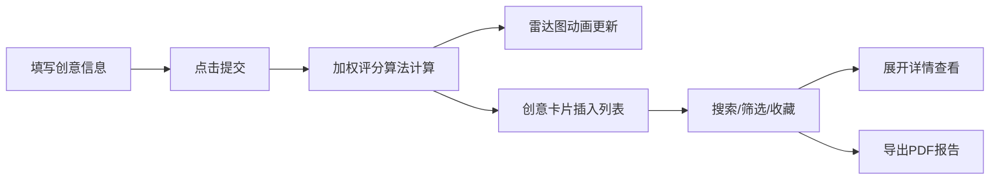

## 1. 产品概述

针对独立开发者的在线项目创意孵化与可行性评估工具，帮助开发者快速记录、整理项目点子，并通过多维度量化评分筛选出最具落地潜力的创意。

- 核心价值：将模糊的创意想法转化为可量化的评估指标，降低独立开发者的项目决策风险
- 目标用户：独立开发者、自由职业者、小型创业团队

## 2. 核心功能

### 2.1 功能模块
1. **创意输入面板**：项目名称、创意描述、技术标签选择、预估参数填写
2. **智能评分系统**：基于市场需求、技术难度、投资成本三维度的加权算法
3. **雷达图可视化**：彩色渐变雷达图实时展示分项得分，带动画过渡
4. **创意卡片列表**：卡片展示、排序、搜索、标签筛选、展开详情
5. **收藏与导出**：星标收藏（心跳动画）、金色高亮、PDF评估报告导出

### 2.2 页面详情
| 页面名称 | 模块名称 | 功能描述 |
|---------|---------|---------|
| 主页面 | 创意输入面板 | 左侧30%宽度面板，包含名称/描述输入、10个技术标签多选（限1-3个）、开发时长/用户规模/初始资金滑块、提交按钮 |
| 主页面 | 雷达图结果区 | 右侧70%宽度区域，展示#6c5ce7到#fd79a8渐变填充雷达图，0.3秒动画过渡 |
| 主页面 | 创意卡片列表 | 下方卡片网格，按综合得分降序排列，支持模糊搜索和标签筛选，交错淡入动画 |
| 主页面 | 收藏与导出 | 卡片星标按钮（0.2秒心跳缩放）、收藏置顶金色边框、PDF导出含雷达图和得分表 |

## 3. 核心流程

用户在左侧面板填写创意信息 → 点击提交触发评分算法 → 右侧雷达图平滑更新展示分项得分 → 下方列表按得分排序插入新卡片 → 用户可搜索/筛选/收藏/展开查看详情 → 一键导出PDF评估报告

## 4. 用户界面设计

### 4.1 设计风格
- **配色方案**：深色宇宙科技风
  - 背景色：#1a1a2e（深邃紫蓝夜空）
  - 卡片色：#16213e（深海蓝紫）
  - 主渐变：#6c5ce7 → #fd79a8（紫粉渐变，雷达图填充）
  - 悬停光晕：#0f3460（发光盒阴影）
  - 收藏高亮：金色边框
  - 文字色：白色系
- **按钮风格**：圆角胶囊形，悬停时带蓝色发光盒阴影
- **字体**：现代无衬线字体，清晰层级，标题加粗
- **布局风格**：桌面端左右两栏（3:7）+ 下方列表；移动端上下堆叠
- **图标风格**：简洁线性图标，星标收藏用填充星形

### 4.2 页面设计概览
| 页面名称 | 模块名称 | UI元素 |
|---------|---------|-------|
| 主页面 | 输入面板 | 深色卡片容器、标签芯片多选、范围滑块、发光提交按钮 |
| 主页面 | 雷达图区域 | 大尺寸雷达图、渐变填充、动画过渡、分项得分标签 |
| 主页面 | 卡片列表 | 搜索框+标签筛选器、交错淡入动画、卡片悬停效果、星标按钮 |
| 主页面 | 展开详情 | 展开动画、完整雷达图、分项得分表格、PDF导出按钮 |

### 4.3 响应式
- 桌面端（≥1024px）：左右3:7两栏布局 + 下方列表区
- 平板端（768-1023px）：上下布局，输入面板在上，结果区在下
- 移动端（<768px）：单列堆叠，所有区域垂直排列，触摸区域优化

### 4.4 动画规范
- 雷达图数据更新：0.3秒渐变过渡
- 卡片列表加载：每项0.05秒交错延迟淡入
- 收藏按钮：0.2秒心跳缩放动画（scale 1→1.3→1）
- 按钮悬停：微妙发光效果（box-shadow过渡）
- 卡片展开：平滑高度过渡动画
