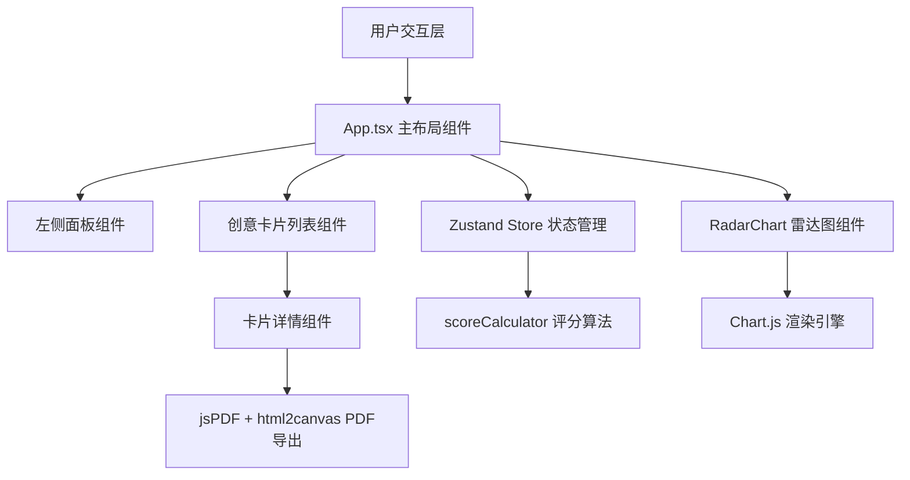

## 1. 架构设计

纯前端单页应用，采用React组件化架构，Zustand管理全局状态，Vite作为构建工具。



## 2. 技术栈说明
- **前端框架**：React 18 + TypeScript（严格模式）
- **构建工具**：Vite
- **状态管理**：Zustand
- **图表库**：Chart.js + react-chartjs-2（雷达图）
- **路由**：react-router-dom（预留路由能力）
- **PDF导出**：jspdf + html2canvas
- **样式方案**：原生CSS + CSS变量（全局样式文件）
- **图标**：lucide-react

## 3. 路由定义
| 路由 | 用途 |
|-----|------|
| / | 主页面，包含完整创意孵化功能 |

## 4. 数据模型

### 4.1 创意项目数据结构
```typescript
interface IdeaProject {
  id: string;
  name: string;
  description: string;
  techTags: string[];
  developmentMonths: number;
  targetUsers: number;
  initialFunding: number;
  scores: {
    marketDemand: number;
    technicalDifficulty: number;
    investmentCost: number;
    total: number;
  };
  isFavorite: boolean;
  createdAt: number;
}
```

### 4.2 评分算法输入输出
```typescript
// 输入：原始参数
interface ScoreInput {
  techTags: string[];
  developmentMonths: number;  // 1-12
  targetUsers: number;        // 100-100000
  initialFunding: number;     // 0-500000
}

// 输出：分项和综合得分（0-100）
interface ScoreOutput {
  marketDemand: number;       // 权重0.4
  technicalDifficulty: number; // 权重0.35
  investmentCost: number;     // 权重0.25
  total: number;              // 加权总和
}
```

## 5. 文件结构

```
d:\P\tasks\auto122\
├── package.json              # 依赖与启动脚本
├── index.html                # 入口页面（标题：创意孵化器）
├── tsconfig.json             # TypeScript严格模式配置
├── vite.config.js            # Vite构建配置
└── src/
    ├── main.tsx              # 应用入口，挂载根组件
    ├── App.tsx               # 主布局组件，状态管理
    ├── components/
    │   └── RadarChart.tsx    # 雷达图封装组件
    ├── utils/
    │   └── scoreCalculator.ts # 加权评分算法纯函数
    └── styles/
        └── global.css        # 全局样式与动画
```

## 6. 核心算法设计

### 6.1 市场需求得分（权重0.4）
- 目标用户规模：线性映射100→20分，100000→100分
- 技术标签加成：热门标签（AI/ML、移动端）额外加分

### 6.2 技术难度得分（权重0.35，越高越难，得分越低表示越可行）
- 开发时长：1月→100分，12月→20分（难度越高可行性得分越低）
- 标签复杂度：区块链、AI/ML增加难度系数

### 6.3 投资成本得分（权重0.25，成本越低得分越高）
- 初始资金：0元→100分，50万→20分

### 6.4 综合评价生成规则
- 总分≥85："潜力巨大，建议优先推进"
- 总分70-84："前景良好，值得投入资源"
- 总分50-69："有一定潜力，需优化关键指标"
- 总分<50："风险较高，建议优化成本或调整方向"
