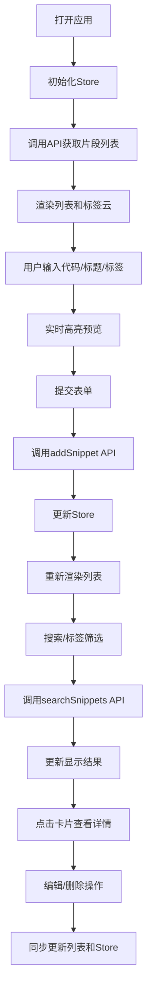

## 1. 产品概述

开发者速记与代码片段管理应用，专为开发者设计的快速记录与检索系统，解决设备间同步代码片段和笔记的需求，支持代码语法高亮、标签分类和全文搜索。

- 核心目标：提供简洁高效的代码片段存储、分类和检索体验
- 目标用户：需要在多设备间同步和管理代码片段的开发者
- 市场价值：填补通用笔记工具在开发者代码管理场景的专业空白

## 2. 核心功能

### 2.1 用户角色

| 角色 | 注册方式 | 核心权限 |
|------|----------|----------|
| 开发者用户 | 无需注册（本地存储+后端API） | 创建、编辑、删除、搜索代码片段，管理标签 |

### 2.2 功能模块

1. **代码片段管理**：创建、编辑、删除代码片段，支持5种编程语言语法高亮
2. **标签分类系统**：多标签管理、彩色标签显示、标签筛选、标签云展示
3. **全文搜索**：按标题、标签、代码内容搜索，支持模糊匹配和匹配行号显示
4. **实时预览**：代码编辑时实时语法高亮预览，支持拖拽调整布局
5. **响应式界面**：暗色主题，桌面/移动端自适应布局

### 2.3 页面详情

| 页面名称 | 模块名称 | 功能描述 |
|-----------|-------------|---------------------|
| 主应用页 | 侧边栏标签云 | 显示所有标签，按使用频次排序，点击筛选 |
| 主应用页 | 代码输入区 | 标题、语言选择、代码textarea、标签输入 |
| 主应用页 | 语法高亮预览区 | 实时显示带One Dark主题的代码高亮预览 |
| 主应用页 | 片段列表区 | 卡片网格展示，搜索框，空状态插画 |
| 主应用页 | 详情弹窗 | 完整代码、行号、编辑/删除操作、确认对话框 |

## 3. 核心流程

用户打开应用 → 初始化加载已有片段 → 在左侧输入区编写代码 → 右侧实时预览高亮效果 → 添加标签 → 提交保存 → 列表显示新片段 → 通过搜索框或标签云筛选 → 点击卡片查看详情 → 编辑或删除片段

## 4. 用户界面设计

### 4.1 设计风格

- 主色调：背景 `#1e1e2e`，卡片 `#282a36`，文字 `#f8f8f2`，边框 `#44475a`
- 标签色：`#e74c3c #3498db #2ecc71 #f39c12 #9b59b6 #1abc9c`（六色预设随机分配）
- 按钮风格：圆角矩形，悬停上移3px，点击缩放0.1s反馈
- 字体：使用 JetBrains Mono 等宽字体用于代码，现代无衬线字体用于UI
- 布局：左侧320px固定侧边栏，右侧主区域两栏布局（输入区:预览区 = 3:7）
- 图标：使用 lucide-react 图标库，风格统一线性图标

### 4.2 页面设计概述

| 页面名称 | 模块名称 | UI元素 |
|-----------|-------------|-------------|
| 主应用页 | 侧边栏标签云 | 彩色标签，字号随频次变化（12px-20px），hover效果 |
| 主应用页 | 代码输入区 | 表单输入框，语言下拉选择，textarea代码输入，标签输入框（回车添加） |
| 主应用页 | 语法高亮预览区 | One Dark主题高亮，行号显示，与输入区同步滚动 |
| 主应用页 | 片段列表 | 卡片网格布局，悬停上移阴影效果，显示前50字符预览 |
| 主应用页 | 详情弹窗 | 居中模态框，高度不超过视口80%，代码行号，编辑删除按钮 |
| 主应用页 | 空状态 | CSS绘制云朵+虚线插画，渐入动画 |

### 4.3 响应式设计

- 桌面端（≥768px）：左侧固定侧边栏，主区域左右分栏
- 移动端（<768px）：侧边栏折叠为顶部抽屉，代码输入与预览改为上下布局
- 触控优化：增大可点击区域，支持滑动操作

### 4.4 动画效果

- 所有过渡使用 CSS transitions（0.25s ease-out）
- 卡片悬停：上移3px + 阴影加深
- 按钮点击：0.1s 缩放反馈
- 列表空状态→有数据：渐入动画
- 弹窗：背景模糊 + 缩放淡入
