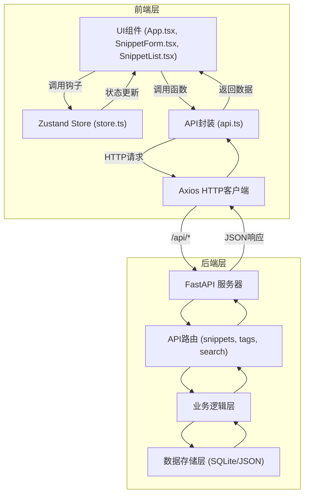
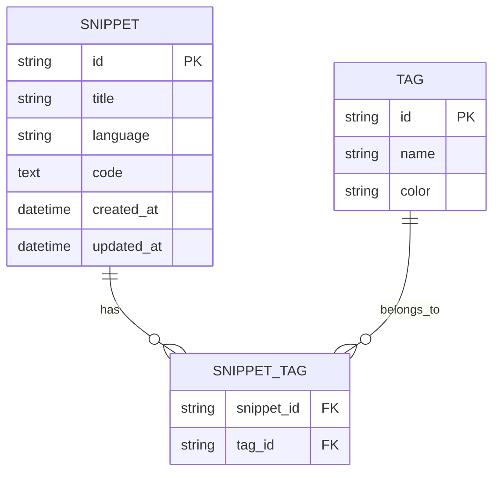
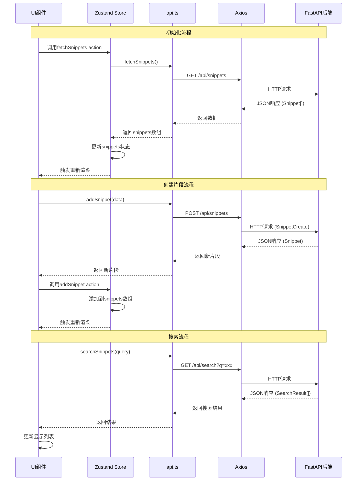

## 1. 架构设计



## 2. 技术选型

- **前端**：React 18 + TypeScript + Vite
- **状态管理**：Zustand
- **路由**：React Router DOM
- **HTTP客户端**：Axios
- **代码高亮**：react-syntax-highlighter（One Dark主题）
- **图标**：lucide-react
- **后端**：FastAPI（Python）
- **数据库**：SQLite（本地开发）
- **构建工具**：Vite
- **包管理器**：npm

## 3. 项目结构

```
auto123/
├── src/                          # 前端源码
│   ├── components/               # React组件
│   │   ├── SnippetForm.tsx       # 代码片段表单组件
│   │   └── SnippetList.tsx       # 片段列表组件
│   ├── api.ts                    # API调用封装
│   ├── store.ts                  # Zustand全局状态
│   ├── App.tsx                   # 主应用组件
│   ├── main.tsx                  # 应用入口
│   └── index.css                 # 全局样式
├── backend/                      # 后端源码（FastAPI）
│   ├── main.py                   # FastAPI入口
│   ├── models.py                 # 数据模型
│   ├── schemas.py                # Pydantic模式
│   ├── database.py               # 数据库连接
│   └── crud.py                   # CRUD操作
├── public/                       # 静态资源
├── index.html                    # HTML入口
├── package.json                  # 前端依赖
├── vite.config.js                # Vite配置（含代理）
├── tsconfig.json                 # TypeScript配置
├── requirements.txt              # Python依赖
└── .trae/
    └── documents/
        ├── PRD.md
        └── TECHNICAL_ARCHITECTURE.md
```

## 4. 路由定义

| 路由 | 用途 |
|-------|---------|
| / | 主应用页面（片段列表、表单、预览） |

## 5. API定义

### TypeScript 类型定义

```typescript
interface Snippet {
  id: string;
  title: string;
  language: 'javascript' | 'python' | 'html' | 'css' | 'typescript';
  code: string;
  tags: string[];
  created_at: string;
  updated_at: string;
}

interface SearchResult extends Snippet {
  matched_lines?: number[];
}

interface SnippetCreate {
  title: string;
  language: string;
  code: string;
  tags: string[];
}

interface SnippetUpdate {
  title?: string;
  language?: string;
  code?: string;
  tags?: string[];
}
```

### API 端点

| 方法 | 路径 | 描述 | 请求体 | 响应 |
|------|------|------|--------|------|
| GET | `/api/snippets` | 获取所有片段 | - | `Snippet[]` |
| GET | `/api/snippets/:id` | 获取单个片段 | - | `Snippet` |
| POST | `/api/snippets` | 创建片段 | `SnippetCreate` | `Snippet` |
| PUT | `/api/snippets/:id` | 更新片段 | `SnippetUpdate` | `Snippet` |
| DELETE | `/api/snippets/:id` | 删除片段 | - | `{ success: boolean }` |
| GET | `/api/search?q=:query` | 搜索片段 | - | `SearchResult[]` |
| GET | `/api/tags` | 获取所有标签及频次 | - | `{ tag: string; count: number }[]` |

## 6. 数据模型

### 6.1 ER图



### 6.2 表结构

```sql
-- 片段表
CREATE TABLE snippets (
    id VARCHAR(36) PRIMARY KEY,
    title VARCHAR(255) NOT NULL,
    language VARCHAR(50) NOT NULL,
    code TEXT NOT NULL,
    created_at DATETIME DEFAULT CURRENT_TIMESTAMP,
    updated_at DATETIME DEFAULT CURRENT_TIMESTAMP
);

-- 标签表
CREATE TABLE tags (
    id VARCHAR(36) PRIMARY KEY,
    name VARCHAR(50) UNIQUE NOT NULL,
    color VARCHAR(7) NOT NULL
);

-- 片段-标签关联表
CREATE TABLE snippet_tags (
    snippet_id VARCHAR(36) REFERENCES snippets(id) ON DELETE CASCADE,
    tag_id VARCHAR(36) REFERENCES tags(id) ON DELETE CASCADE,
    PRIMARY KEY (snippet_id, tag_id)
);

-- 创建索引
CREATE INDEX idx_snippets_title ON snippets(title);
CREATE INDEX idx_snippets_language ON snippets(language);
CREATE INDEX idx_snippets_created_at ON snippets(created_at DESC);
CREATE INDEX idx_tags_name ON tags(name);
```

## 7. 数据流说明

### 数据流向图



### 模块调用关系

1. **App.tsx** → 调用 `store.ts` 的初始化方法，调用 `api.ts` 获取数据，传递 Props 给子组件
2. **SnippetForm.tsx** → 调用 `api.ts` 的 `addSnippet` / `updateSnippet`，调用 `store.ts` 更新状态
3. **SnippetList.tsx** → 调用 `api.ts` 的 `searchSnippets`，调用 `store.ts` 获取筛选条件，传递数据给卡片组件
4. **api.ts** → 封装所有 HTTP 请求，统一错误处理，数据转换
5. **store.ts** → 管理全局状态，提供 selectors 和 actions，响应式更新 UI

## 8. 性能优化策略

- **代码高亮**：使用 Web Worker 处理语法高亮计算，避免阻塞主线程
- **搜索防抖**：300ms 防抖处理搜索输入，减少 API 调用
- **虚拟滚动**：长列表使用虚拟滚动优化渲染性能
- **本地缓存**：前端缓存常用数据，减少重复请求
- **后端索引**：数据库建立适当索引，确保搜索响应 < 200ms
- **懒加载**：非关键资源延迟加载，首屏加载 < 1s
