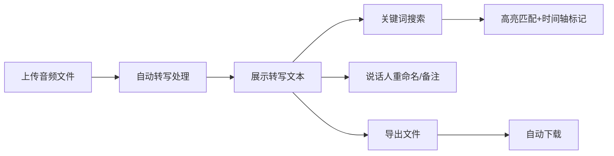

## 1. 产品概述

会议录音转写助手是一款能够将在线会议或讲座的录音/视频文件自动转写为文本，并支持多说话人区分和关键词高亮搜索的应用。主要解决会议记录整理效率低下、难以定位重要发言片段的问题。

- 目标用户：需要整理会议记录、讲座内容的职场人士和学生
- 核心价值：提升会议记录整理效率，快速定位重要发言片段

## 2. 核心功能

### 2.1 用户角色

| 角色 | 注册方式 | 核心权限 |
|------|----------|----------|
| 普通用户 | 无需注册，直接使用 | 上传音频、查看转写结果、搜索、导出 |

### 2.2 功能模块

1. **音频上传与转写**：文件上传、进度显示、转写模拟、说话人区分
2. **全文搜索与定位**：关键词搜索、高亮显示、时间轴标记、跳转定位
3. **说话人管理**：重命名、添加备注、本地存储
4. **导出与分享**：多种格式导出（TXT/SRT/JSON）、下载

### 2.3 页面详情

| 页面名称 | 模块名称 | 功能描述 |
|---------|---------|----------|
| 主页面 | 左侧上传控制区 | 文件上传、进度条、转写控制、说话人列表 |
| 主页面 | 右侧文本展示区 | 搜索框、转写文本、时间轴面板 |
| 主页面 | 导出弹窗 | 格式选择、进度提示、自动下载 |

## 3. 核心流程

用户上传音频文件 → 系统自动转写（模拟）→ 展示带说话人标签的转写文本 → 用户搜索关键词 → 高亮匹配结果并标记时间轴 → 用户重命名说话人/添加备注 → 用户选择格式导出 → 自动下载文件

## 4. 用户界面设计

### 4.1 设计风格

- **主色调**：#1976d2（蓝色）
- **背景色**：#f5f7fa（浅灰蓝）
- **卡片色**：#ffffff（白色）
- **文字色**：#212121（深灰）
- **说话人A背景**：#e3f2fd（浅蓝）
- **说话人B背景**：#fff3e0（浅橙）
- **说话人C背景**：#e8f5e9（浅绿）
- **搜索高亮**：#ffeb3b（黄色）
- **按钮风格**：圆角4px，hover时颜色加深，0.2s过渡动画
- **字体**：系统无衬线字体，清晰易读
- **布局风格**：左右分栏卡片式布局

### 4.2 页面设计概览

| 页面名称 | 模块名称 | UI 元素 |
|---------|---------|---------|
| 主页面 | 上传控制区 | 拖拽上传区、虚线边框动画、进度条、说话人列表卡片 |
| 主页面 | 文本展示区 | 搜索框、虚拟列表、句子卡片、悬停左边界线 |
| 主页面 | 时间轴面板 | 竖线标记、点击跳转、闪烁动画 |
| 主页面 | 导出弹窗 | 格式选项、进度条、简约设计 |

### 4.3 响应式设计

- 桌面端优先，左右分栏（左侧40%，右侧60%）
- 移动端自适应为上下布局
- 触摸操作优化

### 4.4 动效设计

- 上传区拖拽时虚线边框动画
- 转写过程脉冲动画
- 搜索匹配高亮动画
- 句子焦点放大动画（0.3s ease-out）
- 时间轴标记闪烁动画（2次）
- 按钮hover颜色加深过渡（0.2s）
- 句子悬停左边界线显示
